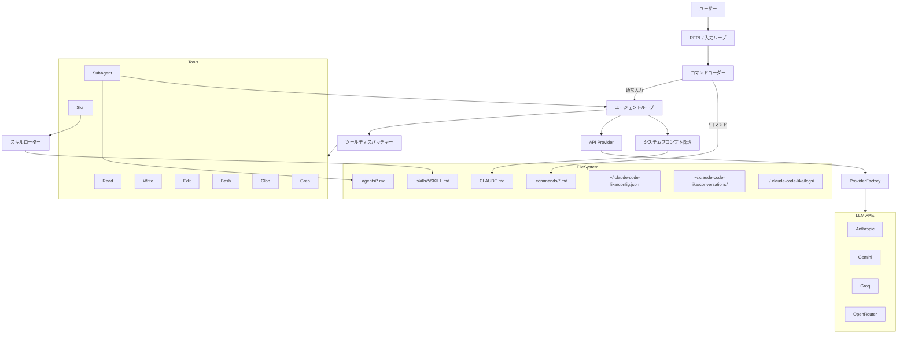
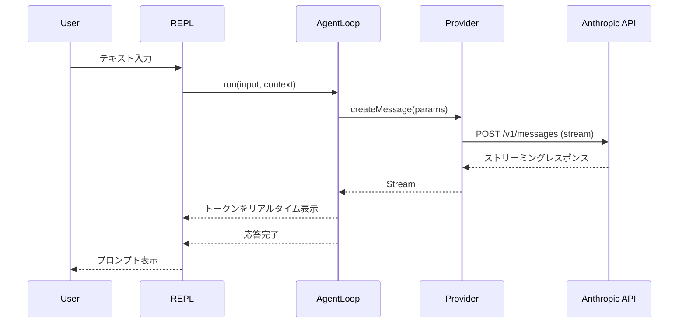
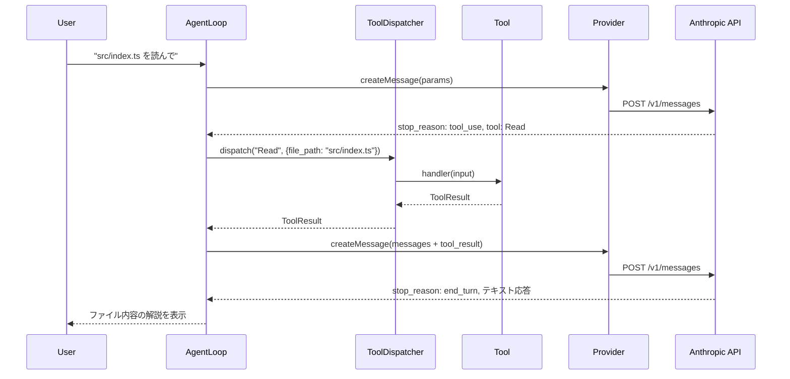
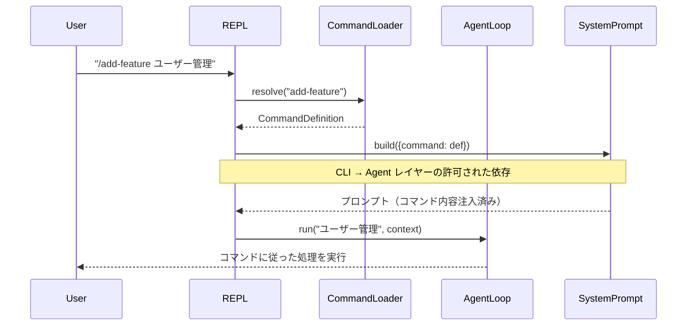
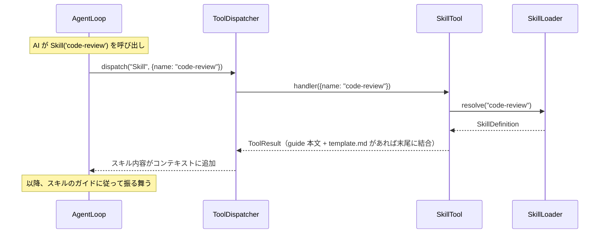
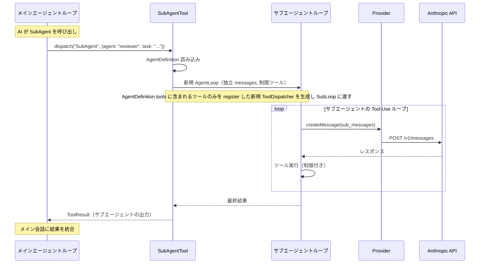
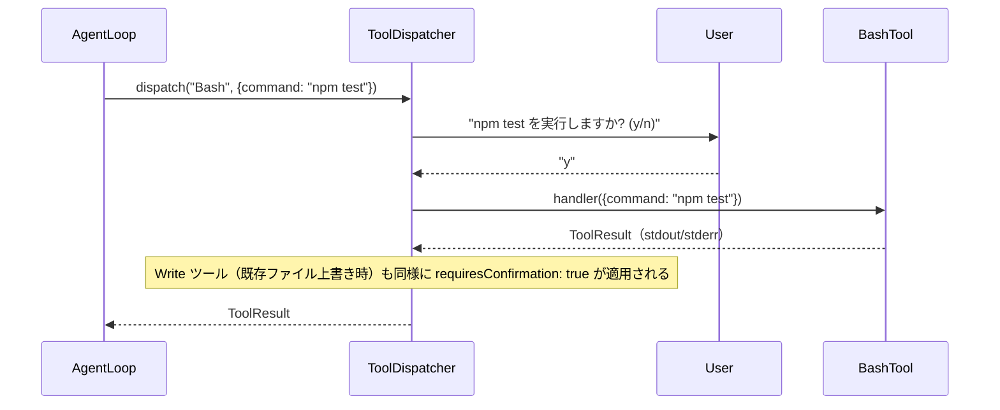
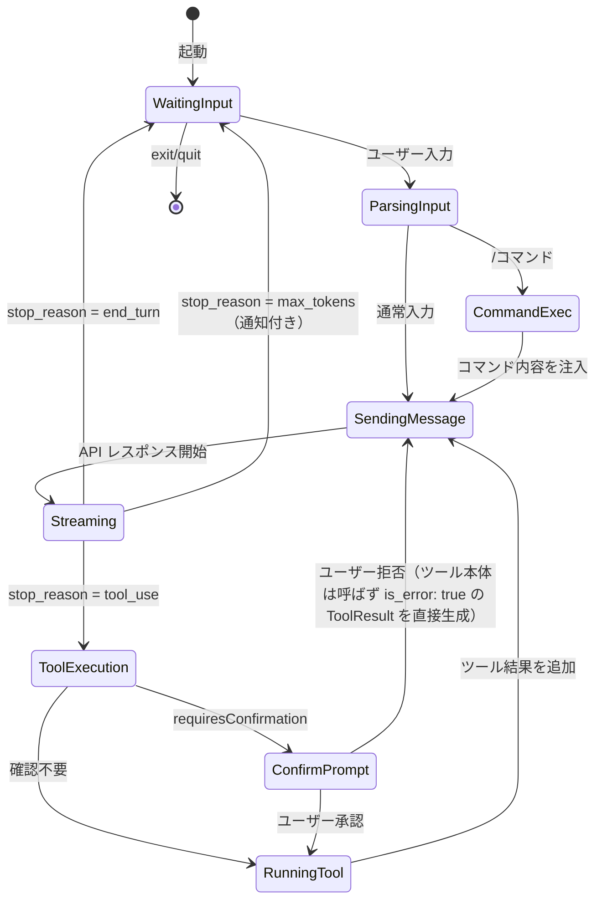

# 機能設計書 (Functional Design Document)

## システム構成図



## 技術スタック

| 分類 | 技術 | 選定理由 |
|------|------|----------|
| 言語 | TypeScript (strict mode) | 型安全性とツール定義の明確化 |
| ランタイム | Node.js 22+ | ESM ネイティブ、最新 API 対応 |
| AI SDK | @anthropic-ai/sdk | Claude API 公式 SDK、ストリーミング対応 |
| CLI 入力 | node:readline/promises | 外部依存なし、非同期対応 |
| 出力装飾 | chalk v5 | ESM 対応、カラー出力 |
| Markdown | marked + marked-terminal | ターミナル向け Markdown レンダリング |
| スピナー | ora | ストリーミング待機中の表示 |
| Glob | fast-glob | 高速ファイルパターンマッチング |
| diff 表示 | diff | Edit ツールの変更可視化 |
| YAML パース | yaml | コマンド/スキル/エージェントの frontmatter 解析 |
| テスト | Vitest | ESM ネイティブ、高速 |
| ビルド | tsup | TypeScript バンドル、CLI 向け |

## データモデル定義

### メッセージ（Anthropic API 形式）

```typescript
// Anthropic SDK の型を再利用
import type { MessageParam, ContentBlock, ToolUseBlock, ToolResultBlockParam } from '@anthropic-ai/sdk/resources/messages';

// 会話コンテキスト
interface ConversationContext {
  messages: MessageParam[];       // 会話履歴
  systemPrompt: string;           // システムプロンプト（CLAUDE.md 含む）
  tools: ToolDefinition[];        // 利用可能なツール定義
}
```

### ツール定義

```typescript
interface ToolDefinition {
  name: string;                                    // ツール名（例: "Read"）
  description: string;                             // ツールの説明
  input_schema: Record<string, unknown>;           // JSON Schema 形式のパラメータ定義
  handler: (input: Record<string, unknown>) => Promise<ToolResult>;  // 実行関数
  requiresConfirmation?: boolean;                  // 実行前確認が必要か
}

interface ToolResult {
  content: string;          // ツール実行結果
  is_error?: boolean;       // エラーかどうか
}
```

### コマンド定義

```typescript
interface CommandDefinition {
  name: string;             // コマンド名（ファイル名から導出）
  description: string;      // frontmatter の description
  allowedTools?: string[];  // frontmatter の allowed-tools
  body: string;             // Markdown 本文（手順書）
  filePath: string;         // 元ファイルのパス
}
```

### スキル定義

```typescript
interface SkillDefinition {
  name: string;             // スキル名（ディレクトリ名から導出）
  description: string;      // frontmatter の description
  guide: string;            // SKILL.md の本文
  template?: string;        // template.md の内容（存在する場合）。additionalFiles には含まない
  additionalFiles: Map<string, string>;  // キー: ファイル名（相対パスではなくファイル名のみ）。template.md と SKILL.md を除くその他のファイル
  dirPath: string;          // スキルディレクトリのパス
}
```

### サブエージェント定義

```typescript
interface AgentDefinition {
  name: string;             // エージェント名
  description: string;      // frontmatter の description
  tools: string[];          // 使用可能ツール名の配列
  model?: string;           // 使用モデル（オプション）
  instructions: string;     // Markdown 本文（指示書）
  filePath: string;         // 元ファイルのパス
}
```

### ツール入力スキーマ

```typescript
// Read ツール
interface ReadToolInput {
  file_path: string;        // 読み込むファイルのパス
  offset?: number;          // 開始行（1始まり）
  limit?: number;           // 読み込む行数（デフォルト: 2000）
}
// バイナリ判定: ファイル内に null バイト（\x00）が含まれる場合はバイナリとみなし、
// "バイナリファイルのため読み取りをスキップしました" を返却する

// Write ツール
interface WriteToolInput {
  file_path: string;        // 書き込み先ファイルパス
  content: string;          // 書き込む内容
}
// 動作: 親ディレクトリが存在しない場合は自動作成する（mkdir -p 相当）
// 既存ファイル上書き時は requiresConfirmation: true で確認プロンプトを表示する
// 新規ファイル作成時は確認なし。完了後は "ファイルパス (N lines)" 形式で返却する

// Edit ツール
interface EditToolInput {
  file_path: string;        // 編集対象ファイルのパス
  old_string: string;       // 置換対象の文字列（完全一致）
  new_string: string;       // 置換後の文字列
}
// 制約: old_string が見つからない場合、または複数箇所にマッチする場合は
// is_error: true で AI に返却する（上書きは行わない）

// Bash ツール
interface BashToolInput {
  command: string;          // 実行するシェルコマンド
  timeout?: number;         // タイムアウト秒数（デフォルト: 120 秒。AppConfig.timeout で変更可能）
}

// Glob ツール
interface GlobToolInput {
  pattern: string;          // glob パターン
  path?: string;            // 検索ディレクトリ（デフォルト: cwd）
}
// デフォルト除外: node_modules/, .git/, dist/

// Grep ツール（context_lines のデフォルト: 2 行）
interface GrepToolInput {
  pattern: string;          // 正規表現パターン
  path?: string;            // 検索ディレクトリ（デフォルト: cwd）
  glob?: string;            // 対象ファイルの glob パターン
  context_lines?: number;   // 前後に表示するコンテキスト行数（デフォルト: 2）
}
// バイナリ判定: ReadToolInput と同様に null バイト（\x00）が含まれるファイルをスキップ
// デフォルト除外: node_modules/, .git/

// Skill ツール
interface SkillToolInput {
  name: string;             // スキル名
}

// SubAgent ツール
interface SubAgentToolInput {
  agent: string;            // エージェント名（.agents/[name].md）
  task: string;             // 委譲するタスクの内容
}
```

### 設定

```typescript
interface AppConfig {
  model: string;            // デフォルト: 空文字（未指定時はプロバイダーのデフォルトモデルを使用）
  maxTokens: number;        // デフォルト: 8192
  timeout: number;          // Bash タイムアウト秒数、デフォルト: 120
  theme: 'default' | 'dark' | 'light';  // 配色テーマ（将来拡張可能）
  provider?: ProviderName;  // 未指定時は環境変数から自動検出（優先順: ANTHROPIC > GEMINI > GROQ > OPENROUTER）
}

type ProviderName = 'anthropic' | 'gemini' | 'groq' | 'openrouter';

// ProviderFactory の戻り値
interface ProviderInfo {
  provider: Provider;
  name: ProviderName;
}
```

### 会話履歴

```typescript
interface ConversationRecord {
  id: string;               // UUID
  summary: string;          // 最初のユーザーメッセージ（先頭 100 文字で切り詰め）
  messages: MessageParam[];
  createdAt: string;        // ISO 8601
  updatedAt: string;        // ISO 8601
}
```

## コンポーネント設計

### REPL（入力ループ）

**責務**:
- CLI 引数の解析（`--resume`, `--list`, `--debug`）
- ユーザー入力の受付と表示
- `/` プレフィックスによるコマンド判定
- 特殊入力（`exit`, `quit`, `Ctrl+C`）の処理
- 空入力の無視

```typescript
interface ReplOptions {
  resumeId?: string;          // --resume [id] で指定する会話 ID
  listConversations?: boolean; // --list フラグ
  debug?: boolean;            // --debug フラグ
}

class Repl {
  constructor(options: ReplOptions);
  start(): Promise<void>;                    // REPL ループ開始（listConversations: true の場合は会話一覧を表示して即終了）
  private handleInput(input: string): Promise<void>;  // 入力処理の振り分け
  // Ctrl+C 中断: Repl が AbortController を所有し、handleInterrupt() で abort() を呼ぶ。
  // AgentLoop.run() には signal を渡し、processStream() 内で検知してストリームを中断する。
  private handleInterrupt(): void;           // Ctrl+C 処理
}
```

**依存関係**: CommandLoader, AgentLoop, ConversationStore

### コマンドローダー

**責務**:
- `.commands/` ディレクトリからコマンド定義を読み込み
- YAML frontmatter の解析
- `/コマンド名` の解決と実行
- `allowedTools` フィールドは現在宣言のみ保持し、ツール使用制限は行わない（将来の拡張ポイント）

```typescript
class CommandLoader {
  // 遅延読み込み: 初回 /コマンド名 解決時に REPL から呼び出す。起動時には呼び出さない。
  // dirs 例: ['~/.claude/commands/', '.commands/']（グローバル + プロジェクトローカル）
  loadCommands(dirs: string[]): Promise<void>;         // コマンド定義読み込み
  resolve(input: string): CommandDefinition | null;    // コマンド名を解決（/help は null を返す）
  listCommands(): CommandDefinition[];                 // コマンド一覧
  formatHelp(): string;                                // /help 用のフォーマット済み文字列
  isBuiltinCommand(name: string): boolean;             // 'help' 等の組み込みコマンドを判定
}
```

**配置先**: `src/loaders/command-loader.ts`
**依存関係**: なし（ファイルシステムのみ）

### スキルローダー

**責務**:
- `.skills/` ディレクトリからスキル定義を読み込み
- SKILL.md + template.md + 追加ファイルのバンドル
- `Skill('name')` 呼び出し時のコンテキスト注入

```typescript
class SkillLoader {
  // 遅延読み込み: Skill('name') 呼び出し時に初めてファイルを読み込む（起動時には呼び出さない）
  // dirs 例: ['~/.claude/skills/', '.skills/']（グローバル + プロジェクトローカル）
  loadSkills(dirs: string[]): Promise<void>;           // スキル定義読み込み
  resolve(name: string): SkillDefinition | null;       // スキル名を解決
  listSkills(): SkillDefinition[];                     // スキル一覧（Skill('name') 失敗時のサジェスト、将来の /help 拡張用途）
}
```

**配置先**: `src/loaders/skill-loader.ts`
**依存関係**: なし（ファイルシステムのみ）

### エージェントローダー

**責務**:
- `.agents/` ディレクトリからエージェント定義を読み込み
- YAML frontmatter（name, description, tools, model）と Markdown 本文のパース
- `SubAgent(name)` 呼び出し時のエージェント定義解決

```typescript
class AgentLoader {
  // 遅延読み込み: SubAgent ツール呼び出し時に初めてファイルを読み込む（起動時には呼び出さない）
  // dirs 例: ['~/.claude/agents/', '.agents/']（グローバル + プロジェクトローカル）
  loadAgents(dirs: string[]): Promise<void>;        // エージェント定義読み込み
  resolve(name: string): AgentDefinition | null;    // エージェント名を解決
  listAgents(): AgentDefinition[];                  // エージェント一覧（SubAgent 名解決失敗時のサジェスト、将来の /help 拡張用途）
  // CommandLoader と異なりビルトインエージェントは存在しないため isBuiltin 相当メソッドは持たない
}
```

**配置先**: `src/loaders/agent-loader.ts`
**依存関係**: なし（ファイルシステムのみ）

### エージェントループ

**責務**:
- Anthropic API へのメッセージ送信
- ストリーミングレスポンスの処理
- `tool_use` → ツール実行 → `tool_result` → 再呼び出しのループ
- `end_turn` でのループ終了

```typescript
class AgentLoop {
  // onToken コールバック経由で出力。AgentLoop 自体は console に直接書き込まない（レイヤールール遵守）
  constructor(options: { onToken?: (token: string) => void });
  // 内部で tool_use → tool_result ループを end_turn or max_tokens まで自律的に繰り返す。
  // context.messages は run() 呼び出し前の状態を渡せばよく、呼び出し元での更新は不要。
  // 戻り値: 最終ターン（end_turn）の AI テキスト応答（ContentBlock の text ブロックを順に連結した文字列）。
  // ストリーミング中の出力は onToken コールバック経由で呼び出し元（Repl）に委譲する。
  run(userMessage: string, context: ConversationContext): Promise<string>;
  private processStream(stream: Stream): Promise<ContentBlock[]>;
  private handleToolUse(toolUse: ToolUseBlock): Promise<ToolResultBlockParam>;
  // Ctrl+C 中断: Repl.handleInterrupt() から AbortController.abort() を呼び出し、
  // processStream() 内でシグナルを検知してストリームを中断する
}
```

**依存関係**: Provider, ToolDispatcher

### ツールディスパッチャー

**責務**:
- ツール名からハンドラーへのルーティング
- 確認プロンプトの表示（requiresConfirmation が true の場合）
- ツール実行結果の返却

```typescript
class ToolDispatcher {
  // onConfirm コールバック経由で確認プロンプトを Repl に委譲（レイヤールール遵守）
  constructor(options: { onConfirm?: (message: string) => Promise<boolean> });
  register(tool: ToolDefinition): void;                // ツール登録
  dispatch(name: string, input: Record<string, unknown>): Promise<ToolResult>;
  // 未登録ツール名の場合は throw せず is_error: true の ToolResult を返却する
  // 確認拒否時は { content: "ユーザーが実行を拒否しました", is_error: true } を返却する
  getToolSchemas(): ToolSchema[];                      // API に送るスキーマ一覧
}

// API に送信するツールスキーマ（Anthropic Tool Use 形式）
// ToolDefinition から handler と requiresConfirmation を除いた API 送信専用サブセット
interface ToolSchema {
  name: string;                                        // ツール名
  description: string;                                 // ツールの説明
  input_schema: Record<string, unknown>;               // JSON Schema 形式
}
```

**依存関係**: 各ツール実装

### Skill ツール

**責務**:
- `SkillLoader.resolve()` を呼び出してスキル定義を取得
- guide 本文・template.md（存在する場合）・additionalFiles の内容を結合して ToolResult を生成する。結合順: (1) guide → (2) template.md → (3) additionalFiles の Map エントリを挿入順で連結

**実装形式**: `ToolDefinition` の `handler` 関数として実装（クラスではなく関数）
**配置先**: `src/tools/skill.ts`
**依存関係**: SkillLoader

### SubAgent ツール

**責務**:
- `AgentLoader.resolve()` を呼び出してエージェント定義を取得
- `AgentDefinition.tools` に含まれるツールのみを register した新規 `ToolDispatcher` を生成
- 独立した messages 配列と制限付き `ToolDispatcher` で新規 `AgentLoop` を起動
- サブエージェントの最終結果を `ToolResult` として返却
- サブエージェント実行中はスピナーのみ表示し、トークンは親の `onToken` に渡さない（完了後に結果テキストのみ返却）

**実装形式**: `ToolDefinition` の `handler` 関数として実装（クラスではなく関数）
**配置先**: `src/tools/sub-agent.ts`
**依存関係**: AgentLoader, AgentLoop, ToolDispatcher

### システムプロンプト管理

**責務**:
- 基本システムプロンプトの生成
- CLAUDE.md の読み込みと注入
- コマンド/スキル実行時のコンテキスト追加

```typescript
class SystemPromptManager {
  // 組み立て順: (1) 基本システムプロンプト → (2) CLAUDE.md の内容 → (3) command.body または skill.guide
  // コマンド実行時: options.command を渡してシステムプロンプトに注入（UC-03）
  // スキル呼び出し: UC-04 ではツール結果として messages に追加する方式を採用。
  //   skill オプションは将来的にシステムプロンプト注入方式へ切り替える場合の拡張点として予約
  //   現在は未使用。渡されても無視する。型定義のみ保持
  build(options?: { command?: CommandDefinition; skill?: SkillDefinition }): string;
  private loadClaudeMd(): string | null;
}
```

**依存関係**: なし（ファイルシステムのみ）

### API Provider

**責務**:
- LLM API への通信（Anthropic / Gemini / Groq / OpenRouter）
- レスポンスを汎用型 `LLMResponse` に変換して返却

```typescript
interface Provider {
  createMessage(params: CreateMessageParams): Promise<LLMResponse>;
  readonly modelId: string;
}

interface CreateMessageParams {
  messages: MessageParam[];
  system: string;
  tools: ToolSchema[];
  maxTokens: number;
}
```

**プロバイダー実装**:

| クラス | SDK | 配置先 |
|--------|-----|--------|
| `AnthropicProvider` | `@anthropic-ai/sdk` | `src/providers/anthropic.ts` |
| `GeminiProvider` | `@google/genai` | `src/providers/gemini.ts` |
| `OpenAICompatibleProvider` | `openai` | `src/providers/openai-compatible.ts` |

### Provider ファクトリー

**責務**:
- `config.provider` 指定時はそのプロバイダーを使用
- 未指定時は環境変数の優先順位（ANTHROPIC > GEMINI > GROQ > OPENROUTER）で自動選択
- `ProviderInfo`（`Provider` + `ProviderName`）を返す

```typescript
class ProviderFactory {
  static create(config: AppConfig): ProviderInfo;
  // config.provider が未設定の場合は環境変数から自動検出（ANTHROPIC > GEMINI > GROQ > OPENROUTER）
  // 該当プロバイダーの環境変数から API キーを取得
  // 環境変数未設定時は Error をスロー。呼び出し元（src/index.ts）でキャッチして終了メッセージ表示後 process.exit(1)
}
```

**配置先**: `src/providers/provider-factory.ts`

**依存関係**: AppConfig, Provider 各実装

### 会話履歴ストア

**責務**:
- 会話の保存・復元・一覧表示
- ターン完了ごとの自動保存（E-01 実装後）

```typescript
class ConversationStore {
  // 保存先: ~/.claude-code-like/conversations/[uuid].json
  constructor(baseDir?: string);  // デフォルト: ~/.claude-code-like/conversations/
  save(record: ConversationRecord): Promise<void>;
  // updatedAt が最新のレコードを返す（--resume id 省略時に使用）
  // 会話が 0 件の場合は null を返す。Repl は null の場合は新規会話として開始する
  loadLatest(): Promise<ConversationRecord | null>;
  loadById(id: string): Promise<ConversationRecord | null>;
  // updatedAt 降順で返却（--list 表示用）
  list(): Promise<Pick<ConversationRecord, 'id' | 'summary' | 'createdAt' | 'updatedAt'>[]>;
}
```

**復元フロー（`--resume`）**: Repl が `ConversationStore.loadById()` で `ConversationRecord` を取得し、その `messages` 配列を `ConversationContext.messages` に設定して `AgentLoop` に渡す。復元責務は Repl（CLI レイヤー）に属する。

**保存タイミング**:
- 正常終了時: `exit` / `quit` 処理中に保存
- ターン完了ごと: `stop_reason === "end_turn"` 後に上書き保存
- 異常終了時: `process.on('SIGINT')` / `process.on('SIGTERM')` でシグナルハンドラーを登録し、受信時に即時保存
  - Ctrl+C は `Repl.handleInterrupt()`（AgentLoop 中断）と `process.on('SIGINT')`（保存）の両方が発火する
  - AgentLoop 外（WaitingInput 状態）での Ctrl+C は `process.on('SIGINT')` のみ発火して終了する

**保存責務**: Repl（CLI レイヤー）に属する。`AgentLoop.run()` の完了後に Repl が `ConversationStore.save()` を呼び出す。

**配置先**: `src/agent/conversation-store.ts`
**依存関係**: なし（ファイルシステムのみ）

## ユースケース設計

### UC-01: 通常の対話フロー



### UC-02: ツール使用フロー



### UC-03: コマンド実行フロー



### UC-04: スキル呼び出しフロー



### UC-05: サブエージェント実行フロー



### UC-06: 確認プロンプト付きツール実行フロー



## 状態遷移図

### エージェントループの状態



## UI 設計（CLI 出力）

### カラーコーディング

| 要素 | 色 | 用途 |
|------|-----|------|
| ユーザープロンプト | 緑 | `> ` プレフィックス |
| AI 応答 | 白（デフォルト） | Markdown レンダリング |
| ツール名 | シアン | `[Read] src/index.ts` |
| ツール結果 | グレー | ツール出力の表示 |
| エラー | 赤 | エラーメッセージ |
| 確認プロンプト | 黄 | `実行しますか? (y/n)` |
| diff 追加行 | 緑 | `+ 追加された行` |
| diff 削除行 | 赤 | `- 削除された行` |

### 表示フォーマット

```
> ユーザーの入力

[Read] src/index.ts (42 lines)
[Edit] src/index.ts (3 lines changed)
[Bash] npm test

AI の応答（Markdown レンダリング）

>
```

## ファイル構造

### アプリケーションデータ

```
~/.claude-code-like/
├── config.json              # 設定ファイル（E-02）
├── conversations/           # 会話履歴（E-01）
│   ├── [uuid].json
│   └── ...
└── logs/                    # API 通信ログ（E-05）
    └── [YYYY-MM-DD].jsonl   # 日別ログ（1リクエスト1行、JSONL 形式）
```

### グローバル拡張ファイル

```
~/.claude/
├── commands/               # グローバルコマンド定義（全プロジェクト共通）
├── skills/                 # グローバルスキル定義（全プロジェクト共通）
└── agents/                 # グローバルエージェント定義（全プロジェクト共通）
```

### プロジェクト側の拡張ファイル

```
[project-root]/
├── CLAUDE.md                # プロジェクト固有プロンプト（C-08）
├── .commands/               # コマンド定義（C-09）
│   ├── add-feature.md
│   └── setup-project.md
├── .skills/                 # スキル定義（C-10）
│   └── code-review/
│       ├── SKILL.md
│       ├── template.md
│       └── guide.md
└── .agents/                 # サブエージェント定義（C-11）
    ├── developer.md
    └── reviewer.md
```

### YAML Frontmatter 形式

**コマンド（`.commands/*.md`）**:
```yaml
---
description: 新機能を実装する
allowed-tools: Read, Write, Edit, Bash, Glob, Grep
---

# コマンドの手順書（Markdown）
```

**スキル（`.skills/[name]/SKILL.md`）**:
```yaml
---
name: code-review
description: コードレビューのチェックリスト
---

# スキルのガイド（Markdown）
```

**サブエージェント（`.agents/[name].md`）**:
```yaml
---
name: reviewer
description: コードレビューを行うエージェント
tools: Read, Glob, Grep
model: sonnet
---

# エージェントへの指示（Markdown）
```

## セキュリティ考慮事項

| 観点 | 対策 |
|------|------|
| API キー管理 | 環境変数（`ANTHROPIC_API_KEY`, `GEMINI_API_KEY`, `GROQ_API_KEY`, `OPENROUTER_API_KEY`）から取得。ファイル保存・ログ出力時はマスキング |
| Bash ツール | 実行前に必ずユーザー確認プロンプトを表示 |
| Write ツール | 既存ファイル上書き時にユーザー確認プロンプトを表示 |
| 通信先制限 | 選択されたプロバイダーの API エンドポイントのみに接続 |
| テレメトリ | 一切の外部送信を行わない |
| 通信ログ | `--debug` でローカルに記録。API キーはマスキング |
| サブエージェント | `tools` フィールドで使用可能ツールを制限（最小権限の原則） |

## エラーハンドリング

### エラーの分類

| エラー種別 | 処理 | ユーザーへの表示 |
|-----------|------|-----------------|
| API キー未設定 | 起動時に検出、即座に終了 | "API キーが設定されていません。以下のいずれかの環境変数を設定してください: ..." |
| API レート制限 (429) | リトライなし。エラーメッセージを表示して REPL に戻る | "API レート制限に達しました。しばらく待ってから再試行してください" |
| API 認証エラー (401) | 即座に終了 | "API キーが無効です。API キーを確認してください" |
| ファイル不在 | ツール結果としてエラーを返却 | is_error: true で AI に通知 |
| Bash タイムアウト | プロセスを kill | is_error: true, "コマンドがタイムアウトしました (120秒)" |
| コマンド未発見 | エラーメッセージを表示 | "コマンド '[name]' が見つかりません。/help で一覧を確認してください" |
| スキル未発見 | ツール結果としてエラーを返却 | is_error: true, "スキル '[name]' が見つかりません" |
| エージェント未発見 | ツール結果としてエラーを返却 | is_error: true, "エージェント '[name]' が見つかりません" |
| ツール未登録 | ToolResult として is_error: true を返却 | is_error: true, "ツール '[name]' は存在しません" |
| ネットワークエラー | エラーメッセージを表示 | "API に接続できません。ネットワーク接続を確認してください" |
| max_tokens 到達 | エージェントループを終了し REPL に戻る | "応答が最大トークン数に達しました。続きが必要な場合は入力してください" |

## パフォーマンス最適化

- **ストリーミング表示**: `stream` パラメータを使い、最初のトークンを即座に表示
- **遅延読み込み**: コマンド/スキル/エージェント定義は `/コマンド名` 実行時または `Skill('name')` 呼び出し時に初めてファイルを読み込む（起動時にはロードしない）。これにより CLI 起動の初期化処理を 1 秒以内に収める（architecture.md のパフォーマンス要件を参照）
- **ログ非同期書き込み**: `--debug` 時の通信ログは非同期でファイルに書き込み、メイン処理をブロックしない

## テスト戦略

### ユニットテスト

| 指標 | 目標値 | 計測コマンド |
|------|--------|-------------|
| コードカバレッジ | ツール単体テスト 80% 以上 | `npm run test:coverage` |
| テスト pass 率 | 各ツールハンドラーの正常系テストケースで 95% 以上が成功 | `vitest run` |

- 各ツールの handler 関数（Read, Write, Edit, Bash, Glob, Grep, Skill）
- CommandLoader の frontmatter 解析
- SkillLoader のファイル読み込み
- SystemPromptManager のプロンプト生成
- ToolDispatcher のツール登録と dispatch ルーティング
- ConversationStore の保存・復元・一覧取得
- YAML frontmatter パースのエッジケース

### 統合テスト

**成功基準**: 全統合テストがパスすること（カバレッジ目標なし、シナリオ網羅を優先）

- AgentLoop: モック Provider を使った tool_use → tool_result ループ
- コマンド実行: ファイルシステム上のコマンド定義から実行まで
- サブエージェント: メインループからサブエージェント起動と結果返却

### E2E テスト（モック Provider を使用。実際の Anthropic API は呼び出さない）

**成功基準**: 定義済みシナリオが全てパスすること（最低 2 シナリオ: ツール未使用の基本会話フローとツール使用のファイル操作フロー。ツールあり/なしの両パスを網羅することが MVP の最小カバレッジ）

- CLI 起動 → 質問入力 → AI 応答の一連のフロー（`basic-conversation.test.ts`）
- ファイル操作（Read → Edit → 確認）の一連のフロー（`file-operations.test.ts`）
