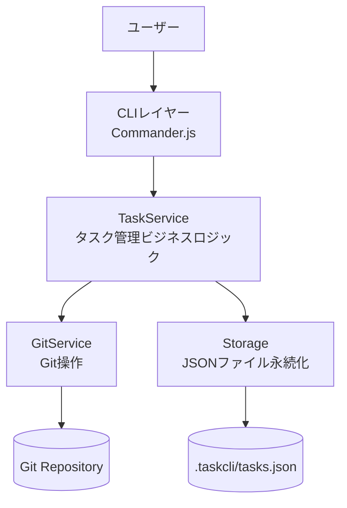
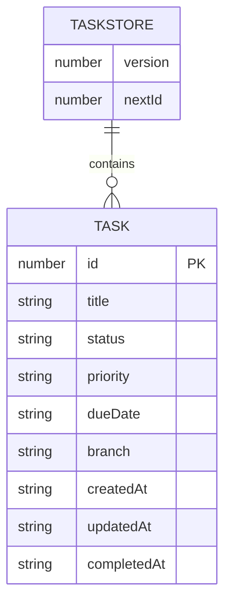
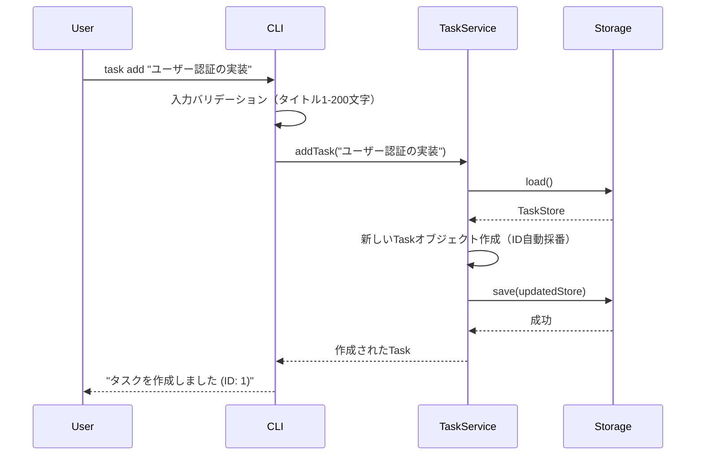
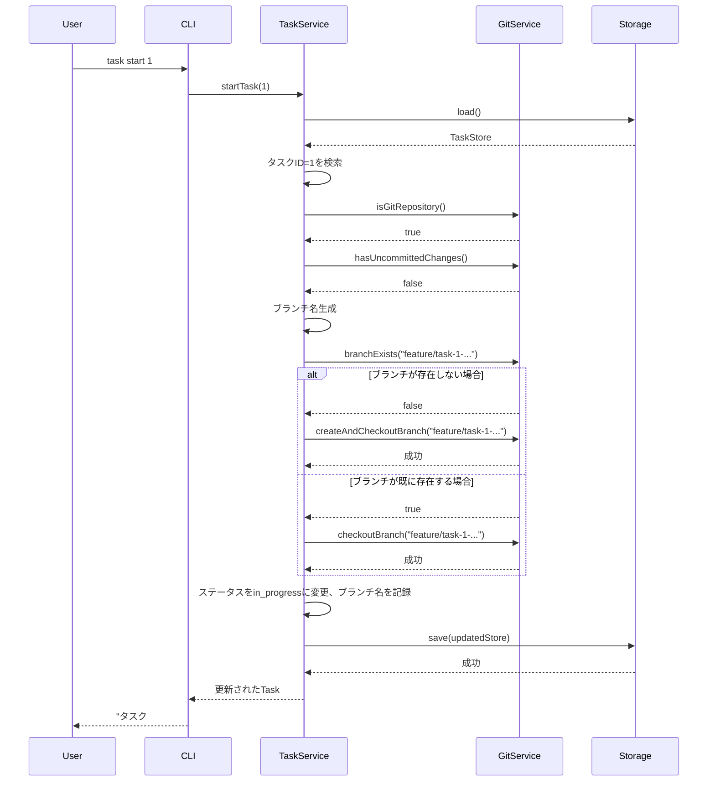
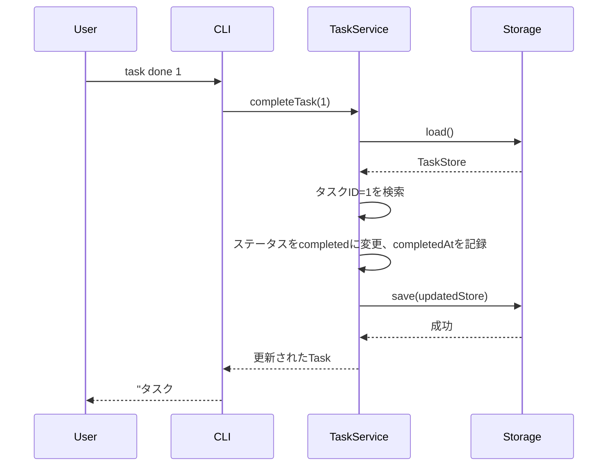
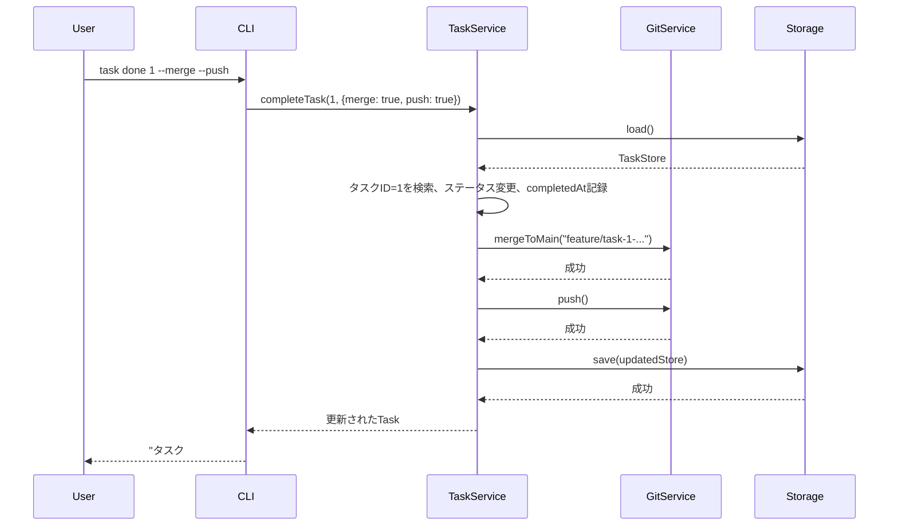
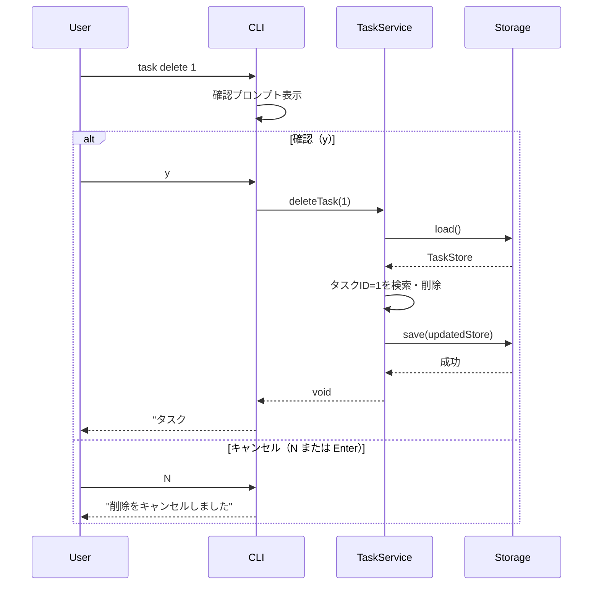
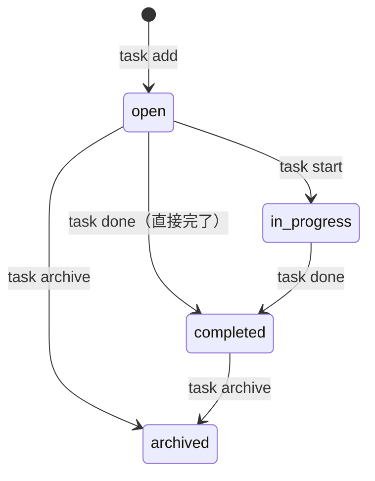

# 機能設計書 (Functional Design Document)

## システム構成図



## 技術スタック

| 分類 | 技術 | 選定理由 |
|------|------|----------|
| 言語 | TypeScript 5.x | 型安全性による開発効率向上、PRDで定義した型をそのまま実装に利用可能 |
| ランタイム | Node.js 20.x LTS以上 | LTS版で安定性を確保、クロスプラットフォーム対応 |
| CLIフレームワーク | Commander.js | 学習コストが低く、サブコマンド・オプションの定義が簡潔。npm週間DL数が業界トップクラス |
| Git操作 | simple-git | Node.jsからのGit操作を安全に抽象化。Promise対応でasync/awaitが使える |
| テーブル表示 | cli-table3 | カラム幅の自動調整、色付き出力対応 |
| 色付き出力 | chalk | ターミナルの色付き文字列出力のデファクトスタンダード |
| テスト | Vitest | TypeScriptネイティブ対応、高速実行、Jest互換API |
| ビルド | tsc (TypeScriptコンパイラ) | TypeScript標準のコンパイラでJavaScriptに変換。追加設定不要 |

## データモデル定義

### エンティティ: Task

```typescript
interface Task {
  id: number;                  // 自動採番の連番ID（1から開始）
  title: string;               // タスクタイトル（1〜200文字）
  status: TaskStatus;          // タスクのステータス
  priority: TaskPriority;      // 優先度（P1で実装。MVPではデフォルト値のみ使用）
  dueDate: string | null;      // 期限（ISO 8601形式 "YYYY-MM-DD"、未設定はnull。P1で実装）
  branch: string | null;       // 関連Gitブランチ名（未作成はnull）
  createdAt: string;           // 作成日時（ISO 8601形式）
  updatedAt: string;           // 更新日時（ISO 8601形式）
  completedAt: string | null;  // 完了日時（ISO 8601形式、未完了はnull）
}

type TaskStatus = "open" | "in_progress" | "completed" | "archived";

type TaskPriority = "high" | "medium" | "low";
```

**制約**:
- `id`は`.taskcli/tasks.json`内で一意。`nextId`フィールドで次に発行するIDを管理する
- `title`は1文字以上200文字以下。空文字は許可しない
- `status`のデフォルト値は`"open"`
- `priority`のデフォルト値は`"medium"`
- `branch`は`task start`実行時に自動設定される
- `completedAt`は`task done`実行時に自動設定される

### データストア構造

```typescript
interface TaskStore {
  version: 1;                  // スキーマバージョン（将来の移行用）
  nextId: number;              // 次に発行するタスクID
  tasks: Task[];               // タスクの配列
}
```

### ER図



## コンポーネント設計

### CLIレイヤー（commands/）

**責務**:
- Commander.jsによるコマンド・オプションの定義
- ユーザー入力のバリデーション
- TaskServiceの呼び出し
- 結果のフォーマットと表示

```typescript
// 各コマンドは個別のファイルに定義し、Commander.jsのprogramに登録する
// commands/add.ts
function registerAddCommand(program: Command): void;

// commands/list.ts
function registerListCommand(program: Command): void;

// commands/show.ts
function registerShowCommand(program: Command): void;

// commands/start.ts
function registerStartCommand(program: Command): void;

// commands/done.ts
function registerDoneCommand(program: Command): void;

// commands/delete.ts
function registerDeleteCommand(program: Command): void;

// commands/archive.ts
function registerArchiveCommand(program: Command): void;

// commands/search.ts（P1）
function registerSearchCommand(program: Command): void;
```

### サービスレイヤー（services/）

#### TaskService

**責務**:
- タスクのCRUD操作のビジネスロジック
- ステータス遷移の管理
- Storage/GitServiceの協調

```typescript
class TaskService {
  constructor(
    private storage: Storage,
    private gitService: GitService
  ) {}

  // タスクを作成する
  addTask(title: string, options?: { priority?: TaskPriority; dueDate?: string }): Task;

  // タスク一覧を取得する（デフォルトはID昇順でソート）
  listTasks(options?: { status?: TaskStatus; all?: boolean; sort?: "priority" | "due" }): Task[];

  // タスクの詳細を取得する
  getTask(id: number): Task;

  // タスクを開始する（ステータス変更 + ブランチ作成）
  startTask(id: number): Task;

  // タスクを完了する
  completeTask(id: number, options?: { merge?: boolean; push?: boolean }): Task;

  // タスクを削除する
  deleteTask(id: number): void;

  // タスクをアーカイブする
  archiveTask(id: number): Task;

  // タスクを更新する（P1）
  updateTask(id: number, updates: { title?: string; priority?: TaskPriority; dueDate?: string }): Task;

  // タスクを検索する（P1）
  searchTasks(keyword: string): Task[];
}
```

#### GitService

**責務**:
- Gitリポジトリの状態確認
- ブランチの作成・切り替え
- マージ・プッシュ操作

```typescript
class GitService {
  // Gitリポジトリ内で実行されているか確認する
  isGitRepository(): Promise<boolean>;

  // ブランチを作成して切り替える
  createAndCheckoutBranch(branchName: string): Promise<void>;

  // 指定ブランチにチェックアウトする
  checkoutBranch(branchName: string): Promise<void>;

  // ブランチが存在するか確認する
  branchExists(branchName: string): Promise<boolean>;

  // ワーキングツリーに未コミットの変更があるか確認する
  hasUncommittedChanges(): Promise<boolean>;

  // 現在のブランチをmainにマージする
  mergeToMain(branchName: string): Promise<void>;

  // リモートにプッシュする
  push(): Promise<void>;
}
```

### データレイヤー（services/）

#### Storage

**責務**:
- `.taskcli/tasks.json`の読み書き
- アトミックな書き込み（一時ファイル→リネーム）
- ディレクトリの自動作成

```typescript
class Storage {
  constructor(private basePath: string) {}

  // タスクストアを読み込む（ファイルが無い場合は初期データを返す）
  // 同期I/Oを使用（CLIはプロセスの寿命が短いため非同期オーバーヘッドを避ける。詳細は「パフォーマンス最適化」参照）
  load(): TaskStore;

  // タスクストアを保存する（アトミック書き込み）
  save(store: TaskStore): void;

  // .taskcliディレクトリが存在するか確認する
  exists(): boolean;

  // .taskcliディレクトリを初期化する
  initialize(): void;
}
```

**basePathの決定方法**:
- `basePath`はCLIエントリポイントで`process.cwd()`から取得し、Storageのコンストラクタに渡す
- `.taskcli/`ディレクトリは`basePath`直下に作成される（例: `/home/user/project/.taskcli/tasks.json`）

**アトミック書き込みの実装方針**:
1. 一時ファイル `.taskcli/tasks.json.tmp` にデータを書き込む
2. `fs.renameSync()` で一時ファイルを `tasks.json` にリネーム
3. リネームはOSレベルでアトミックなため、書き込み中のクラッシュでもデータが破損しない

### ユーティリティ（utils/）

#### ブランチ名生成

```typescript
// タスクのタイトルからブランチ名を生成する
function generateBranchName(taskId: number, title: string): string;
// 例:
//   generateBranchName(1, "Add user authentication")
//    → "feature/task-1-add-user-authentication"
//   generateBranchName(2, "ユーザー認証機能の実装")
//    → "feature/task-2"  （日本語のみの場合、slugは空になる）
//   generateBranchName(3, "Fix bug123 in login")
//    → "feature/task-3-fix-bug123-in-login"
```

**変換ルール**:
1. タイトルを小文字に変換する
2. 英数字とハイフン以外の文字を除去する（日本語等の非ASCII文字は省略される）
3. 連続するハイフンを1つにまとめる
4. 先頭・末尾のハイフンを除去する
5. 最大50文字に切り詰める
6. `feature/task-{id}-{slug}` 形式で返す
7. slugが空の場合は `feature/task-{id}` とする（全角文字のみのタイトルの場合など）

#### テーブル表示フォーマッター

```typescript
// タスク一覧をテーブル形式の文字列に変換する
function formatTaskTable(tasks: Task[]): string;

// タスクの詳細をフォーマットされた文字列に変換する
function formatTaskDetail(task: Task): string;
```

## ユースケース図

### UC1: タスク追加 (`task add`)



### UC2: タスク開始 (`task start`)



### UC3: タスク完了 (`task done`)

**基本フロー**（`task done <id>`）:



**Git操作付きフロー**（`task done <id> --merge --push`、P1）:



### UC4: タスク削除 (`task delete`)



## ステータス遷移図



**許可される遷移と禁止される遷移**:

| 現在のステータス | 遷移可能なステータス | 禁止される遷移先 |
|----------------|-------------------|-----------------|
| `open` | `in_progress`, `completed`, `archived` | なし |
| `in_progress` | `completed` | `open`, `archived` |
| `completed` | `archived` | `open`, `in_progress` |
| `archived` | なし（終了状態） | `open`, `in_progress`, `completed` |

**禁止遷移時のエラーメッセージ例**:
- `in_progress` → `open`: 「開始済みのタスクを未着手に戻すことはできません」
- `completed` → `in_progress`: 「完了済みのタスクを再開することはできません」
- `archived` → 任意: 「アーカイブ済みのタスクはステータスを変更できません」

## UI設計

### テーブル表示（`task list`）

```
ID  Status       Title                          Branch
 1  in_progress  ユーザー認証機能の実装          feature/task-1-user-auth
 2  open         データエクスポート機能          -
 3  completed    初期セットアップ               feature/task-3-initial-setup
```

**表示項目**:
| 項目 | 説明 | フォーマット |
|------|------|-------------|
| ID | タスクID | 右寄せ数値 |
| Status | ステータス | 色付きテキスト |
| Title | タスクタイトル | 最大30文字（超過時は省略記号） |
| Branch | 関連ブランチ名 | ブランチ名またはハイフン |

### 詳細表示（`task show <id>`）

```
Task #1
─────────────────────────
Title:    ユーザー認証機能の実装
Status:   in_progress
Priority: high
Due:      2026-03-15
Branch:   feature/task-1-user-auth
Created:  2026-03-01 10:00
Updated:  2026-03-01 10:30
```

### カラーコーディング

**ステータスの色分け**:
- `open`: 白（デフォルト）
- `in_progress`: 黄
- `completed`: 緑
- `archived`: グレー

**優先度の色分け**（P1で`--sort priority`使用時）:
- `high`: 赤
- `medium`: 黄
- `low`: 青

**期限の色分け**（P1で`--due`設定時）:
- 期限超過: 赤（太字）
- 期限3日以内: 赤
- 期限7日以内: 黄
- それ以外: デフォルト

### 0件時の表示

```
タスクがありません。`task add` で最初のタスクを作成しましょう
```

### 初回実行時のガイダンス

```
TaskCLI を初期化しました (.taskcli/)

ヒント: .taskcli/ をGitで管理する場合、チームでタスクを共有できます。
管理しない場合は .gitignore に追加してください:
  echo '.taskcli/' >> .gitignore

クイックスタート:
  task add "最初のタスク"    タスクを作成
  task list                  一覧を表示
  task start 1               タスクを開始（ブランチ自動作成）
  task done 1                タスクを完了
```

## ファイル構造

### データ保存ディレクトリ

```
.taskcli/
└── tasks.json    # タスクデータ
```

### tasks.json の例

```json
{
  "version": 1,
  "nextId": 4,
  "tasks": [
    {
      "id": 1,
      "title": "ユーザー認証機能の実装",
      "status": "in_progress",
      "priority": "high",
      "dueDate": "2026-03-15",
      "branch": "feature/task-1-user-auth",
      "createdAt": "2026-03-01T10:00:00.000Z",
      "updatedAt": "2026-03-01T10:30:00.000Z",
      "completedAt": null
    },
    {
      "id": 2,
      "title": "データエクスポート機能",
      "status": "open",
      "priority": "medium",
      "dueDate": null,
      "branch": null,
      "createdAt": "2026-03-01T11:00:00.000Z",
      "updatedAt": "2026-03-01T11:00:00.000Z",
      "completedAt": null
    },
    {
      "id": 3,
      "title": "初期セットアップ",
      "status": "completed",
      "priority": "medium",
      "dueDate": null,
      "branch": "feature/task-3-initial-setup",
      "createdAt": "2026-02-28T09:00:00.000Z",
      "updatedAt": "2026-03-01T12:00:00.000Z",
      "completedAt": "2026-03-01T12:00:00.000Z"
    }
  ]
}
```

## パフォーマンス最適化

- **ファイルI/Oの最小化**: コマンド1回の実行で`load()`は1回、`save()`は最大1回に抑える
- **同期I/Oの使用**: CLIツールはプロセスの寿命が短いため、`fs.readFileSync`/`fs.writeFileSync`を使用してシンプルに実装する（非同期I/Oのオーバーヘッドを避ける）
- **Git操作の遅延実行**: Git操作が不要なコマンド（`task list`、`task show`など）ではGitServiceを呼び出さない

## セキュリティ考慮事項

- **入力値のサニタイズ**: タスクタイトルに含まれるシェル特殊文字をブランチ名に含めない（`generateBranchName`で英数字・ハイフンのみに変換）
- **ファイルパーミッション**: `.taskcli/tasks.json`は通常のファイルパーミッション（644）で作成。GitHub Token等の機密情報はMVPでは扱わない（P1で対応）
- **パストラバーサル防止**: タスクIDは数値のみ許可し、ファイルパスの組み立てに文字列IDを使用しない

## エラーハンドリング

### エラーの分類

| エラー種別 | 処理 | ユーザーへの表示 |
|-----------|------|-----------------|
| 入力バリデーションエラー | 処理を中断 | 「タイトルは1〜200文字で入力してください」 |
| タスクが見つからない | 処理を中断 | 「タスク #5 が見つかりません。`task list`で既存のタスクを確認してください」 |
| データファイル未存在 | 初期データで自動作成 | （初回実行時ガイダンスを表示） |
| データファイル破損 | 処理を中断 | 「データファイルが破損しています。.taskcli/tasks.json を確認してください」 |
| Gitリポジトリ外 | ブランチ連携をスキップ | 「Gitリポジトリが見つかりません。ブランチ連携をスキップします」 |
| 未コミット変更あり | 確認プロンプト | 「未コミットの変更があります。ブランチを切り替えますか？ (y/N)」 |
| ブランチ作成失敗 | 処理を中断 | 「ブランチの作成に失敗しました: [Gitエラーメッセージ]」 |
| マージコンフリクト | 処理を中断 | 「マージコンフリクトが発生しました。手動で解決してください」 |

### エラーメッセージの原則

すべてのエラーメッセージは以下の構造を持つ:
1. **何が起きたか**: エラーの説明
2. **どうすればよいか**: 対処方法の提示

```
エラー: タスク #5 が見つかりません
ヒント: `task list` で既存のタスクを確認してください
```

## テスト戦略

### ユニットテスト
- **TaskService**: 各メソッドのビジネスロジック（作成、ステータス遷移、バリデーション）
- **Storage**: load/saveの正常系・異常系（ファイル未存在、破損データ）
- **generateBranchName**: 各種タイトルからのブランチ名変換
- **formatTaskTable / formatTaskDetail**: 出力フォーマットの検証

### 統合テスト
- **TaskService + Storage**: タスクの作成→一覧表示→完了→削除のライフサイクル
- **TaskService + GitService**: タスク開始時のブランチ作成・チェックアウト連携

### E2Eテスト
- **基本フロー**: `task add` → `task list` → `task start` → `task done` の一連の操作
- **エラーケース**: 存在しないID指定、空タイトル、Gitリポジトリ外での実行
