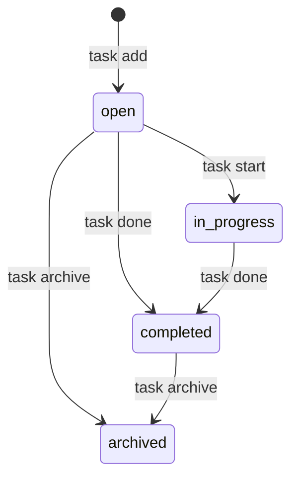

# プロジェクト用語集 (Glossary)

## 概要

このドキュメントは、TaskCLIプロジェクト内で使用される用語の定義を管理します。

**更新日**: 2026-03-01

## ドメイン用語

### タスク (Task)

**定義**: ユーザーが完了すべき作業の単位。タイトル、ステータス、優先度、期限、関連Gitブランチ、完了日時を持つ。

**説明**: TaskCLIにおける中核的なデータエンティティ。ユーザーは`task add`で作成し、`task start`で作業を開始し、`task done`で完了する。各タスクには一意の数値ID（`number`型）が自動採番される。完了時には`completedAt`フィールドに完了日時が記録される。

**関連用語**: [タスクステータス](#タスクステータス-task-status)、[タスク優先度](#タスク優先度-task-priority)、[ブランチ連携](#ブランチ連携-branch-linking)

**使用例**:
- 「タスクを追加する」: `task add "ユーザー認証の実装"` で新しいタスクを作成
- 「タスクを開始する」: `task start 1` でステータスを変更しブランチを作成

**データモデル**: `src/types/task.ts`（未実装。実装後に参照可能）

### ブランチ連携 (Branch Linking)

**定義**: タスクとGitブランチを1対1で紐付け、タスクの開始・完了操作に連動してブランチの作成・チェックアウトを自動化する機能。

**説明**: `task start <id>` 実行時に `feature/task-{id}-{slug}` 形式のブランチが自動作成される。ブランチ名はタスクのIDとタイトルから生成される。Gitリポジトリ外では自動的にスキップされる。

**関連用語**: [タスク](#タスク-task)、[スラグ](#スラグ-slug)

**使用例**:
- `task start 1` → ブランチ `feature/task-1-user-auth` が自動作成される

### スラグ (Slug)

**定義**: タスクタイトルからGitブランチ名に使用可能な形式に変換された文字列。英数字とハイフンのみで構成される。

**説明**: タイトルを小文字に変換した後、英数字・ハイフン以外の文字（日本語等の非ASCII文字を含む）を除去して生成。連続するハイフンは1つにまとめ、先頭・末尾のハイフンを除去する。最大50文字に切り詰められる。全角文字のみのタイトルの場合はスラグが空になり、`feature/task-{id}` 形式のブランチ名が生成される。

**実装箇所**: `src/utils/branch-name.ts`（未実装。実装後に参照可能）

### タスクストア (TaskStore)

**定義**: タスクデータの永続化に使用するJSONファイルのルートデータ構造。スキーマバージョン、次に発行するID、タスクの配列を保持する。

**説明**: `.taskcli/tasks.json` にJSON形式で保存される。`version`フィールドで将来のスキーマ移行に対応する。

**関連用語**: [タスク](#タスク-task)、[アトミック書き込み](#アトミック書き込み-atomic-write)

**データモデル**: `src/types/task.ts`（未実装。実装後に参照可能）

## ステータス・状態

### タスクステータス (Task Status)

**定義**: タスクの進行状態を示す列挙型。4つの状態を持つ。

**取りうる値**:

| ステータス | 意味 | 遷移条件 | 次の状態 |
|----------|------|---------|---------|
| `open` | 新規・未着手 | タスク作成時の初期状態 | `in_progress`, `completed`, `archived` |
| `in_progress` | 作業中 | `task start` でタスクを開始 | `completed` |
| `completed` | 完了 | `task done` でタスクを完了 | `archived` |
| `archived` | アーカイブ済み | `task archive` でアーカイブ | なし（終了状態） |

**禁止される遷移**: `in_progress` → `open`/`archived`、`completed` → `open`/`in_progress`、`archived` → 任意。詳細は[機能設計書のステータス遷移図](./functional-design.md#ステータス遷移図)を参照。

**状態遷移図**:


**実装**: `src/types/task.ts` の `TaskStatus` 型（未実装。実装後に参照可能）

### タスク優先度 (Task Priority)

**定義**: タスクの重要度を示す3段階の指標。

**取りうる値**:
- `high`: 高優先度。緊急または重要なタスク
- `medium`: 中優先度。通常のタスク（デフォルト値）
- `low`: 低優先度。時間があれば対応するタスク

**実装**: `src/types/task.ts` の `TaskPriority` 型

## 技術用語

### Commander.js

**定義**: Node.js用のCLIフレームワーク。コマンド、サブコマンド、オプションの定義を簡潔に記述できる。

**本プロジェクトでの用途**: TaskCLIの全コマンド（add, list, show, start, done, delete, archive, search）の定義とパース。

**バージョン**: ^14.0.0

**関連ドキュメント**: [アーキテクチャ設計書](./architecture.md)

### simple-git

**定義**: Node.jsからGit操作をPromiseベースで実行するライブラリ。

**本プロジェクトでの用途**: ブランチの作成・切り替え・存在確認、未コミット変更の検出、マージ・プッシュ操作。

**バージョン**: ^3.0.0

**関連ドキュメント**: [機能設計書 GitService](./functional-design.md#コンポーネント設計)

### chalk

**定義**: Node.js向けのターミナル色付き文字列出力ライブラリ。ANSIカラーのデファクトスタンダード。

**本プロジェクトでの用途**: ステータスや優先度に応じた色分け表示（`open`: 白、`in_progress`: 黄、`completed`: 緑、`archived`: グレー）。

**バージョン**: ^5.0.0（ESM対応版）

**関連ドキュメント**: [機能設計書 カラーコーディング](./functional-design.md#カラーコーディング)

### cli-table3

**定義**: Node.js向けのCLIテーブル表示ライブラリ。カラム幅の自動調整と色付き出力に対応する。

**本プロジェクトでの用途**: `task list`コマンドでのタスク一覧のテーブル形式表示。

**バージョン**: ^0.6.0

**関連ドキュメント**: [機能設計書 UI設計](./functional-design.md#ui設計)

### Vitest

**定義**: Viteベースの高速テストフレームワーク。TypeScript/ESMをネイティブサポートする。

**本プロジェクトでの用途**: ユニットテスト、統合テスト、E2Eテストの実行。

**バージョン**: ^2.0.0

**関連ドキュメント**: [開発ガイドライン テスト戦略](./development-guidelines.md#テスト戦略)

### TypeScript

**定義**: Microsoftが開発した静的型付きJavaScriptのスーパーセット。型安全性によりコンパイル時にバグを検出できる。

**本プロジェクトでの用途**: 全てのソースコードはTypeScriptで記述する。Task、TaskStatus、TaskPriority等のドメインモデルを型として定義し、コンパイル時に整合性を検証する。

**バージョン**: ~5.3.0（パッチバージョンのみ自動更新）

**関連ドキュメント**: [アーキテクチャ設計書](./architecture.md#テクノロジースタック)

### tsc (TypeScriptコンパイラ)

**定義**: TypeScript標準のコンパイラ。TypeScriptソースコードをJavaScriptに変換する。

**本プロジェクトでの用途**: TypeScriptソースコードのJavaScriptへのコンパイル。`tsconfig.json`で設定を管理する。

**バージョン**: TypeScript ~5.3.0に同梱

## アーキテクチャ用語

### レイヤードアーキテクチャ (Layered Architecture)

**定義**: システムを役割ごとに複数の層に分割し、上位層から下位層への一方向の依存関係を持たせる設計パターン。

**本プロジェクトでの適用**:

```
CLIレイヤー (src/cli/)        ← コマンド定義、入力バリデーション、結果表示
    ↓
サービスレイヤー (src/services/) ← ビジネスロジック、Git操作
    ↓
データレイヤー (src/services/storage.ts) ← JSONファイル永続化
```

**依存関係ルール**:
- CLI → Service（許可）
- Service → Storage（許可）
- Storage → Service（禁止）
- Service → CLI（禁止）

**関連ドキュメント**: [アーキテクチャ設計書](./architecture.md#アーキテクチャパターン)、[リポジトリ構造定義書](./repository-structure.md#依存関係のルール)

### アトミック書き込み (Atomic Write)

**定義**: ファイルの書き込みを中断不可能な単一操作として実行する手法。書き込み途中のクラッシュでもデータが破損しないことを保証する。

**本プロジェクトでの適用**: `.taskcli/tasks.json`の保存時に一時ファイル（`.tmp`）に書き込んでから`rename`でアトミックに置換する。

**実装箇所**: `src/services/storage.ts` の `save()` メソッド（未実装。実装後に参照可能）

**関連ドキュメント**: [機能設計書 Storage](./functional-design.md#データレイヤーservices)

## エラー・例外

### バリデーションエラー (ValidationError)

**クラス名**: `ValidationError`

**発生条件**: ユーザー入力がビジネスルールに違反した場合。タイトルが空文字、200文字超過、日付フォーマット不正など。

**対処方法**:
- ユーザー: エラーメッセージに従って入力を修正
- 開発者: バリデーションルールが`docs/product-requirements.md`の受け入れ条件と一致しているか確認

**例**:
```typescript
throw new ValidationError("タイトルは1〜200文字で入力してください");
```

### タスク未検出エラー (TaskNotFoundError)

**クラス名**: `TaskNotFoundError`

**発生条件**: 指定されたIDに対応するタスクが存在しない場合。

**対処方法**:
- ユーザー: `task list`で既存のタスクIDを確認
- 開発者: IDのパースと検索ロジックを確認

**例**:
```typescript
throw new TaskNotFoundError(5);
// → "タスク #5 が見つかりません"
```

## 略語・頭字語

### CLI

**正式名称**: Command Line Interface

**意味**: コマンドラインから操作するインターフェース

**本プロジェクトでの使用**: TaskCLIのメインインターフェース。`task <command>` 形式で操作する。

### CRUD

**正式名称**: Create, Read, Update, Delete

**意味**: データの基本操作4種（作成、読み取り、更新、削除）

**本プロジェクトでの使用**: タスクの基本操作（add, show/list, start/done/archive, delete）を指す。

### MVP

**正式名称**: Minimum Viable Product

**意味**: 最小限の実用可能なプロダクト。市場投入に必要な最小限の機能セット。

**本プロジェクトでの使用**: PRDのP0（必須）機能がMVPのスコープ。タスクCRUD、ステータス管理、Git連携、テーブル表示、JSON永続化の5機能。

### PRD

**正式名称**: Product Requirements Document

**意味**: プロダクト要求定義書。プロダクトの目的、ユーザー、機能要件を定義するドキュメント。

**本プロジェクトでの使用**: `docs/product-requirements.md` に配置。全ての設計・実装の出発点となる。

## 索引

### あ行
- [アトミック書き込み](#アトミック書き込み-atomic-write) - アーキテクチャ用語

### か行
- [chalk](#chalk) - 技術用語
- [cli-table3](#cli-table3) - 技術用語
- [CRUD](#crud) - 略語
- [CLI](#cli) - 略語
- [Commander.js](#commanderjs) - 技術用語

### さ行
- [simple-git](#simple-git) - 技術用語
- [スラグ](#スラグ-slug) - ドメイン用語

### た行
- [タスク](#タスク-task) - ドメイン用語
- [タスクステータス](#タスクステータス-task-status) - ステータス
- [タスクストア](#タスクストア-taskstore) - ドメイン用語
- [タスク優先度](#タスク優先度-task-priority) - ステータス
- [TaskNotFoundError](#タスク未検出エラー-tasknotfounderror) - エラー
- [tsc](#tsc-typescriptコンパイラ) - 技術用語
- [TypeScript](#typescript) - 技術用語

### は行
- [バリデーションエラー](#バリデーションエラー-validationerror) - エラー
- [ブランチ連携](#ブランチ連携-branch-linking) - ドメイン用語
- [PRD](#prd) - 略語

### ま行
- [MVP](#mvp) - 略語

### ら行
- [レイヤードアーキテクチャ](#レイヤードアーキテクチャ-layered-architecture) - アーキテクチャ用語

### V
- [ValidationError](#バリデーションエラー-validationerror) - エラー
- [Vitest](#vitest) - 技術用語
