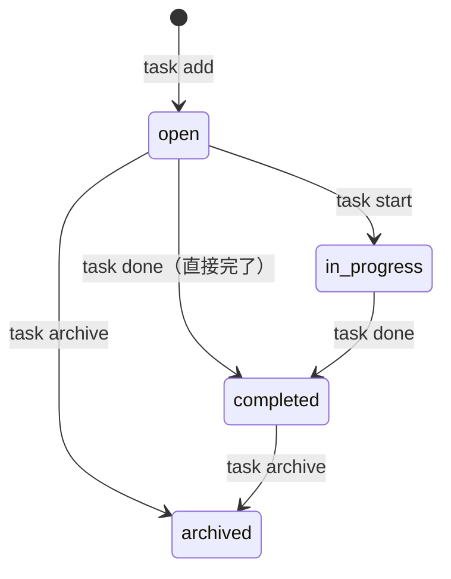

# プロダクト要求定義書 (Product Requirements Document)

## プロダクト概要

### 名称
**TaskCLI** - Gitと一体化したターミナル完結型タスク管理ツール

### プロダクトコンセプト
- **ターミナル完結**: ブラウザやGUIを開くことなく、すべてのタスク管理操作をCLI上で完結させる
- **Git一体化**: タスクとGitブランチを1対1で紐付け、タスク開始からブランチ作成・コミット・完了までのワークフローを自動化する
- **シンプル・高速**: 最小限のコマンド体系で即座に応答し、開発フローを中断させない軽量な操作感を提供する

### プロダクトビジョン
開発者がターミナルから離れることなく、タスク管理と開発作業をシームレスに行える世界を目指す。タスクの作成・確認・完了がGit操作と自然に融合し、コンテキストスイッチによる集中力の低下をゼロにする。JiraやTrelloのような重量級ツールではなく、開発者のワークフローに溶け込む軽量なタスク管理を実現する。

### 目的
- 開発者のタスク管理におけるコンテキストスイッチ（ターミナル↔ブラウザ）を排除する
- タスクとGitブランチの紐付けを自動化し、「今どのタスクで何をしているか」を常に明確にする
- タスク開始→ブランチ作成→コミット→完了の一連の開発フローを自動化・簡素化する
- 個人開発者および小規模チームが1分以内に導入・利用開始できる軽量なツールを提供する

## ターゲットユーザー

### プライマリーペルソナ: 佐藤健太（29歳、フリーランスエンジニア）
- フリーランスで3〜5つのWebアプリプロジェクトを並行して開発している
- Vim/VS Code + ターミナル中心の開発環境。CLI操作に慣れており、効率を重視する
- 技術スタック: TypeScript、React、Node.js、Git、GitHub
- **現在の課題**: 複数プロジェクトのタスクが頭の中だけで管理されており、「次に何をやるか」を思い出すのに時間がかかる。GitHub Issuesは使っているが、ローカルの作業との連携が弱く、ブランチとタスクの紐付けが手作業になっている
- **期待する解決策**: ターミナルでタスクを管理でき、`task start`で自動的にブランチが作られ、作業の開始から完了までが一つの流れで進む
- **1日の典型的なワークフロー**: 朝にタスク一覧を確認→優先タスクを選んで作業開始→コミットを重ねて→PRを出して→タスクを完了。この流れが全部ターミナルで完結してほしい

### セカンダリーペルソナ: 山田裕子（35歳、スタートアップCTO）
- 3〜5人のエンジニアチームを率いるテックリード
- チームの進捗をリアルタイムで把握したいが、Jira/Asanaは小規模チームには重すぎると感じている
- 技術スタック: Go、TypeScript、Docker、Git、GitHub
- **現在の課題**: チームメンバーが今何をやっているかを確認するためにブラウザでプロジェクト管理ツールを開く必要があり、朝会でのタスク確認に時間がかかる
- **期待する解決策**: CLIでチーム全体のタスク状況をさっと確認でき、GitHub連携でタスクの進捗が自動更新される
- **1日の典型的なワークフロー**: 朝に`task list --team`でチーム状況を確認→自分のタスクを進める→メンバーからの質問に答える→夕方に再度進捗確認

## 成功指標（KPI）

### プライマリーKPI
- **週次アクティブユーザー（WAU）**: リリース後3ヶ月で100人
  - 測定方法: オプトインの匿名利用統計（`task --analytics`で有効化。デフォルトはオフ）
- **タスク完了率**: 作成されたタスクの70%以上が`completed`ステータスに到達（3ヶ月後）
  - 測定方法: ローカルの利用統計から算出（匿名集計、オプトイン）
- **GitHub Stars**: リリース後6ヶ月で500

### セカンダリーKPI
- **導入完了率**: `npm install -g taskcli`から最初のタスク作成まで1分以内に完了する割合が80%以上
  - 測定方法: Getting Startedガイドのユーザビリティテスト（10名対象）
- **継続利用率**: 初回利用から1ヶ月後も週1回以上使い続けているユーザーが60%以上
  - 測定方法: オプトインの匿名利用統計
- **Net Promoter Score（NPS）**: 30以上（リリース後3ヶ月でアンケート実施）

## 機能要件

### コア機能（MVP / P0）

#### 1. タスクの基本操作（CRUD）

**ユーザーストーリー**:
開発者として、ターミナルから離れずにタスクの作成・一覧表示・詳細確認・完了・削除を行うために、シンプルなCLIコマンドでタスクを管理できる機能が欲しい

**受け入れ条件**:
- [ ] `task add "<タイトル>"`でタスクを作成できる。作成時にIDが自動採番される
- [ ] `task list`で全タスクの一覧をテーブル形式（ID、ステータス、タイトル、ブランチ）で表示できる
- [ ] `task show <id>`でタスクの詳細情報（タイトル、ステータス、ブランチ名、作成日時、更新日時）を表示できる
- [ ] `task done <id>`でタスクのステータスを`completed`に変更できる（ステータス遷移の詳細は「2. タスクのステータス管理」を参照）
- [ ] `task delete <id>`でタスクを削除できる。削除前に確認プロンプトを表示する
- [ ] 存在しないIDを指定した場合、分かりやすいエラーメッセージを表示する

**優先度**: P0（必須）

#### 2. タスクのステータス管理

**ユーザーストーリー**:
開発者として、タスクの進捗状況を把握するために、タスクに明確なステータスを設定・変更できる機能が欲しい

**受け入れ条件**:
- [ ] タスクは以下の4つのステータスを持つ: `open`（新規）、`in_progress`（作業中）、`completed`（完了）、`archived`（アーカイブ）
- [ ] タスク作成時のデフォルトステータスは`open`
- [ ] `task start <id>`でステータスが`in_progress`に変更される
- [ ] `task done <id>`でステータスが`completed`に変更される
- [ ] `task archive <id>`でステータスが`archived`に変更される
- [ ] ステータスの遷移は以下の規則に従う

**許可されるステータス遷移**:



| 現在のステータス | 遷移可能なステータス |
|----------------|-------------------|
| `open` | `in_progress`, `completed`, `archived` |
| `in_progress` | `completed` |
| `completed` | `archived` |
| `archived` | なし（終了状態） |

**禁止される遷移**:
- `in_progress` → `open`（開始済みを未着手に戻すことはできない）
- `in_progress` → `archived`（作業中タスクを直接アーカイブすることはできない。先に完了させてからアーカイブする）
- `completed` → `open` / `in_progress`（完了済みを再開することはできない）
- `archived` → 任意のステータス（アーカイブは終了状態）

**優先度**: P0（必須）

#### 3. タスクとGitブランチの自動連携

**ユーザーストーリー**:
開発者として、タスクの作業を開始する際にブランチ作成の手間を省くために、タスク開始時に自動でGitブランチが作成・切り替えされる機能が欲しい

**受け入れ条件**:
- [ ] `task start <id>`を実行すると、`feature/task-<id>-<タイトルのslug>`形式のブランチが自動作成される
- [ ] ブランチ作成後、自動的にそのブランチにチェックアウトされる
- [ ] タスクにブランチ名が記録され、`task show <id>`や`task list`で確認できる
- [ ] 既にブランチが存在する場合は既存ブランチにチェックアウトする（重複作成しない）
- [ ] Gitリポジトリ外で実行された場合、ブランチ連携をスキップして警告メッセージを表示する
- [ ] ワーキングツリーに未コミットの変更がある場合は警告を表示し、ブランチ切り替えの確認を求める

**優先度**: P0（必須）

#### 4. タスク一覧のテーブル表示

**ユーザーストーリー**:
開発者として、現在のタスク状況を素早く把握するために、見やすいテーブル形式でタスク一覧を表示できる機能が欲しい

**受け入れ条件**:
- [ ] `task list`で以下のカラムを持つテーブルを表示: ID、Status、Title、Branch
- [ ] ステータスに応じた色分け表示（`open`: 白、`in_progress`: 黄、`completed`: 緑、`archived`: グレー）
- [ ] デフォルトでは`archived`以外のタスクを表示する
- [ ] `task list --all`で`archived`を含む全タスクを表示する
- [ ] タスクが0件の場合、「タスクがありません。`task add`で最初のタスクを作成しましょう」と表示する

**優先度**: P0（必須）

#### 5. データの永続化（JSONファイル）

**ユーザーストーリー**:
開発者として、タスクデータを安全に保持するために、ローカルファイルにデータが保存される機能が欲しい

**受け入れ条件**:
- [ ] タスクデータはプロジェクトルートの`.taskcli/tasks.json`に保存される
- [ ] `task add`実行時に`.taskcli/`ディレクトリが存在しない場合は自動作成する
- [ ] JSONファイルは人間が読める形式（インデント付き）で保存する
- [ ] ファイルの読み書きはアトミックに行い、書き込み中のクラッシュでデータが破損しない（一時ファイル経由で書き込み後にリネーム）
- [ ] `.taskcli/`ディレクトリを`.gitignore`に追加するかどうかはユーザーの判断に委ねる（初回実行時にガイダンスを表示）

**優先度**: P0（必須）

### 重要機能（P1）

#### 6. タスクの更新

**ユーザーストーリー**:
開発者として、既存タスクの情報を修正するために、タスクのタイトルや属性を更新できる機能が欲しい

**受け入れ条件**:
- [ ] `task update <id> --title "<新しいタイトル>"`でタスクのタイトルを変更できる
- [ ] `task update <id> --priority <high|medium|low>`で優先度を変更できる（優先度機能の実装後）
- [ ] `task update <id> --due <YYYY-MM-DD>`で期限を変更できる（期限機能の実装後）
- [ ] 存在しないIDを指定した場合、分かりやすいエラーメッセージを表示する

**優先度**: P1（重要）

#### 7. タスクの絞り込み・検索

**ユーザーストーリー**:
開発者として、特定の条件に合うタスクを素早く見つけるために、ステータスやキーワードでタスクを絞り込む機能が欲しい

**受け入れ条件**:
- [ ] `task list --status <status>`で特定のステータスのタスクのみ表示できる
- [ ] `task search "<キーワード>"`でタイトルにキーワードを含むタスクを検索できる
- [ ] 該当タスクが0件の場合、「該当するタスクが見つかりませんでした」と表示する

**優先度**: P1（重要）

#### 8. 優先度と期限の管理

**ユーザーストーリー**:
開発者として、タスクの重要度と期限を管理するために、優先度と期限日を設定できる機能が欲しい

**受け入れ条件**:
- [ ] `task add "<タイトル>" --priority <high|medium|low>`で優先度を設定できる。デフォルトは`medium`
- [ ] `task add "<タイトル>" --due <YYYY-MM-DD>`で期限を設定できる
- [ ] `task list --sort priority`で優先度順にソートして表示できる
- [ ] `task list --sort due`で期限順にソートして表示できる
- [ ] 期限が過ぎたタスクは赤色で強調表示する

**優先度**: P1（重要）

#### 9. タスク完了時の自動処理

**ユーザーストーリー**:
開発者として、タスク完了時の定型作業を省略するために、ブランチのマージやリモートプッシュを自動化できる機能が欲しい

**受け入れ条件**:
- [ ] `task done <id>`のデフォルト動作ではGit操作を行わない（タスクのステータス変更のみ。P0の動作と同一）
- [ ] `task done <id> --merge`オプション指定時のみ、関連ブランチをmainブランチにマージする
- [ ] `task done <id> --push`オプション指定時のみ、リモートへのプッシュを実行する
- [ ] `--merge`と`--push`は組み合わせて使用可能（`task done <id> --merge --push`）
- [ ] マージコンフリクトが発生した場合は明確なエラーメッセージを表示し、手動解決を促す

**優先度**: P1（重要）

#### 10. GitHub Issuesとの連携

**ユーザーストーリー**:
開発者として、GitHub上のIssueとローカルタスクを同期するために、Issueのインポート・同期機能が欲しい

**受け入れ条件**:
- [ ] `task sync`でローカルタスクとGitHub Issuesを双方向同期できる
- [ ] `task import --github`でGitHub Issuesからタスクをインポートできる
- [ ] 同期時にGitHubのPersonal Access Tokenを使用して認証する
- [ ] トークンは`~/.taskcli/config.json`または環境変数`TASKCLI_GITHUB_TOKEN`で設定する
- [ ] 認証エラー時に分かりやすいメッセージと設定方法を表示する
- [ ] 同期時にローカルとリモートで同一タスクに競合が発生した場合、ローカルの変更を優先し、競合が発生した旨を警告メッセージで通知する

**優先度**: P1（重要）

### 将来的な機能（Post-MVP / P2）

#### 11. チーム機能

`task list --team`でチームメンバー全員のタスク一覧を表示。`task assign <id> @<user>`でタスクをアサイン。GitHub連携を通じてチーム間の同期を行う。

**優先度**: P2（できれば）

#### 12. 作業時間の記録

`task start <id>`で作業時間の計測を自動開始し、`task done <id>`で記録。`task report`で作業時間のサマリーを表示。

**優先度**: P2（できれば）

#### 13. タスクテンプレート

`task template create <name>`でテンプレートを定義。`task add --template <name> "<タイトル>"`でテンプレートからタスクを作成。バグ修正、機能追加などの定型タスクを素早く作成できる。

**優先度**: P2（できれば）

### CLIインターフェース

```bash
# === P0: コア機能 ===

# タスクの基本操作
task add "<タイトル>"                        # タスクを作成
task list                                    # タスク一覧を表示
task show <id>                               # タスクの詳細を表示
task done <id>                               # タスクを完了
task delete <id>                             # タスクを削除

# ステータス管理
task start <id>                              # タスクを開始（in_progressに変更 + ブランチ作成）
task archive <id>                            # タスクをアーカイブ

# === P1: 重要機能 ===

# タスクの更新
task update <id> --title "<新タイトル>"        # タイトル変更

# 絞り込み・検索
task list --status <status>                  # ステータスで絞り込み
task list --all                              # アーカイブ含む全タスク表示
task list --sort <priority|due>              # ソート
task search "<キーワード>"                    # キーワード検索

# 優先度・期限
task add "<タイトル>" --priority <high|medium|low>   # 優先度付きで作成
task add "<タイトル>" --due <YYYY-MM-DD>             # 期限付きで作成

# 完了時の自動処理
task done <id> --merge                       # 完了+マージ
task done <id> --push                        # 完了+プッシュ

# GitHub連携
task sync                                   # GitHub Issuesと同期
task import --github                         # GitHub Issuesからインポート

# === P2: 将来機能 ===

# チーム
task list --team                             # チームのタスク一覧
task assign <id> @<user>                     # タスクをアサイン

# 作業時間
task report                                  # 作業時間レポート

# テンプレート
task template create <name>                  # テンプレート作成
task add --template <name> "<タイトル>"       # テンプレートからタスク作成
```

## 非機能要件

### パフォーマンス
- コマンド実行時間: 100ms以内（ローカル操作。ネットワーク通信を伴うGitHub連携は除く）
- タスク一覧表示: 1,000件のタスクで1秒以内
- メモリ使用量: 50MB以下（通常操作時）

### ユーザビリティ
- 新規ユーザーが5分以内に基本操作（add, list, start, done）を習得できる
- `task --help`および各サブコマンドの`--help`で使用方法を確認できる
- エラーメッセージには原因と対処方法を含める（例: 「タスクID 5が見つかりません。`task list`で既存のタスクを確認してください」）
- 初回実行時にクイックスタートガイドを表示する

### 信頼性
- データ損失ゼロ: JSONファイルの書き込みはアトミック操作（一時ファイル→リネーム）で行う
- 不正な操作からの保護: 削除操作は確認プロンプトを表示し、`--force`フラグで確認をスキップ可能
- エラー発生時にスタックトレースではなくユーザーフレンドリーなメッセージを表示する

### セキュリティ
- GitHub Personal Access Tokenはファイルシステム上で適切なパーミッション（600）で保存する
- トークンをログやエラーメッセージに出力しない
- 入力値のサニタイズ: タスクタイトルやブランチ名に不正な文字が含まれないよう検証する

### 互換性
- 対応OS: macOS、Linux、Windows（Git Bash / WSL含む）
- 対応Node.jsバージョン: 20.x LTS以上
- Git 2.30以上が必要（ブランチ連携機能使用時）

## スコープ外

明示的にスコープ外とする項目:
- **Webダッシュボード/GUI**: 本プロダクトはCLI専用。GUIの提供は行わない
- **独自のクラウド同期サービス**: データ同期はGit/GitHub経由のみ。専用サーバーは構築しない
- **GitLab/Bitbucket連携**: 初期リリースではGitHubのみサポート。他プラットフォームは将来検討
- **モバイルアプリ**: ターミナル環境が前提。モバイル対応は行わない
- **プラグインシステム**: 初期リリースでは組み込み機能のみ。拡張機能の仕組みは将来検討
- **プロジェクト管理機能**: ガントチャート、バーンダウンチャートなどのプロジェクト管理機能は提供しない
