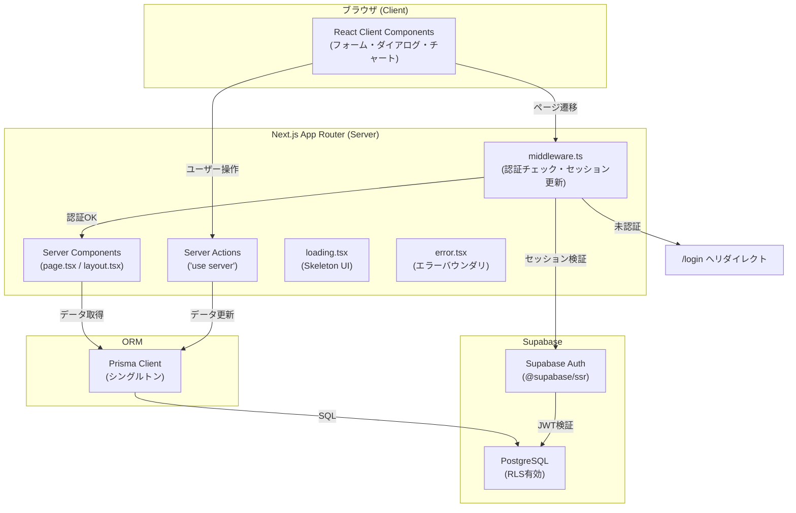
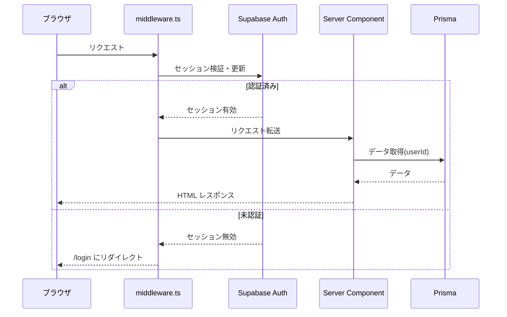
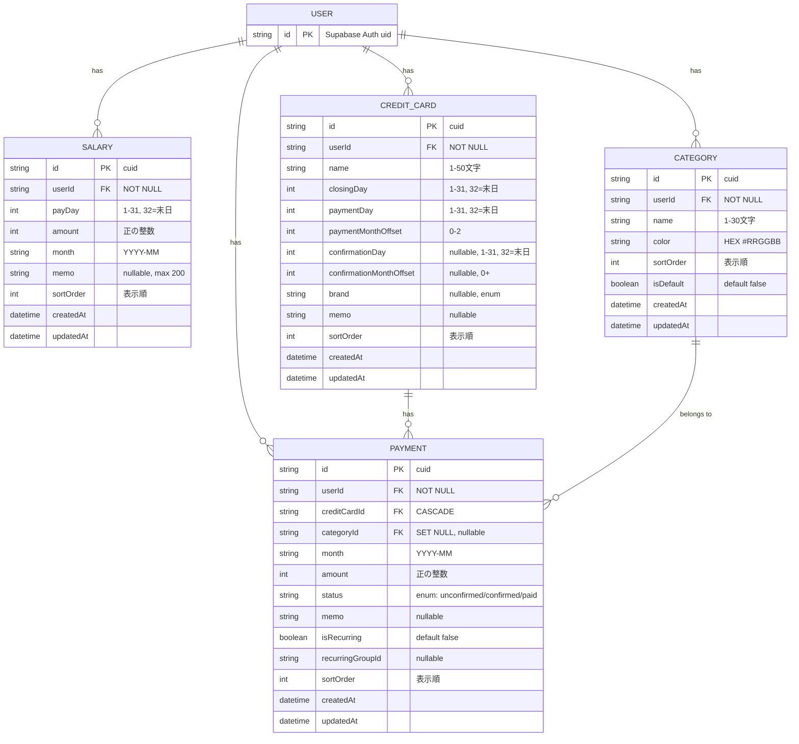
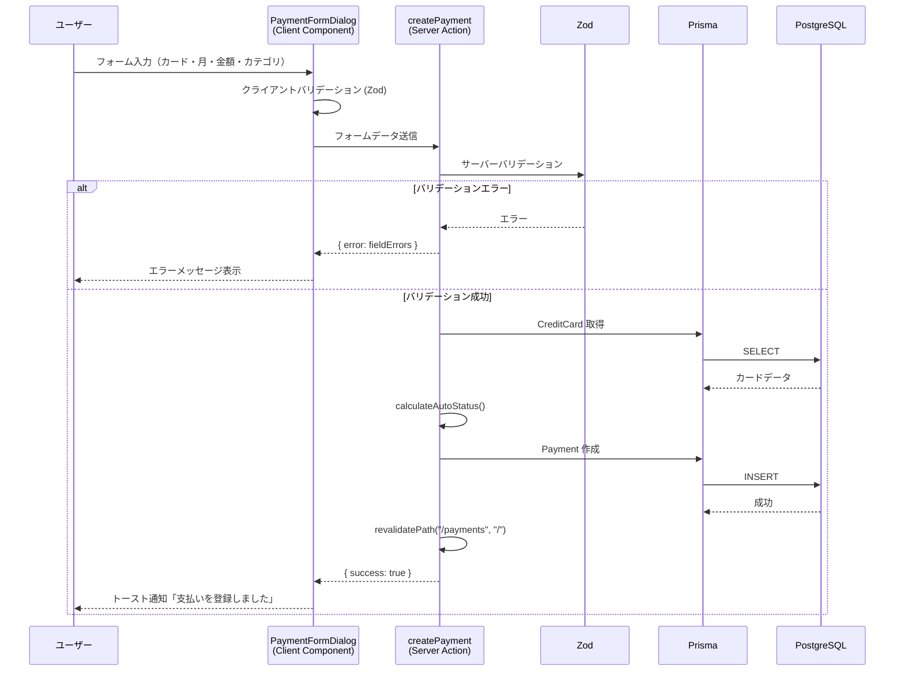
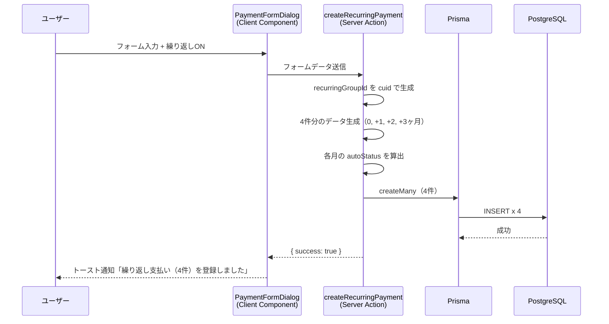
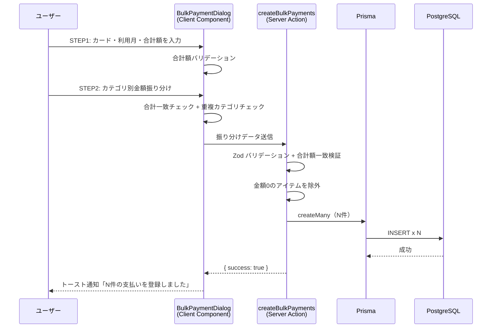
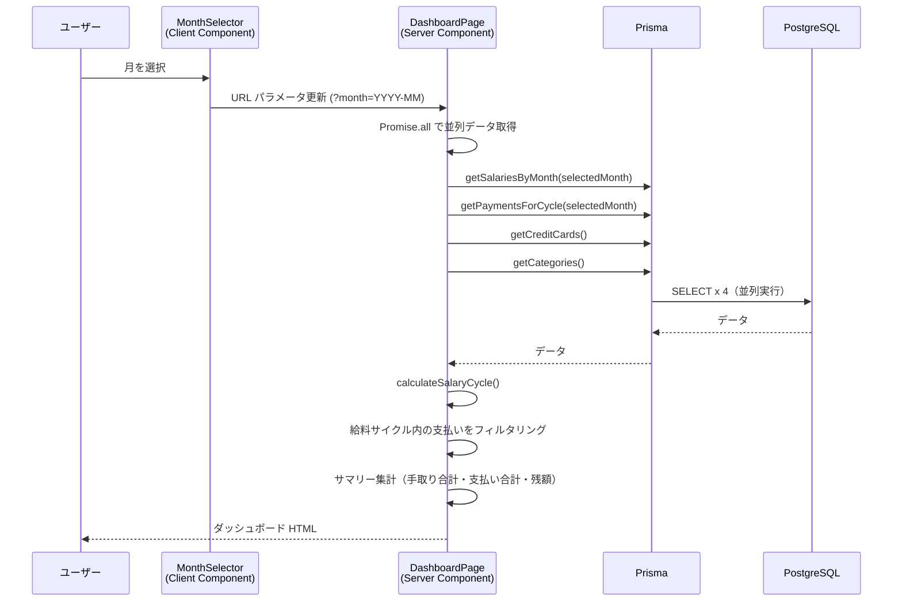
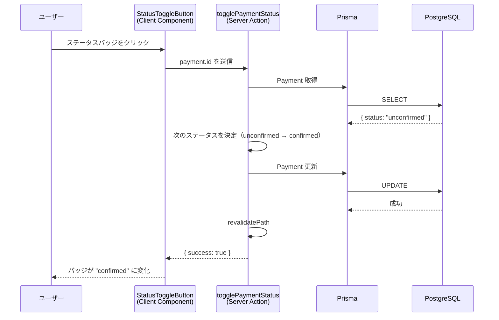
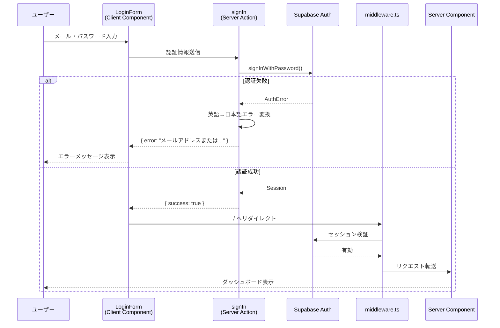

# 機能設計書 (Functional Design Document)

| 項目 | 内容 |
|------|------|
| バージョン | v1.3 |
| 作成日 | 2026-03-04 |
| 更新日 | 2026-03-04 |
| ステータス | 承認待ち |
| 対応PRD | product-requirements.md v1.8 |

## 改版履歴

| バージョン | 日付 | 変更内容 |
|-----------|------|---------|
| v1.0 | 2026-03-04 | 初版作成 |
| v1.1 | 2026-03-04 | レビュー指摘対応: ディレクトリ構成をRoute Group構成に統一、payDay=32のコードバグ修正、カテゴリ名case-insensitive重複チェック実装方法追記、bulkUpdatePaymentStatusスコープ注記追加、getPaymentsForCycleフォールバック仕様明確化、updatePayment/deleteRecurringGroup Server Action追記、ボトムナビ項目をarchitecture.mdと統一（4項目）、デフォルトカテゴリ自動作成タイミング追記 |
| v1.2 | 2026-03-04 | repository-structure.md/architecture.md との整合性修正: src/プレフィックス除去、actions/をlib/actions/に移動、schemas/削除しlib/validations/に統合、types/削除（Zodスキーマからz.infer<>で生成に統一）、インポートパス修正、middleware.tsパス修正、CreditCardインデックスを[userId, sortOrder]に修正、トースト通知をsonnerに修正、sortOrder 0始まりに統一、lib/supabase/middleware.ts追加、deletePayment Server Action追加、lib/utils/にstatus.tsとauth-errors.ts追加 |
| v1.3 | 2026-03-04 | development-guidelines.md との整合性修正: 全Server ActionをActionResult<T>型に統一（safeParse + try-catch + 日本語エラーメッセージ）、PaymentインデックスをuserId複合インデックスに修正 |

---

## 1. システム構成図



### 認証フロー



---

## 2. 技術スタック

| 分類 | 技術 | 選定理由 |
|------|------|----------|
| フレームワーク | Next.js (App Router) | Server Components によるパフォーマンス最適化、Server Actions によるAPI不要のデータ更新、Vercel との親和性 |
| 言語 | TypeScript (strict mode) | 型安全性による開発効率向上、Prisma/Zod との型連携 |
| UI | Tailwind CSS v4 + shadcn/ui | ユーティリティファーストで高速スタイリング、shadcn/ui でアクセシブルなコンポーネントを即座に利用可能 |
| DB | Prisma + Supabase PostgreSQL | 型安全なORMによるDB操作、Supabaseのマネージド PostgreSQL で運用負荷軽減 |
| 認証 | Supabase Auth (@supabase/ssr) | SSR対応の認証ライブラリ、RLS との統合によるセキュアなアクセス制御 |
| チャート | Recharts | React ネイティブ、SVG ベースで軽量、カスタマイズ性が高い |
| 日付 | date-fns | Tree-shaking 対応で軽量、イミュータブルな日付操作 |
| フォーム | React Hook Form + Zod | 非制御コンポーネントによる高パフォーマンス、Zod でサーバー/クライアント共通のバリデーション |
| テスト | Vitest + React Testing Library + Playwright | Vite ベースの高速テスト実行、ユーザー視点のコンポーネントテスト、クロスブラウザE2E |
| リンター | ESLint + Prettier | コード品質・一貫性の自動担保 |
| ホスティング | Vercel | Next.js のファーストパーティホスティング、自動デプロイ・プレビュー環境 |
| 開発環境 | Dev Container (Node.js 22) | 開発環境の統一、再現可能なセットアップ |

---

## 3. データモデル定義

### 3.1 TypeScript インターフェース

```typescript
// === エンティティ型 ===

interface Salary {
  id: string;            // cuid
  userId: string;        // Supabase Auth の uid
  payDay: number;        // 支給日（1-31, 32=末日）
  amount: number;        // 手取り額（円、正の整数）
  month: string;         // 対象月 "YYYY-MM"
  memo: string | null;   // メモ（最大200文字）
  sortOrder: number;     // 表示順
  createdAt: Date;       // 作成日時
  updatedAt: Date;       // 更新日時
}

interface CreditCard {
  id: string;                        // cuid
  userId: string;                    // Supabase Auth の uid
  name: string;                      // カード名（1-50文字）
  closingDay: number;                // 締め日（1-31, 32=末日）
  paymentDay: number;                // 支払い日（1-31, 32=末日）
  paymentMonthOffset: number;        // 支払月オフセット（0-2）
  confirmationDay: number | null;    // 確定日（null=未設定, 1-31, 32=末日）
  confirmationMonthOffset: number | null; // 確定日の月オフセット（0=当月, 1=翌月）
  brand: string | null;              // "visa"|"mastercard"|"jcb"|"amex"|"other"
  memo: string | null;               // メモ
  sortOrder: number;                 // 表示順
  createdAt: Date;                   // 作成日時
  updatedAt: Date;                   // 更新日時
}

type PaymentStatus = "unconfirmed" | "confirmed" | "paid";

interface Payment {
  id: string;                         // cuid
  userId: string;                     // Supabase Auth の uid
  creditCardId: string;               // クレカID（CASCADE）
  categoryId: string | null;          // カテゴリID（SET NULL）
  month: string;                      // 利用月 "YYYY-MM"
  amount: number;                     // 金額（円、正の整数）
  status: PaymentStatus;              // unconfirmed / confirmed / paid
  memo: string | null;                // メモ
  isRecurring: boolean;               // 繰り返し支払いフラグ
  recurringGroupId: string | null;    // 繰り返しグループID
  sortOrder: number;                  // 表示順
  createdAt: Date;                    // 作成日時
  updatedAt: Date;                    // 更新日時
}

interface Category {
  id: string;            // cuid
  userId: string;        // Supabase Auth の uid
  name: string;          // カテゴリ名（1-30文字）
  color: string;         // 表示カラー（HEXコード "#RRGGBB"）
  sortOrder: number;     // 表示順
  isDefault: boolean;    // デフォルトフラグ
  createdAt: Date;       // 作成日時
  updatedAt: Date;       // 更新日時
}

// Post-MVP
interface Budget {
  id: string;            // cuid
  userId: string;        // Supabase Auth の uid
  categoryId: string;    // カテゴリID（CASCADE）
  month: string;         // 対象月 "YYYY-MM"
  amount: number;        // 予算額（円）
  createdAt: Date;       // 作成日時
  updatedAt: Date;       // 更新日時
}
```

### 3.2 Zod バリデーションスキーマ

```typescript
import { z } from "zod";

// === 共通バリデーション ===

/** 日付入力（1-31, 32=末日） */
const daySchema = z.number().int().min(1).max(32);

/** 月フォーマット "YYYY-MM" */
const monthSchema = z.string().regex(/^\d{4}-(0[1-9]|1[0-2])$/);

// === Salary ===

export const salaryFormSchema = z.object({
  month: monthSchema,
  payDay: daySchema,
  amount: z.number().int().min(1, "金額は1円以上で入力してください"),
  memo: z.string().max(200, "メモは200文字以内で入力してください").nullable(),
});

export type SalaryFormValues = z.infer<typeof salaryFormSchema>;

// === CreditCard ===

export const creditCardFormSchema = z.object({
  name: z
    .string()
    .min(1, "カード名を入力してください")
    .max(50, "カード名は50文字以内で入力してください"),
  closingDay: daySchema,
  paymentDay: daySchema,
  paymentMonthOffset: z.number().int().min(0).max(2),
  confirmationDay: daySchema.nullable(),
  confirmationMonthOffset: z.number().int().min(0).nullable(),
  brand: z.enum(["visa", "mastercard", "jcb", "amex", "other"]).nullable(),
  memo: z.string().nullable(),
}).refine(
  (data) => {
    // confirmationDay が null なら confirmationMonthOffset も null
    if (data.confirmationDay === null) {
      return data.confirmationMonthOffset === null;
    }
    // confirmationDay が設定されていれば confirmationMonthOffset も必須
    return data.confirmationMonthOffset !== null;
  },
  { message: "確定日を設定する場合は確定月オフセットも設定してください" }
);

export type CreditCardFormValues = z.infer<typeof creditCardFormSchema>;

// === Payment ===

export const paymentFormSchema = z.object({
  creditCardId: z.string().cuid(),
  categoryId: z.string().cuid().nullable(),
  month: monthSchema,
  amount: z.number().int().min(1, "金額は1円以上で入力してください"),
  memo: z.string().nullable(),
  isRecurring: z.boolean().default(false),
});

export type PaymentFormValues = z.infer<typeof paymentFormSchema>;

// === 一括登録 ===

export const bulkPaymentFormSchema = z.object({
  creditCardId: z.string().cuid(),
  month: monthSchema,
  totalAmount: z.number().int().min(1, "合計額は1円以上で入力してください"),
  items: z
    .array(
      z.object({
        categoryId: z.string().cuid(),
        amount: z.number().int().min(0),
      })
    )
    .min(1, "1件以上の振り分けが必要です")
    .refine(
      (items) => items.some((item) => item.amount > 0),
      { message: "全件0円は登録できません" }
    )
    .refine(
      (items) => {
        const ids = items.map((i) => i.categoryId);
        return new Set(ids).size === ids.length;
      },
      { message: "同一カテゴリの重複選択はできません" }
    ),
});

export type BulkPaymentFormValues = z.infer<typeof bulkPaymentFormSchema>;

// === Category ===

export const categoryFormSchema = z.object({
  name: z
    .string()
    .min(1, "カテゴリ名を入力してください")
    .max(30, "カテゴリ名は30文字以内で入力してください"),
  color: z
    .string()
    .regex(/^#[0-9A-Fa-f]{6}$/, "カラーはHEXコード形式で入力してください"),
});

export type CategoryFormValues = z.infer<typeof categoryFormSchema>;
```

### 3.3 ER図



### 3.4 制約・インデックス

| テーブル | 制約/インデックス | 説明 |
|---------|-----------------|------|
| Salary | `@@index([userId, month])` | ユーザー×月の検索高速化 |
| CreditCard | `@@index([userId, sortOrder])` | ソート順でのカード一覧取得 |
| Payment | `@@index([userId, month])` | ユーザー×月の支払い検索 |
| Payment | `@@index([userId, creditCardId])` | カード別支払い検索 |
| Payment | `@@index([recurringGroupId])` | 繰り返しグループ一括操作 |
| Category | `@@unique([userId, name])` | ユーザー内カテゴリ名の一意性（大文字/小文字区別なし。アプリケーション層で正規化） |
| Budget | `@@unique([userId, categoryId, month])` | ユーザー×カテゴリ×月の一意性（Post-MVP） |

#### カテゴリ名の大文字/小文字重複チェック（PRD F-05 対応）

DB のユニーク制約はデフォルトで case-sensitive のため、アプリケーション層で case-insensitive な重複チェックを行う。カテゴリの作成・編集時に以下のロジックを Server Action 内で実行する。

```typescript
// Prisma での case-insensitive 検索
const existing = await prisma.category.findFirst({
  where: {
    userId: user.id,
    name: { equals: validated.name, mode: "insensitive" },
    id: { not: excludeId }, // 編集時は自分自身を除外
  },
});
if (existing) {
  return { error: "同じ名前のカテゴリが既に存在します" };
}
```

- **新規作成時**: `excludeId` は省略（`undefined`）するか、`id` 条件自体を含めない
- **編集時**: `excludeId` に編集対象カテゴリの `id` を指定し、自分自身を検索結果から除外する
- Prisma の `mode: "insensitive"` は PostgreSQL の `ILIKE` に変換されるため、DB のロケール設定に依存しない

---

## 4. コンポーネント設計

### 4.1 ディレクトリ構成

```
app/
├── layout.tsx                        # ルートレイアウト
├── not-found.tsx                     # 404 ページ
├── globals.css
├── (auth)/                           # Route Group: 認証不要
│   ├── layout.tsx                    # 認証レイアウト（ヘッダーなし）
│   ├── login/
│   │   └── page.tsx                  # ログイン
│   ├── register/
│   │   └── page.tsx                  # 新規登録
│   ├── forgot-password/
│   │   └── page.tsx                  # パスワード忘れ
│   └── reset-password/
│       └── page.tsx                  # パスワードリセット
├── (main)/                           # Route Group: 認証必須
│   ├── layout.tsx                    # メインレイアウト（ナビゲーション付き）
│   ├── page.tsx                      # ダッシュボード（/）
│   ├── loading.tsx                   # ダッシュボード Skeleton
│   ├── error.tsx                     # エラーバウンダリ
│   ├── credit-cards/
│   │   ├── page.tsx                  # クレカ管理
│   │   ├── loading.tsx
│   │   └── error.tsx
│   ├── salary/
│   │   ├── page.tsx                  # 手取り管理
│   │   ├── loading.tsx
│   │   └── error.tsx
│   ├── payments/
│   │   ├── page.tsx                  # 支払い管理
│   │   ├── loading.tsx
│   │   └── error.tsx
│   ├── budget/
│   │   ├── page.tsx                  # カテゴリ管理（MVP）/ 予算管理（Post-MVP）
│   │   ├── loading.tsx
│   │   └── error.tsx
│   └── reports/
│       └── page.tsx                  # レポート（Post-MVP）
components/
├── ui/                               # shadcn/ui コンポーネント
├── layout/
│   ├── header-nav.tsx                # PC用ヘッダーナビ (Client)
│   ├── bottom-nav.tsx                # モバイル用ボトムナビ (Client)
│   └── responsive-nav.tsx            # レスポンシブナビ切替 (Client)
├── dashboard/
│   ├── summary-cards.tsx             # サマリーカード3枚 (Server)
│   ├── status-breakdown.tsx          # ステータス別内訳 (Server)
│   ├── payment-schedule.tsx          # 支払い予定テーブル (Client: 折りたたみ操作)
│   ├── cashflow-timeline.tsx         # 資金繰りタイムライン (Server)
│   └── month-selector.tsx            # 月セレクター (Client)
├── credit-cards/
│   ├── card-list.tsx                 # カード一覧 (Client: D&D)
│   ├── card-form-dialog.tsx          # カード登録/編集ダイアログ (Client)
│   └── delete-confirm-dialog.tsx     # 削除確認ダイアログ (Client)
├── salary/
│   ├── salary-list.tsx               # 手取り一覧 (Server)
│   ├── salary-form-dialog.tsx        # 手取り登録/編集ダイアログ (Client)
│   └── amount-presets.tsx            # 金額プリセット (Client)
├── payments/
│   ├── payment-list.tsx              # 支払い一覧 (Client: フィルター・検索)
│   ├── payment-form-dialog.tsx       # 支払い登録/編集ダイアログ (Client)
│   ├── bulk-payment-dialog.tsx       # 一括登録ダイアログ (Client)
│   ├── status-badge.tsx              # ステータスバッジ (Server)
│   └── status-toggle-button.tsx      # ステータス循環ボタン (Client)
├── categories/
│   ├── category-list.tsx             # カテゴリ一覧 (Client: D&D)
│   ├── category-form-dialog.tsx      # カテゴリ登録/編集ダイアログ (Client)
│   └── color-picker.tsx              # カラーピッカー (Client)
└── auth/
    ├── login-form.tsx                # ログインフォーム (Client)
    ├── register-form.tsx             # 新規登録フォーム (Client)
    └── forgot-password-form.tsx      # パスワードリセットフォーム (Client)
lib/
├── prisma.ts                         # Prisma Client シングルトン
├── supabase/
│   ├── server.ts                     # createServerClient
│   ├── client.ts                     # createBrowserClient
│   └── middleware.ts                 # middleware 用クライアント
├── actions/
│   ├── credit-card-actions.ts        # クレカ CRUD
│   ├── salary-actions.ts             # 手取り CRUD
│   ├── payment-actions.ts            # 支払い CRUD + 一括登録
│   ├── category-actions.ts           # カテゴリ CRUD
│   └── auth-actions.ts               # 認証アクション
├── validations/
│   ├── payment.ts                    # Payment 用 Zod スキーマ
│   ├── credit-card.ts                # CreditCard 用 Zod スキーマ
│   ├── salary.ts                     # Salary 用 Zod スキーマ
│   └── category.ts                   # Category 用 Zod スキーマ
├── utils/
│   ├── format.ts                     # 金額フォーマット等
│   ├── date.ts                       # 日付ユーティリティ
│   ├── salary-cycle.ts               # 給料サイクル計算
│   ├── payment-date.ts               # 引き落とし日・確定日算出
│   ├── status.ts                     # 自動ステータス判定
│   └── auth-errors.ts                # Supabase Auth エラー日本語化
└── constants.ts                      # 定数定義
middleware.ts                         # 認証ミドルウェア
```

> **注記**: 型定義は各モジュールファイルに共置する（独立した `types/` ディレクトリは作成しない）。共用型は `lib/validations/` の Zod スキーマから `z.infer<>` で生成する。

### 4.2 ページコンポーネント（Server Components）

各 `page.tsx` は Server Component として Prisma から直接データを取得し、Client Component に props で渡す。

#### ダッシュボード (`app/(main)/page.tsx`)

```typescript
// Server Component - データ取得を一括で行う
export default async function DashboardPage({
  searchParams,
}: {
  searchParams: Promise<{ month?: string }>;
}) {
  const { month } = await searchParams;
  const user = await getAuthUser();
  const selectedMonth = month || getCurrentMonth(); // "YYYY-MM"

  // 並列データ取得（ウォーターフォール排除）
  const [salaries, payments, creditCards, categories] = await Promise.all([
    getSalariesByMonth(user.id, selectedMonth),
    getPaymentsForCycle(user.id, selectedMonth),
    getCreditCards(user.id),
    getCategories(user.id),
  ]);

  const cycle = calculateSalaryCycle(salaries, selectedMonth);

  return (
    <>
      <MonthSelector currentMonth={selectedMonth} />
      <SummaryCards salaries={salaries} payments={payments} cycle={cycle} />
      <StatusBreakdown payments={payments} />
      <PaymentSchedule
        payments={payments}
        creditCards={creditCards}
        categories={categories}
        cycle={cycle}
      />
      <CashflowTimeline
        salaries={salaries}
        creditCards={creditCards}
        payments={payments}
        cycle={cycle}
      />
    </>
  );
}
```

#### クレカ管理 (`app/(main)/credit-cards/page.tsx`)

```typescript
export default async function CreditCardsPage() {
  const user = await getAuthUser();
  const creditCards = await getCreditCards(user.id);

  return <CardList creditCards={creditCards} />;
}
```

#### 手取り管理 (`app/(main)/salary/page.tsx`)

```typescript
export default async function SalaryPage() {
  const user = await getAuthUser();
  const salaries = await getSalaries(user.id);
  const recentAmounts = await getRecentSalaryAmounts(user.id, 3);

  return <SalaryList salaries={salaries} recentAmounts={recentAmounts} />;
}
```

#### 支払い管理 (`app/(main)/payments/page.tsx`)

```typescript
export default async function PaymentsPage({
  searchParams,
}: {
  searchParams: Promise<{ month?: string; category?: string; q?: string }>;
}) {
  const { month, category, q } = await searchParams;
  const user = await getAuthUser();
  const selectedMonth = month || getCurrentMonth();

  const [payments, creditCards, categories] = await Promise.all([
    getPaymentsByMonth(user.id, selectedMonth, category, q),
    getCreditCards(user.id),
    getCategories(user.id),
  ]);

  return (
    <PaymentList
      payments={payments}
      creditCards={creditCards}
      categories={categories}
      selectedMonth={selectedMonth}
    />
  );
}
```

#### カテゴリ管理 (`app/(main)/budget/page.tsx`)

```typescript
export default async function BudgetPage() {
  const user = await getAuthUser();
  const categories = await getCategories(user.id);

  return <CategoryList categories={categories} />;
}
```

### 4.3 Server Actions

すべてのデータ更新は Server Actions で実行する。各アクションは以下の共通パターンに従う。

1. Zod でバリデーション
2. 認証ユーザーの取得
3. Prisma でデータ操作
4. `revalidatePath` でキャッシュ無効化
5. 結果を返却

#### credit-card-actions.ts

```typescript
"use server";

import { revalidatePath } from "next/cache";
import { prisma } from "@/lib/prisma";
import { creditCardFormSchema } from "@/lib/validations/credit-card";
import { getAuthUser } from "@/lib/supabase/server";
import type { ActionResult } from "@/lib/types";

export async function createCreditCard(formData: unknown): Promise<ActionResult> {
  const user = await getAuthUser();
  const parsed = creditCardFormSchema.safeParse(formData);
  if (!parsed.success) {
    return { success: false, error: "入力内容に誤りがあります", fieldErrors: parsed.error.flatten().fieldErrors };
  }

  try {
    // 最大 sortOrder を取得して +1
    const maxSort = await prisma.creditCard.aggregate({
      where: { userId: user.id },
      _max: { sortOrder: true },
    });

    await prisma.creditCard.create({
      data: {
        ...parsed.data,
        userId: user.id,
        sortOrder: (maxSort._max.sortOrder ?? -1) + 1,
      },
    });

    revalidatePath("/credit-cards");
    return { success: true };
  } catch (e) {
    return { success: false, error: "カードの登録に失敗しました" };
  }
}

export async function updateCreditCard(id: string, formData: unknown): Promise<ActionResult> {
  const user = await getAuthUser();
  const parsed = creditCardFormSchema.safeParse(formData);
  if (!parsed.success) {
    return { success: false, error: "入力内容に誤りがあります", fieldErrors: parsed.error.flatten().fieldErrors };
  }

  try {
    await prisma.creditCard.update({
      where: { id, userId: user.id },
      data: parsed.data,
    });

    revalidatePath("/credit-cards");
    return { success: true };
  } catch (e) {
    return { success: false, error: "カードの更新に失敗しました" };
  }
}

export async function deleteCreditCard(id: string): Promise<ActionResult> {
  const user = await getAuthUser();

  try {
    // カスケード削除（関連する Payment も削除される）
    await prisma.creditCard.delete({
      where: { id, userId: user.id },
    });

    revalidatePath("/credit-cards");
    revalidatePath("/payments");
    revalidatePath("/");
    return { success: true };
  } catch (e) {
    return { success: false, error: "カードの削除に失敗しました" };
  }
}

export async function reorderCreditCards(orderedIds: string[]): Promise<ActionResult> {
  const user = await getAuthUser();

  try {
    // D&D 保存時に sortOrder を正規化（0, 1, 2, ...）
    await prisma.$transaction(
      orderedIds.map((id, index) =>
        prisma.creditCard.update({
          where: { id, userId: user.id },
          data: { sortOrder: index },
        })
      )
    );

    revalidatePath("/credit-cards");
    return { success: true };
  } catch (e) {
    return { success: false, error: "カードの並び替えに失敗しました" };
  }
}
```

#### payment-actions.ts（抜粋: 一括登録・繰り返し登録）

```typescript
"use server";

import { revalidatePath } from "next/cache";
import { prisma } from "@/lib/prisma";
import { paymentFormSchema, bulkPaymentFormSchema } from "@/lib/validations/payment";
import { getAuthUser } from "@/lib/supabase/server";
import { calculateAutoStatus } from "@/lib/utils/payment-date";
import { createId } from "@paralleldrive/cuid2";
import { addMonths } from "date-fns";
import type { ActionResult } from "@/lib/types";

/** 支払い登録（通常） */
export async function createPayment(formData: unknown): Promise<ActionResult> {
  const user = await getAuthUser();
  const parsed = paymentFormSchema.safeParse(formData);
  if (!parsed.success) {
    return { success: false, error: "入力内容に誤りがあります", fieldErrors: parsed.error.flatten().fieldErrors };
  }

  try {
    const creditCard = await prisma.creditCard.findUniqueOrThrow({
      where: { id: parsed.data.creditCardId, userId: user.id },
    });

    const status = calculateAutoStatus(parsed.data.month, creditCard);

    await prisma.payment.create({
      data: {
        ...parsed.data,
        userId: user.id,
        status,
        sortOrder: await getNextSortOrder(user.id),
      },
    });

    revalidatePath("/payments");
    revalidatePath("/");
    return { success: true };
  } catch (e) {
    return { success: false, error: "支払いの登録に失敗しました" };
  }
}

/** 繰り返し支払い登録（本体 + 3件 = 計4件） */
export async function createRecurringPayment(formData: unknown): Promise<ActionResult> {
  const user = await getAuthUser();
  const parsed = paymentFormSchema.safeParse(formData);
  if (!parsed.success) {
    return { success: false, error: "入力内容に誤りがあります", fieldErrors: parsed.error.flatten().fieldErrors };
  }

  try {
    const creditCard = await prisma.creditCard.findUniqueOrThrow({
      where: { id: parsed.data.creditCardId, userId: user.id },
    });

    const recurringGroupId = createId();
    const baseMonth = parsed.data.month; // "YYYY-MM"
    const baseSortOrder = await getNextSortOrder(user.id);

    // 4件分のデータを生成（0, +1, +2, +3ヶ月）
    const payments = Array.from({ length: 4 }, (_, i) => {
      const month = formatMonth(addMonths(parseMonth(baseMonth), i));
      return {
        ...parsed.data,
        userId: user.id,
        month,
        status: calculateAutoStatus(month, creditCard),
        isRecurring: true,
        recurringGroupId,
        sortOrder: baseSortOrder + i,
      };
    });

    await prisma.payment.createMany({ data: payments });

    revalidatePath("/payments");
    revalidatePath("/");
    return { success: true };
  } catch (e) {
    return { success: false, error: "繰り返し支払いの登録に失敗しました" };
  }
}

/** 一括登録 */
export async function createBulkPayments(formData: unknown): Promise<ActionResult> {
  const user = await getAuthUser();
  const parsed = bulkPaymentFormSchema.safeParse(formData);
  if (!parsed.success) {
    return { success: false, error: "入力内容に誤りがあります", fieldErrors: parsed.error.flatten().fieldErrors };
  }

  // 合計額の一致を検証
  const itemsTotal = parsed.data.items.reduce((sum, item) => sum + item.amount, 0);
  if (itemsTotal !== parsed.data.totalAmount) {
    return { success: false, error: "振り分け合計が合計額と一致しません" };
  }

  try {
    const creditCard = await prisma.creditCard.findUniqueOrThrow({
      where: { id: parsed.data.creditCardId, userId: user.id },
    });

    const baseSortOrder = await getNextSortOrder(user.id);
    const status = calculateAutoStatus(parsed.data.month, creditCard);

    // 金額0のアイテムを除外して登録
    const items = parsed.data.items.filter((item) => item.amount > 0);

    await prisma.payment.createMany({
      data: items.map((item, index) => ({
        userId: user.id,
        creditCardId: parsed.data.creditCardId,
        categoryId: item.categoryId,
        month: parsed.data.month,
        amount: item.amount,
        status,
        isRecurring: false,
        sortOrder: baseSortOrder + index,
      })),
    });

    revalidatePath("/payments");
    revalidatePath("/");
    return { success: true };
  } catch (e) {
    return { success: false, error: "一括登録に失敗しました" };
  }
}

/** ステータス循環遷移 */
export async function togglePaymentStatus(id: string): Promise<ActionResult> {
  const user = await getAuthUser();

  try {
    const payment = await prisma.payment.findUniqueOrThrow({
      where: { id, userId: user.id },
    });

    const nextStatus: Record<string, PaymentStatus> = {
      unconfirmed: "confirmed",
      confirmed: "paid",
      paid: "unconfirmed",
    };

    await prisma.payment.update({
      where: { id, userId: user.id },
      data: { status: nextStatus[payment.status] },
    });

    revalidatePath("/payments");
    revalidatePath("/");
    return { success: true };
  } catch (e) {
    return { success: false, error: "ステータスの変更に失敗しました" };
  }
}

/**
 * カード単位の一括ステータス変更
 *
 * 注記: カード単位一括ステータス変更は、支払い管理画面では選択月内の支払い、
 * ダッシュボードでは給料サイクル内の支払いを対象とする。
 * 呼び出し元画面によってフィルタ条件が異なるため、month パラメータで対象範囲を限定する。
 */
export async function bulkUpdatePaymentStatus(
  creditCardId: string,
  month: string,
  newStatus: "confirmed" | "paid"
): Promise<ActionResult> {
  const user = await getAuthUser();

  try {
    await prisma.payment.updateMany({
      where: {
        userId: user.id,
        creditCardId,
        month,
      },
      data: { status: newStatus },
    });

    revalidatePath("/payments");
    revalidatePath("/");
    return { success: true };
  } catch (e) {
    return { success: false, error: "一括ステータス変更に失敗しました" };
  }
}

/** 支払い編集（PRD F-03: 繰り返し支払いの編集は対象の1件のみに適用） */
export async function updatePayment(id: string, formData: unknown): Promise<ActionResult> {
  const user = await getAuthUser();
  const parsed = paymentFormSchema.safeParse(formData);
  if (!parsed.success) {
    return { success: false, error: "入力内容に誤りがあります", fieldErrors: parsed.error.flatten().fieldErrors };
  }

  try {
    const creditCard = await prisma.creditCard.findUniqueOrThrow({
      where: { id: parsed.data.creditCardId, userId: user.id },
    });

    const status = calculateAutoStatus(parsed.data.month, creditCard);

    await prisma.payment.update({
      where: { id, userId: user.id },
      data: {
        ...parsed.data,
        status,
      },
    });

    revalidatePath("/payments");
    revalidatePath("/");
    return { success: true };
  } catch (e) {
    return { success: false, error: "支払いの更新に失敗しました" };
  }
}

/** 支払い削除（PRD F-03: 単一の支払いを削除） */
export async function deletePayment(id: string): Promise<ActionResult> {
  const user = await getAuthUser();

  try {
    await prisma.payment.delete({
      where: { id, userId: user.id },
    });

    revalidatePath("/payments");
    revalidatePath("/");
    return { success: true };
  } catch (e) {
    return { success: false, error: "支払いの削除に失敗しました" };
  }
}

/** 繰り返しグループの一括削除（PRD F-03: 同一 recurringGroupId の支払いを一括削除） */
export async function deleteRecurringGroup(recurringGroupId: string): Promise<ActionResult> {
  const user = await getAuthUser();

  try {
    await prisma.payment.deleteMany({
      where: {
        userId: user.id,
        recurringGroupId,
      },
    });

    revalidatePath("/payments");
    revalidatePath("/");
    return { success: true };
  } catch (e) {
    return { success: false, error: "繰り返しグループの削除に失敗しました" };
  }
}
```

### 4.4 ユーティリティ関数

#### lib/utils/format.ts

```typescript
/** 金額を日本円フォーマットで表示 */
export function formatCurrency(amount: number): string {
  return new Intl.NumberFormat("ja-JP", {
    style: "currency",
    currency: "JPY",
  }).format(amount);
}

/** カードブランドの表示ラベル */
export const BRAND_LABELS: Record<string, string> = {
  visa: "Visa",
  mastercard: "Mastercard",
  jcb: "JCB",
  amex: "American Express",
  other: "その他",
};
```

#### lib/utils/date.ts

```typescript
import { format, parse, lastDayOfMonth, setDate, isValid } from "date-fns";
import { toZonedTime } from "date-fns-tz";

const TZ = "Asia/Tokyo";

/** 現在の JST 日時を取得 */
export function nowJST(): Date {
  return toZonedTime(new Date(), TZ);
}

/** 現在月を "YYYY-MM" 形式で取得 */
export function getCurrentMonth(): string {
  return format(nowJST(), "yyyy-MM");
}

/** "YYYY-MM" を Date に変換（その月の1日） */
export function parseMonth(month: string): Date {
  return parse(month, "yyyy-MM", new Date());
}

/** Date を "YYYY-MM" に変換 */
export function formatMonth(date: Date): string {
  return format(date, "yyyy-MM");
}

/**
 * 特定の月の指定日を実日付に変換する
 * dayValue=32（末日）の場合はその月の最終日を返す
 * dayValue が月の日数を超える場合は月末日に丸める
 */
export function resolveDay(year: number, month: number, dayValue: number): Date {
  const baseDate = new Date(year, month - 1, 1); // month は 1-indexed
  const lastDay = lastDayOfMonth(baseDate).getDate();

  if (dayValue === 32 || dayValue > lastDay) {
    return lastDayOfMonth(baseDate);
  }

  return setDate(baseDate, dayValue);
}
```

---

## 5. ユースケース図

### UC1: 支払い登録（通常）



### UC2: 繰り返し支払い登録



### UC3: 一括登録



### UC4: ダッシュボード表示（給料サイクルフィルタリング）



### UC5: ステータス循環遷移



### UC6: ユーザー認証



---

## 6. 画面遷移図

```mermaid
stateDiagram-v2
    [*] --> AuthCheck: アプリアクセス

    state AuthCheck <<choice>>
    AuthCheck --> Login: 未認証
    AuthCheck --> Dashboard: 認証済み

    state "認証画面群" as AuthGroup {
        Login: ログイン<br/>/login
        Register: 新規登録<br/>/register
        ForgotPassword: パスワード忘れ<br/>/forgot-password
        ResetPassword: パスワードリセット<br/>/reset-password

        Login --> Register: 新規登録リンク
        Register --> Login: ログインリンク
        Login --> ForgotPassword: パスワード忘れリンク
        ForgotPassword --> Login: ログインに戻る
        ResetPassword --> Login: リセット完了
    }

    state "認証済み画面群" as MainGroup {
        Dashboard: ダッシュボード<br/>/
        CreditCards: クレカ管理<br/>/credit-cards
        Salary: 手取り管理<br/>/salary
        Payments: 支払い管理<br/>/payments
        Budget: カテゴリ管理<br/>/budget

        Dashboard --> CreditCards: ナビゲーション
        Dashboard --> Salary: ナビゲーション
        Dashboard --> Payments: ナビゲーション
        Dashboard --> Budget: ナビゲーション
        CreditCards --> Dashboard: ナビゲーション
        Salary --> Dashboard: ナビゲーション
        Payments --> Dashboard: ナビゲーション
        Budget --> Dashboard: ナビゲーション
    end

    Login --> Dashboard: 認証成功
    Register --> Dashboard: 登録成功
    Dashboard --> Login: ログアウト
```

---

## 7. アルゴリズム設計

### 7.1 給料サイクル計算

PRDの仕様に基づき、給料日から次の給料日前日までの期間を1サイクルとして算出する。

```typescript
import { addMonths, subDays, lastDayOfMonth } from "date-fns";

interface SalaryCycle {
  start: Date; // サイクル開始日（給料日）
  end: Date;   // サイクル終了日（次の給料日前日）
}

/**
 * 給料サイクルを算出する
 *
 * @param year - 対象年
 * @param month - 対象月（1-12）
 * @param payDay - 給料日（1-31, 32=末日）
 * @returns SalaryCycle
 *
 * ルール:
 * - 開始日: 選択月の payDay 日
 * - 終了日: 翌月の (payDay - 1) 日
 * - payDay が月の最終日を超える場合は月末日に丸める
 * - payDay = 1 の場合: 終了日は当月末日
 *   （翌月の0日は存在しないため、当月末日に丸める）
 * - payDay = 32（末日）の場合: 開始日はその月の末日、
 *   終了日は翌月末日の前日（翌月の末日 - 1日）
 */
export function calculateSalaryCycle(
  year: number,
  month: number,
  payDay: number
): SalaryCycle {
  // 開始日を算出
  const start = resolveDay(year, month, payDay);

  // 翌月の情報を取得
  const nextMonth = addMonths(new Date(year, month - 1, 1), 1);
  const nextYear = nextMonth.getFullYear();
  const nextMonthNum = nextMonth.getMonth() + 1;

  let end: Date;

  if (payDay === 1) {
    // payDay=1 の場合、終了日は当月末日
    end = lastDayOfMonth(new Date(year, month - 1, 1));
  } else if (payDay === 32) {
    // payDay=32（末日）の場合、翌月末日の前日
    // 末日の翌月も末日スタートなので、翌月末日 - 1
    end = subDays(lastDayOfMonth(new Date(nextYear, nextMonthNum - 1, 1)), 1);
  } else {
    // 通常: 翌月の (payDay - 1) 日
    end = resolveDay(nextYear, nextMonthNum, payDay - 1);
  }

  return { start, end };
}
```

#### 境界値ケース

| ケース | payDay | 月 | 開始日 | 終了日 | 説明 |
|--------|--------|-----|--------|--------|------|
| 通常 | 25 | 2月 | 2/25 | 3/24 | 標準パターン |
| payDay=1 | 1 | 2月 | 2/1 | 2/28(29) | 当月末日が終了日 |
| payDay=31 | 31 | 2月 | 2/28 | 3/30 | 2月は末日に丸め |
| payDay=31 | 31 | 3月 | 3/31 | 4/30 | 翌月30日（31-1=30） |
| payDay=32(末日) | 32 | 2月 | 2/28(29) | 3/30(30) | 末日同士 |
| payDay=32(末日) | 32 | 1月 | 1/31 | 2/27(28) | 末日→翌月末-1 |

### 7.2 給料サイクルフィルタリング

```typescript
import { addMonths, subMonths } from "date-fns";

interface CycleFilterResult {
  cycle: SalaryCycle;
  payments: Payment[];
}

/**
 * 給料サイクルに基づいて支払いをフィルタリングする
 *
 * @param userId - ユーザーID
 * @param selectedMonth - 選択月 "YYYY-MM"
 * @returns フィルタリング済みの支払い一覧
 *
 * ロジック:
 * 1. 選択月の Salary から payDay を取得
 *    - Salary なし → 最新の Salary の payDay を使用
 *    - Salary が1件もなし → 引き落とし月ベースにフォールバック
 * 2. サイクル算出
 * 3. 候補データ取得: 利用月 = 選択月の -2, -1, 0, +1（4ヶ月分）
 * 4. 各支払いの引き落とし日を算出し、サイクル内のものだけ返す
 */
export async function getPaymentsForCycle(
  userId: string,
  selectedMonth: string
): Promise<CycleFilterResult> {
  // 1. payDay の決定
  const salary = await prisma.salary.findFirst({
    where: { userId, month: selectedMonth },
    orderBy: { sortOrder: "asc" },
  });

  let payDay: number | null = salary?.payDay ?? null;

  if (payDay === null) {
    // 最新の Salary から取得
    const latest = await prisma.salary.findFirst({
      where: { userId },
      orderBy: { month: "desc" },
    });
    payDay = latest?.payDay ?? null;
  }

  // 2. サイクル算出
  const monthDate = parseMonth(selectedMonth);
  const year = monthDate.getFullYear();
  const month = monthDate.getMonth() + 1;

  if (payDay === null) {
    // フォールバック: 給料データが未登録のため、サイクルベースのフィルタリングができない。
    // PRD では「引き落とし月ベースにフォールバック」と記載されているが、
    // 引き落とし月の算出にはカード情報（paymentMonthOffset / paymentDay）が必要で
    // カードごとに異なるため、簡易実装として「利用月ベース」を採用する。
    // 選択月と同じ利用月（month フィールド）の支払いをそのまま返す。
    // 期間表示は選択月の月初〜月末とする。
    const start = new Date(year, month - 1, 1);
    const end = lastDayOfMonth(start);
    const payments = await prisma.payment.findMany({
      where: { userId, month: selectedMonth },
    });
    return { cycle: { start, end }, payments };
  }

  const cycle = calculateSalaryCycle(year, month, payDay);

  // 3. 候補データ取得（-2 〜 +1 の4ヶ月分）
  const candidateMonths = [-2, -1, 0, 1].map((offset) =>
    formatMonth(addMonths(monthDate, offset))
  );

  const candidates = await prisma.payment.findMany({
    where: {
      userId,
      month: { in: candidateMonths },
    },
    include: { creditCard: true },
  });

  // 4. 引き落とし日がサイクル内のものをフィルタ
  const payments = candidates.filter((payment) => {
    const paymentDate = calculatePaymentDate(
      payment.month,
      payment.creditCard.paymentMonthOffset,
      payment.creditCard.paymentDay
    );
    return paymentDate >= cycle.start && paymentDate <= cycle.end;
  });

  return { cycle, payments };
}
```

### 7.3 自動ステータス設定

```typescript
import { isAfter, isBefore, isEqual } from "date-fns";

/**
 * 支払い登録時の自動ステータスを算出する
 *
 * 優先順: paid > confirmed > unconfirmed
 *
 * @param month - 利用月 "YYYY-MM"
 * @param creditCard - カードの設定情報
 * @returns PaymentStatus
 */
export function calculateAutoStatus(
  month: string,
  creditCard: {
    paymentDay: number;
    paymentMonthOffset: number;
    confirmationDay: number | null;
    confirmationMonthOffset: number | null;
  }
): PaymentStatus {
  const today = nowJST();

  // 引き落とし日を算出
  const paymentDate = calculatePaymentDate(
    month,
    creditCard.paymentMonthOffset,
    creditCard.paymentDay
  );

  // 引き落とし日 <= 今日 → paid
  if (isBefore(paymentDate, today) || isEqual(paymentDate, today)) {
    return "paid";
  }

  // 確定日を算出（confirmationDay が設定されている場合のみ）
  if (
    creditCard.confirmationDay !== null &&
    creditCard.confirmationMonthOffset !== null
  ) {
    const confirmationDate = calculateConfirmationDate(
      month,
      creditCard.confirmationMonthOffset,
      creditCard.confirmationDay
    );

    // 確定日 <= 今日（かつ引き落とし日が未来）→ confirmed
    if (isBefore(confirmationDate, today) || isEqual(confirmationDate, today)) {
      return "confirmed";
    }
  }

  // それ以外 → unconfirmed
  return "unconfirmed";
}
```

### 7.4 引き落とし日算出

```typescript
/**
 * 支払いの引き落とし日を算出する
 *
 * 引き落とし日 = 利用月 + paymentMonthOffset 月の paymentDay 日
 *
 * @param month - 利用月 "YYYY-MM"
 * @param paymentMonthOffset - 支払月オフセット（0-2）
 * @param paymentDay - 支払い日（1-31, 32=末日）
 * @returns Date
 */
export function calculatePaymentDate(
  month: string,
  paymentMonthOffset: number,
  paymentDay: number
): Date {
  const monthDate = parseMonth(month);
  const targetMonth = addMonths(monthDate, paymentMonthOffset);
  const year = targetMonth.getFullYear();
  const monthNum = targetMonth.getMonth() + 1;

  return resolveDay(year, monthNum, paymentDay);
}
```

### 7.5 確定日算出

```typescript
/**
 * 確定日を算出する
 *
 * 確定日 = 利用月 + confirmationMonthOffset 月の confirmationDay 日
 *
 * @param month - 利用月 "YYYY-MM"
 * @param confirmationMonthOffset - 確定月オフセット
 * @param confirmationDay - 確定日（1-31, 32=末日）
 * @returns Date
 */
export function calculateConfirmationDate(
  month: string,
  confirmationMonthOffset: number,
  confirmationDay: number
): Date {
  const monthDate = parseMonth(month);
  const targetMonth = addMonths(monthDate, confirmationMonthOffset);
  const year = targetMonth.getFullYear();
  const monthNum = targetMonth.getMonth() + 1;

  return resolveDay(year, monthNum, confirmationDay);
}
```

---

## 8. UI設計

### 8.1 カラーコーディング

#### ステータス色

| ステータス | 色 | Tailwind クラス | 用途 |
|-----------|-----|----------------|------|
| unconfirmed（未確定） | 黄 | `bg-yellow-100 text-yellow-800` | まだ金額が確定していない支払い |
| confirmed（確定） | 青 | `bg-blue-100 text-blue-800` | 金額確定済みだが未引き落とし |
| paid（支払済） | 緑 | `bg-green-100 text-green-800` | 引き落とし完了 |

#### 残額表示

| 条件 | 表示 | Tailwind クラス |
|------|------|----------------|
| 残額 >= 0 | 通常表示 | デフォルト |
| 残額 < 0 | 赤字 + 警告アイコン | `text-destructive` + `AlertTriangle` アイコン |

### 8.2 末日入力UI

日付入力（closingDay / paymentDay / confirmationDay / payDay）は共通の UI パターンを使用する。

```
+---------------------------+
| 日付: [  15  ▼ ]          |  ← 1〜31 の数値セレクト
| ☐ 末日                    |  ← チェック時: 値を 32 に、セレクトを無効化
+---------------------------+
```

**動作仕様**:
- チェックボックス OFF: セレクトから 1〜31 を選択
- チェックボックス ON: セレクトがグレーアウト、内部値は 32
- 初期表示で値が 32 の場合: チェックボックスが ON 状態

### 8.3 レスポンシブナビゲーション

#### PC（md以上）: ヘッダーナビゲーション

```
+------------------------------------------------------------------+
| kakeibo  | ダッシュボード | クレカ | 手取り | 支払い | カテゴリ | [ログアウト] |
+------------------------------------------------------------------+
```

#### モバイル（md未満）: ボトムナビゲーション

architecture.md に合わせて4項目に統一する。クレカ管理はPCナビのみとし、モバイルではアクセス頻度の高い4画面に絞る。

```
+------------------------------------------------------------------+
|                          ページコンテンツ                           |
+------------------------------------------------------------------+
| [🏠]         [📋]          [💰]          [📂]                     |
| ホーム       支払い        手取り       カテゴリ                    |
+------------------------------------------------------------------+
```

### 8.4 空状態の表示

| 画面 | 空状態テキスト |
|------|-------------|
| クレカ管理 | 「クレジットカードが登録されていません。最初のカードを追加しましょう。」 |
| 手取り管理 | 「手取りデータが登録されていません。今月の手取りを入力しましょう。」 |
| 支払い管理 | 「支払いデータがありません。支払いを登録しましょう。」 |
| ダッシュボード（支払い予定テーブル） | 「このサイクルに支払いはありません」 |
| カテゴリ管理 | （デフォルトカテゴリが自動作成されるため空状態は発生しない） |

### 8.5 ドラッグ&ドロップ並び順変更

クレジットカード一覧とカテゴリ一覧でドラッグ&ドロップによる並び順変更をサポートする。

**動作仕様**:
- ドラッグハンドル（グリッドアイコン）をつかんでドラッグ
- ドロップ時に `reorderXxx` Server Action を呼び出し
- Server Action 内で sortOrder を 0, 1, 2, ... と正規化して保存
- 「その他」カテゴリ（`isDefault=true` かつ `name="その他"`）はドラッグ対象外で常に末尾固定

### 8.6 一括登録ダイアログ

#### STEP1: 基本情報入力

```
+------------------------------------+
| 一括登録                      [×]  |
+------------------------------------+
| カード:    [ 楽天カード  ▼ ]       |
| 利用月:    [ 2026-03    ▼ ]       |
| 合計額:    [ 50,000     ] 円       |
|                                    |
|              [次へ →]              |
+------------------------------------+
```

#### STEP2: カテゴリ別振り分け

```
+------------------------------------+
| 一括登録（振り分け）          [×]  |
+------------------------------------+
| 合計額: ¥50,000                    |
| 残り:   ¥20,000                    |
+------------------------------------+
| カテゴリ       | 金額              |
| [ 食費    ▼ ] | [ 15,000 ] 円     |
| [ 日用品  ▼ ] | [ 10,000 ] 円     |
| [ 娯楽    ▼ ] | [  5,000 ] 円     |
|          [+ 行を追加]              |
+------------------------------------+
| 振り分け合計: ¥30,000              |
|                                    |
| [← 戻る]     [登録（無効）]       |
+------------------------------------+
```

**制約**:
- 最低1行（1行のみの場合は削除ボタンを無効化）
- 同一カテゴリの重複選択は不可
- 振り分け合計が合計額と一致するまで「登録」ボタンを無効化

---

## 9. パフォーマンス最適化

### 9.1 Server Component でのデータ取得

- `page.tsx` は Server Component として Prisma から直接データを取得
- `Promise.all` で並列クエリを実行し、ウォーターフォールを排除
- Client Component には必要最小限の props のみ渡す

### 9.2 Skeleton UI (`loading.tsx`)

各ページに `loading.tsx` を配置し、データ取得中はスケルトンを表示する。

```typescript
// app/loading.tsx
export default function DashboardLoading() {
  return (
    <div className="space-y-4">
      {/* サマリーカードのスケルトン */}
      <div className="grid grid-cols-1 md:grid-cols-3 gap-4">
        {[1, 2, 3].map((i) => (
          <Skeleton key={i} className="h-24 rounded-lg" />
        ))}
      </div>
      {/* テーブルのスケルトン */}
      <Skeleton className="h-64 rounded-lg" />
    </div>
  );
}
```

### 9.3 動的インポート

バンドルサイズ最適化のため、Recharts 等の重いライブラリは動的インポートする。

```typescript
import dynamic from "next/dynamic";

const RechartsBarChart = dynamic(
  () => import("@/components/reports/bar-chart"),
  {
    loading: () => <Skeleton className="h-64" />,
    ssr: false,
  }
);
```

### 9.4 データベースクエリ最適化

- 適切なインデックス設定（3.4 参照）
- `select` を使用して必要なカラムのみ取得
- ページネーション（支払い一覧が大量になった場合）

---

## 10. セキュリティ考慮事項

### 10.1 認証・認可

| レイヤー | 対策 | 実装箇所 |
|---------|------|---------|
| 認証 | Supabase Auth（JWT ベース） | `@supabase/ssr` |
| セッション管理 | middleware.ts でセッション検証・更新 | `middleware.ts` |
| 未認証リダイレクト | 認証が必要なパスへのアクセスを `/login` にリダイレクト | `middleware.ts` |
| 行レベルアクセス制御 | RLS ポリシー: `auth.uid() = user_id` | Supabase PostgreSQL |

### 10.2 middleware.ts の構成

```typescript
import { createServerClient } from "@supabase/ssr";
import { NextResponse, type NextRequest } from "next/server";

// 認証不要のパス
const PUBLIC_PATHS = ["/login", "/register", "/forgot-password", "/reset-password"];

export async function middleware(request: NextRequest) {
  const { pathname } = request.nextUrl;

  // 公開パスはスキップ
  if (PUBLIC_PATHS.some((path) => pathname.startsWith(path))) {
    return NextResponse.next();
  }

  // Supabase セッション検証・更新
  const supabase = createServerClient(/* ... */);
  const { data: { user } } = await supabase.auth.getUser();

  if (!user) {
    return NextResponse.redirect(new URL("/login", request.url));
  }

  return NextResponse.next();
}

export const config = {
  matcher: ["/((?!_next/static|_next/image|favicon.ico).*)"],
};
```

### 10.3 Server Actions のセキュリティ

- すべての Server Action で `getAuthUser()` を呼び出し、認証済みユーザーを取得
- Zod でバリデーション後にデータ操作を実行
- Prisma クエリの `where` 句に `userId` を必ず含める
- CSRF 対策は Next.js の Server Actions が自動で処理

### 10.4 環境変数

```
# .env.local（Git管理外）
NEXT_PUBLIC_SUPABASE_URL=
NEXT_PUBLIC_SUPABASE_ANON_KEY=
DATABASE_URL=
DIRECT_URL=
```

---

## 11. エラーハンドリング

### 11.1 エラー分類

| エラー種別 | 処理 | ユーザーへの表示 |
|-----------|------|-----------------|
| バリデーションエラー | Zod の safeParse → fieldErrors を返却 | フォームフィールドにインラインエラー表示 |
| 認証エラー | Supabase Auth の AuthError | 日本語変換後のメッセージをトースト/フォームに表示 |
| 権限エラー | middleware でリダイレクト | /login へ遷移 |
| DB エラー（Prisma） | PrismaClientKnownRequestError をキャッチ | 「データの保存に失敗しました。再度お試しください。」 |
| ネットワークエラー | fetch 失敗 | 「通信に失敗しました。ネットワーク接続を確認してください。」 |
| 予期しないエラー | error.tsx でキャッチ | 「予期しないエラーが発生しました。」+ リトライボタン |

### 11.2 error.tsx エラーバウンダリ

```typescript
"use client";

import { useEffect } from "react";
import { Button } from "@/components/ui/button";

export default function Error({
  error,
  reset,
}: {
  error: Error & { digest?: string };
  reset: () => void;
}) {
  useEffect(() => {
    console.error(error);
  }, [error]);

  return (
    <div className="flex flex-col items-center justify-center min-h-[50vh] gap-4">
      <h2 className="text-xl font-semibold">エラーが発生しました</h2>
      <p className="text-muted-foreground">
        予期しないエラーが発生しました。再度お試しください。
      </p>
      <Button onClick={reset}>再試行</Button>
    </div>
  );
}
```

### 11.3 Supabase Auth エラー日本語変換マッピング

```typescript
const AUTH_ERROR_MAP: Record<string, string> = {
  "Invalid login credentials":
    "メールアドレスまたはパスワードが正しくありません",
  "Email not confirmed":
    "メールアドレスが確認されていません。確認メールをご確認ください",
  "User already registered":
    "このメールアドレスは既に登録されています",
  "Password should be at least 6 characters":
    "パスワードは6文字以上で入力してください",
  "Email rate limit exceeded":
    "リクエストが多すぎます。しばらく時間をおいてからお試しください",
  "For security purposes, you can only request this after":
    "セキュリティのため、しばらく時間をおいてからお試しください",
};

export function translateAuthError(message: string): string {
  for (const [key, value] of Object.entries(AUTH_ERROR_MAP)) {
    if (message.includes(key)) {
      return value;
    }
  }
  return "認証エラーが発生しました。再度お試しください";
}
```

### 11.4 トースト通知

操作結果のフィードバックは sonner のトースト通知で統一する。

| 操作 | 成功メッセージ | エラーメッセージ |
|------|-------------|----------------|
| データ登録 | 「XXXを登録しました」 | 「XXXの登録に失敗しました」 |
| データ更新 | 「XXXを更新しました」 | 「XXXの更新に失敗しました」 |
| データ削除 | 「XXXを削除しました」 | 「XXXの削除に失敗しました」 |
| ステータス変更 | 「ステータスを更新しました」 | 「ステータスの更新に失敗しました」 |
| 一括登録 | 「N件の支払いを登録しました」 | 「一括登録に失敗しました」 |

---

## 12. テスト戦略

### 12.1 ユニットテスト（Vitest）

**対象**: ユーティリティ関数、アルゴリズム

| テスト対象 | ファイル | テスト内容 |
|-----------|---------|-----------|
| 給料サイクル計算 | `salary-cycle.test.ts` | 通常パターン、payDay=1、payDay=31、payDay=32（末日）、2月の境界値 |
| 引き落とし日算出 | `payment-date.test.ts` | paymentMonthOffset=0/1/2、末日処理、2月の丸め |
| 確定日算出 | `payment-date.test.ts` | confirmationMonthOffset=0/1、confirmationDay=32 |
| 自動ステータス設定 | `payment-date.test.ts` | paid/confirmed/unconfirmed の各条件、確定日未設定 |
| 金額フォーマット | `format.test.ts` | 正数、0、大きな数値 |
| 月フォーマット | `date.test.ts` | パース、フォーマット、年跨ぎ |
| resolveDay | `date.test.ts` | 通常日、末日超え、32（末日） |
| Zod スキーマ | `schemas.test.ts` | 正常値、境界値、エラーケース |

**テスト例**:

```typescript
import { describe, it, expect } from "vitest";
import { calculateSalaryCycle } from "@/lib/utils/salary-cycle";

describe("給料サイクル計算", () => {
  it("payDay=25、2月 → 2/25〜3/24", () => {
    const cycle = calculateSalaryCycle(2026, 2, 25);
    expect(cycle.start).toEqual(new Date(2026, 1, 25));
    expect(cycle.end).toEqual(new Date(2026, 2, 24));
  });

  it("payDay=1、2月 → 2/1〜2/28", () => {
    const cycle = calculateSalaryCycle(2026, 2, 1);
    expect(cycle.start).toEqual(new Date(2026, 1, 1));
    expect(cycle.end).toEqual(new Date(2026, 1, 28));
  });

  it("payDay=31、2月 → 2/28〜3/30", () => {
    const cycle = calculateSalaryCycle(2026, 2, 31);
    expect(cycle.start).toEqual(new Date(2026, 1, 28));
    expect(cycle.end).toEqual(new Date(2026, 2, 30));
  });

  it("payDay=32（末日）、2月 → 2/28〜3/30", () => {
    const cycle = calculateSalaryCycle(2026, 2, 32);
    expect(cycle.start).toEqual(new Date(2026, 1, 28));
    expect(cycle.end).toEqual(new Date(2026, 2, 30));
  });
});
```

### 12.2 コンポーネントテスト（React Testing Library）

**対象**: Client Components のインタラクション

| テスト対象 | テスト内容 |
|-----------|-----------|
| ログインフォーム | フォーム入力・バリデーション・送信・エラー表示 |
| カード登録フォーム | 末日チェックボックスの連動、バリデーション |
| ステータスバッジ | クリックで循環遷移 |
| 月セレクター | 月の切り替え、URLパラメータ更新 |
| 一括登録ダイアログ | STEP1→STEP2遷移、行追加/削除、合計一致チェック |

### 12.3 E2Eテスト（Playwright、chromium のみ）

**対象**: 主要ユーザーフロー

| テストシナリオ | テスト内容 |
|---------------|-----------|
| 新規登録→ログイン | アカウント作成、ログイン、ダッシュボード表示 |
| カード登録→支払い登録→ダッシュボード確認 | 一連の操作フロー |
| 繰り返し支払い登録 | 4件のレコードが作成されることを確認 |
| 一括登録 | STEP1→STEP2→登録完了のフロー |
| ステータス循環 | unconfirmed→confirmed→paid→unconfirmed |
| カテゴリ管理 | 追加、編集、削除、D&D並び替え |

---

## 付録A: デフォルトカテゴリ

新規ユーザー登録時に自動作成されるカテゴリ一覧。

**自動作成タイミング**: `auth-actions.ts` の `signUp` Server Action 内で、Supabase Auth のユーザー登録が成功した直後に `prisma.category.createMany` で以下の9件を一括作成する。

| name | color | sortOrder | isDefault |
|------|-------|-----------|-----------|
| 食費 | #FF6384 | 0 | true |
| 日用品 | #FF9F40 | 1 | true |
| 水道光熱費 | #36A2EB | 2 | true |
| 通信費 | #FFCE56 | 3 | true |
| 交通費 | #4BC0C0 | 4 | true |
| 娯楽 | #9966FF | 5 | true |
| 医療 | #C9CBCF | 6 | true |
| 雑費 | #7C8A99 | 7 | true |
| その他 | #999999 | 9999 | true |

「その他」は `sortOrder: 9999` を設定し、表示時に `isDefault=true && name="その他"` の判定で常に末尾固定とする。

---

## 付録B: Post-MVP 機能概要

### F-07: 予算管理

- Budget テーブル（`userId + categoryId + month` でユニーク）
- ダッシュボードにカテゴリ別予算消化率プログレスバーを追加
- `/budget` ページに予算設定UIを追加

### F-08: レポート

- `/reports` ページ
- 月別支出推移（棒グラフ）、カテゴリ別支出（円グラフ）、年間サマリー
- Recharts を動的インポートで使用

### F-09: PWA対応

- next-pwa による Service Worker 生成
- Web App Manifest（アイコン、スプラッシュ）
- オフラインキャッシュ戦略

### F-10: CSVエクスポート

- 支払い一覧画面にエクスポートボタン
- BOM付きUTF-8で出力（Excel対応）
- Server Action でCSV文字列を生成し、クライアントでダウンロード
