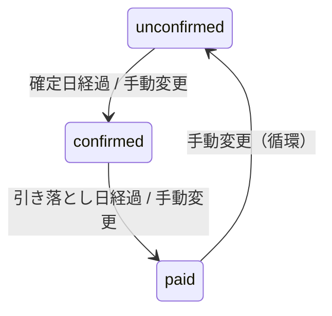

# プロジェクト用語集 (Glossary)

| 項目 | 内容 |
|------|------|
| バージョン | v1.1 |
| 作成日 | 2026-03-04 |
| 更新日 | 2026-03-04 |
| ステータス | 承認待ち |
| 対応PRD | product-requirements.md v1.8 |

## 改版履歴

| バージョン | 日付 | 変更内容 |
|-----------|------|---------|
| v1.0 | 2026-03-04 | 初版作成 |
| v1.1 | 2026-03-04 | レビュー指摘修正: confirmationMonthOffset追加、技術用語・UIパターン用語追加、索引修正、利用月ビジネスルール追記 |

---

## ドメイン用語

### 手取り (Take-home Pay)

**定義**: 給料の支給額（税引後の振込額）。本アプリの「収入」に相当する。

**データモデル**: `Salary` テーブルの `amount` フィールド

**使用例**:
- 「今月の手取りは30万円」
- 「手取りで引き落としが賄えるか確認する」

**関連用語**: [給料日](#給料日-pay-day)、[給料サイクル](#給料サイクル-salary-cycle)

### 給料日 (Pay Day)

**定義**: 手取りが銀行口座に振り込まれる日。1〜31 の整数値、または 32（末日を示す特殊値）。

**データモデル**: `Salary` テーブルの `payDay` フィールド

**使用例**:
- 「給料日は毎月25日」
- 「payDay=32 は月末日を意味する」

**関連用語**: [手取り](#手取り-take-home-pay)、[給料サイクル](#給料サイクル-salary-cycle)

### 給料サイクル (Salary Cycle)

**定義**: 給料日から次の給料日前日までの期間。カレンダー月ではなく、この期間を 1 サイクルとして資金繰りを管理する。

**計算ルール**:
- 開始: 選択月の payDay 日
- 終了: 翌月の (payDay - 1) 日
- payDay が月の最終日を超える場合は月末日に丸める
- payDay = 1 の場合: 当月 1 日〜当月末日
- 例: payDay=25, 2月 → 2/25〜3/24

**実装箇所**: `lib/utils/salary-cycle.ts`

**使用例**:
- 「2月の給料サイクルは 2/25〜3/24」
- 「サイクル内の引き落とし合計を表示する」

**関連用語**: [給料日](#給料日-pay-day)、[ダッシュボード](#ダッシュボード-dashboard)

### 利用月 / 締め月 (Billing Month)

**定義**: クレジットカードの利用が計上される月。`Payment` テーブルの `month` カラム（"YYYY-MM" 形式）。

**ビジネスルール**:
- 本アプリでは利用月をユーザーが手動で選択するため、締め日との自動判定は行わない
- 締め日はカード情報の参考表示として保持するが、利用月の自動振り分けには使用しない

**使用例**:
- 「2月利用分の引き落としは4月」（paymentMonthOffset=2 の場合）

**関連用語**: [引き落とし月](#引き落とし月-payment-month)、[paymentMonthOffset](#paymentmonthoffset)、[締め日](#締め日-closing-day)

### 引き落とし月 (Payment Month)

**定義**: 実際にクレカ代金が銀行口座から引き落とされる月。利用月 + paymentMonthOffset で算出。

**計算式**: `引き落とし月 = 利用月 + paymentMonthOffset`

**使用例**:
- 「2月利用・翌月払い（offset=1）→ 3月引き落とし」

**関連用語**: [利用月](#利用月--締め月-billing-month)、[paymentMonthOffset](#paymentmonthoffset)

### 締め日 (Closing Day)

**定義**: クレジットカードの利用金額が締められる日。1〜31 の整数値、または 32（末日）。

**データモデル**: `CreditCard` テーブルの `closingDay` フィールド

**使用例**:
- 「締め日が15日のカードは、16日〜翌月15日の利用分を翌々月に請求」

**関連用語**: [支払い日](#支払い日-payment-day)、[確定日](#確定日-confirmation-day)

### 支払い日 (Payment Day)

**定義**: クレジットカードの引き落とし日。1〜31 の整数値、または 32（末日）。

**データモデル**: `CreditCard` テーブルの `paymentDay` フィールド

**使用例**:
- 「支払い日は毎月27日」

**関連用語**: [締め日](#締め日-closing-day)、[paymentMonthOffset](#paymentmonthoffset)

### 確定日 (Confirmation Day)

**定義**: クレジットカード会社が利用金額を確定する日。任意設定。null の場合は確定日判定をスキップする。

**データモデル**: `CreditCard` テーブルの `confirmationDay` + `confirmationMonthOffset`

**使用例**:
- 「確定日を過ぎたら自動的に confirmed ステータスになる」

**関連用語**: [ステータス](#ステータス-payment-status)

### ステータス (Payment Status)

**定義**: 支払いの状態を示す 3 値の列挙型。循環遷移が可能。

**値の定義**:

| ステータス | 日本語 | 意味 | 次の状態 |
|----------|--------|------|---------|
| `unconfirmed` | 未確定 | カード会社が金額を未確定 | `confirmed` |
| `confirmed` | 確定 | 金額確定済み、引き落とし前 | `paid` |
| `paid` | 支払済 | 引き落とし完了 | `unconfirmed` |

**状態遷移図**:


**自動ステータス判定**（登録時、JST 基準）:
- 引き落とし日 ≤ 今日 → `paid`（優先）
- 確定日 ≤ 今日（かつ引き落とし日が未来）→ `confirmed`
- それ以外 → `unconfirmed`

**実装箇所**: `lib/utils/status.ts`

**関連用語**: [確定日](#確定日-confirmation-day)、[支払い日](#支払い日-payment-day)

### paymentMonthOffset

**定義**: 利用月から引き落とし月までの月数差。0=当月、1=翌月、2=翌々月。カード会社により異なる。

**データモデル**: `CreditCard` テーブルの `paymentMonthOffset` フィールド（0〜2）

**使用例**:
- 「offset=1 の場合、2月利用分は3月に引き落とし」

**関連用語**: [利用月](#利用月--締め月-billing-month)、[引き落とし月](#引き落とし月-payment-month)

### confirmationMonthOffset

**定義**: 利用月から確定日が属する月までの月数差。0=当月、1=翌月。

**データモデル**: `CreditCard` テーブルの `confirmationMonthOffset` フィールド

**制約**: `confirmationDay` と必ずペアで設定する。片方のみ null は不可。

**計算式**: `確定日 = 利用月 + confirmationMonthOffset 月の confirmationDay 日`

**使用例**:
- 「offset=0, confirmationDay=20 の場合、2月利用分の確定日は2月20日」
- 「offset=1, confirmationDay=10 の場合、2月利用分の確定日は3月10日」

**関連用語**: [確定日](#確定日-confirmation-day)、[paymentMonthOffset](#paymentmonthoffset)

### 繰り返し支払い (Recurring Payment)

**定義**: 固定費など、複数月にわたって同額・同カードで発生する支払い。登録操作 1 回で本体 + 追加 3 件 = 計 4 レコードが作成される。

**データモデル**: `Payment` テーブルの `isRecurring` (true) + `recurringGroupId`（同一グループを識別）

**使用例**:
- 「通信費を繰り返し支払いとして登録する」
- 「繰り返しグループを一括削除する」

**ビジネスルール**:
- 編集は対象の 1 件のみに適用（他のレコードには反映しない）
- 一括削除は `recurringGroupId` で同一グループを対象とする

### 一括登録 (Bulk Register)

**定義**: 1 つのカード・利用月に対して、カテゴリ別に金額を振り分けて複数の支払いを一度に登録する機能。

**UI フロー**:
1. STEP1: カード・利用月・合計額を入力
2. STEP2: カテゴリごとに金額を振り分け（振り分け合計 = 合計額で登録可能）

**使用例**:
- 「カードの明細書を見ながら一括登録する」

### ダッシュボード (Dashboard)

**定義**: 選択月の手取りと支払いの関係を一目で把握する画面。

**構成要素**:
- サマリーカード: 手取り合計（月ベース）、支払い合計（サイクルベース）、残額
- ステータス別内訳: 未確定・確定・支払済の金額
- 支払い予定テーブル: カードごとの折りたたみ表示
- 資金繰りセクション: 給料日と引き落とし日の時系列表示

**関連用語**: [給料サイクル](#給料サイクル-salary-cycle)

### sortOrder

**定義**: 表示順を制御する整数値。CreditCard、Category、Payment、Salary の各テーブルに存在する。

**ビジネスルール**:
- ドラッグ&ドロップで変更可能
- 削除時は欠番を詰め直さない
- D&D 保存時にのみ正規化する（1, 2, 3, ... に振り直し）

---

## 技術用語

### Next.js (App Router)

**定義**: React ベースのフルスタック Web フレームワーク。App Router はファイルベースルーティングと Server Components を提供する。

**本プロジェクトでの用途**: フレームワーク全体。SSR、ルーティング、Server Actions によるデータ更新。

**バージョン**: 15.x

**関連ドキュメント**: [architecture.md](./architecture.md)

### Server Component

**定義**: サーバーサイドでのみ実行される React コンポーネント。`"use client"` を付与しない限り、全コンポーネントがデフォルトで Server Component となる。

**本プロジェクトでの用途**: ページコンポーネント（`page.tsx`）でのデータ取得。Prisma を直接呼び出し、HTML をサーバーで生成する。

**関連用語**: [Client Component](#client-component)

### Client Component

**定義**: ブラウザ上で実行される React コンポーネント。`"use client"` ディレクティブを付与する。

**本プロジェクトでの用途**: フォーム入力、ダイアログ、チャート表示など、インタラクションが必要な最小単位のコンポーネント。

**関連用語**: [Server Component](#server-component)

### Server Action

**定義**: `"use server"` ディレクティブを付与したサーバーサイド関数。フォーム送信やデータ更新に使用する。

**本プロジェクトでの用途**: 全ての CUD（Create/Update/Delete）操作。`lib/actions/` に配置。

**関連ドキュメント**: [architecture.md](./architecture.md)

### Prisma

**定義**: TypeScript/JavaScript 向けの型安全な ORM。スキーマファーストでデータモデルを定義し、型安全なクエリを自動生成する。

**本プロジェクトでの用途**: PostgreSQL へのデータアクセス。シングルトンパターンで管理。

**バージョン**: 6.x

**設定ファイル**: `prisma/schema.prisma`

### Supabase

**定義**: オープンソースの Firebase 代替。PostgreSQL データベース、認証、ストレージ、リアルタイム機能を提供する BaaS。

**本プロジェクトでの用途**:
- **Supabase Auth**: メール+パスワード認証、セッション管理
- **Supabase PostgreSQL**: データベース（RLS 付き）

**関連用語**: [RLS](#rls-row-level-security)

### RLS (Row Level Security)

**正式名称**: Row Level Security

**定義**: PostgreSQL の機能で、テーブルの行単位でアクセス制御を行う。ポリシーに基づいて、各ユーザーが自分のデータのみにアクセスできるよう制限する。

**本プロジェクトでの適用**: 全テーブルに `auth.uid()::text = user_id` ポリシーを設定。ユーザーは自分のデータのみ参照・操作可能。

**関連ドキュメント**: [architecture.md](./architecture.md#42-row-level-security-rls)

### Zod

**定義**: TypeScript ファーストのスキーマバリデーションライブラリ。スキーマから TypeScript 型を自動推論する。

**本プロジェクトでの用途**: フォーム入力のバリデーション（クライアント・サーバー共用）。`lib/validations/` に配置。

**バージョン**: 3.x

### shadcn/ui

**定義**: Radix UI と Tailwind CSS をベースにした、コピー&ペースト方式の UI コンポーネントライブラリ。npm パッケージではなく、ソースコードをプロジェクトに直接コピーする。

**本プロジェクトでの用途**: Button, Input, Dialog, Card, Table 等の基本 UI コンポーネント。`components/ui/` に配置。

### Recharts

**定義**: React ネイティブの SVG チャートライブラリ。

**本プロジェクトでの用途**: ダッシュボードのグラフ表示、レポート機能（Post-MVP）。Dynamic Import (`ssr: false`) で遅延読み込み。

**バージョン**: 2.x

### date-fns

**定義**: 日付操作ライブラリ。軽量でツリーシェイキングに対応している。

**本プロジェクトでの用途**: 給料サイクル計算、引き落とし日算出、月の加減算など日付関連のロジック全般。

**バージョン**: 4.x

### React Hook Form

**定義**: フォーム管理ライブラリ。非制御コンポーネントベースで高パフォーマンス。

**本プロジェクトでの用途**: 支払い登録・編集フォーム、カード登録フォーム等。`@hookform/resolvers` で Zod 統合し、バリデーションを共通化。

**バージョン**: 7.x

### @dnd-kit/core

**定義**: ドラッグ&ドロップライブラリ。アクセシビリティ対応でモダンな D&D 実装を提供する。

**本プロジェクトでの用途**: カード・カテゴリの sortOrder 並び替えに使用。

**バージョン**: 6.x

**関連用語**: [sortOrder](#sortorder)、[D&D](#dd)

### sonner

**定義**: トースト通知ライブラリ。軽量でアニメーション付きの通知を提供する。

**本プロジェクトでの用途**: Server Action の成功/失敗フィードバック。成功通知は自動消去、エラー通知は手動閉じ。

**バージョン**: 2.x

**関連用語**: [トースト通知](#トースト通知-toast)

### Tailwind CSS

**定義**: ユーティリティファースト CSS フレームワーク。クラス名でスタイルを直接指定する。

**本プロジェクトでの用途**: 全画面のスタイリング。モバイルファースト設計で `sm:`, `md:`, `lg:` ブレークポイントを使用。

**バージョン**: 4

### revalidatePath

**定義**: Next.js のキャッシュ再検証関数。Server Action 内でデータ更新後に呼び出し、該当ページの再レンダリングをトリガーする。

**本プロジェクトでの用途**: CUD 操作後に関連ページのキャッシュを無効化し、最新データを反映させる。

**実装箇所**: `lib/actions/` 内の各 Server Action

---

## UI パターン用語

### Skeleton UI

**定義**: データ読み込み中のプレースホルダー UI。実際のコンテンツと同様のレイアウト形状をグレーのブロックで表示し、読み込み中であることを視覚的に伝える。

**本プロジェクトでの適用**: `loading.tsx`（Next.js Suspense フォールバック）で実装。各ページに対応する Skeleton を配置。

### トースト通知 (Toast)

**定義**: 操作結果の一時通知 UI。画面の端に表示され、一定時間後に自動で消去される。

**本プロジェクトでの適用**: sonner で実装。成功=2-3秒自動消去、エラー=手動閉じ。

**関連用語**: [sonner](#sonner)

---

## 略語・頭字語

### MVP

**正式名称**: Minimum Viable Product

**意味**: 最小限の実用的な製品。本プロジェクトでは F-01〜F-06 がMVP スコープ。

### PRD

**正式名称**: Product Requirements Document

**意味**: プロダクト要求定義書。アプリケーションの機能要件・非機能要件を定義する。

**本プロジェクトでの使用**: `docs/product-requirements.md`

### SSR

**正式名称**: Server-Side Rendering

**意味**: サーバー側で HTML を生成してクライアントに送信するレンダリング手法。

**本プロジェクトでの適用**: Next.js Server Components が SSR を担当。

### CRUD

**正式名称**: Create, Read, Update, Delete

**意味**: データの基本操作（作成・読み取り・更新・削除）。

**本プロジェクトでの適用**: Server Actions で CUD、Server Components で Read。

### JST

**正式名称**: Japan Standard Time

**意味**: 日本標準時（UTC+9）。自動ステータス判定の日付比較に使用。

**本プロジェクトでの適用**: `Asia/Tokyo` タイムゾーンで現在日付を取得。

### CUID

**正式名称**: Collision-resistant Unique Identifier

**意味**: 衝突耐性のあるユニーク ID 生成アルゴリズム。UUID に比べてソート可能かつ短い。

**本プロジェクトでの適用**: 全テーブルの主キー（`id` フィールド）に使用。Prisma の `@default(cuid())` で自動生成。

### HEX

**正式名称**: Hexadecimal

**意味**: 16 進数表記。カテゴリの `color` フィールドで使用（例: `"#FF6384"`）。

### D&D

**正式名称**: Drag and Drop

**意味**: ドラッグ&ドロップ操作。カードやカテゴリの並び順変更に使用。

**本プロジェクトでの適用**: `@dnd-kit/core` で実装。sortOrder に保存。

### HMR

**正式名称**: Hot Module Replacement

**意味**: 開発時のモジュール差し替え機能。ページ全体をリロードせずに変更箇所のみを更新する。

**本プロジェクトでの適用**: Next.js 開発サーバーが自動提供。Prisma Client のシングルトン管理は HMR によるコネクション枯渇を防ぐために必要。

---

## アーキテクチャ用語

### App Router アーキテクチャ

**定義**: Next.js 13+ で導入されたファイルベースルーティングとReact Server Components を組み合わせたアーキテクチャ。

**本プロジェクトでの適用**:
```
app/ (ルーティング・ページ)
  ↓
components/ (UI コンポーネント)
  ↓
lib/ (ビジネスロジック・Server Actions)
  ↓
prisma/ (データアクセス)
  ↓
PostgreSQL + RLS (データ永続化・アクセス制御)
```

**関連ドキュメント**: [architecture.md](./architecture.md)

### Route Group

**定義**: Next.js App Router の機能。`(groupName)/` 形式のディレクトリで、URL パスに影響を与えずにルートをグルーピングする。

**本プロジェクトでの適用**:
- `(auth)/`: 認証不要ページ（login, register 等）
- `(main)/`: 認証必須ページ（ダッシュボード, 支払い管理等）

### シングルトンパターン

**定義**: あるクラスのインスタンスが 1 つだけ存在することを保証するデザインパターン。

**本プロジェクトでの適用**: Prisma Client を `globalThis` にキャッシュし、開発環境での HMR によるコネクション枯渇を防止。

**実装箇所**: `lib/prisma.ts`

---

## データモデル用語

### Salary（手取り）

**定義**: 月次の手取り額と給料日を記録するエンティティ。

**主要フィールド**:
- `payDay`: 支給日（1-31, 32=末日）
- `amount`: 手取り額（円）
- `month`: 対象月（"YYYY-MM"）

**関連エンティティ**: なし（独立エンティティ）

### CreditCard（クレジットカード）

**定義**: クレジットカードの基本情報と締め日・支払い日を記録するエンティティ。

**主要フィールド**:
- `closingDay`: 締め日（1-31, 32=末日）
- `paymentDay`: 支払い日（1-31, 32=末日）
- `paymentMonthOffset`: 利用月→引き落とし月の月数差（0-2）
- `brand`: カードブランド（visa/mastercard/jcb/amex/other）

**関連エンティティ**: Payment（1:N、CASCADE 削除）

### Payment（支払い）

**定義**: クレジットカードの利用明細を記録するエンティティ。

**主要フィールド**:
- `month`: 利用月（"YYYY-MM"）
- `amount`: 金額（円）
- `status`: unconfirmed / confirmed / paid
- `isRecurring`: 繰り返し支払いフラグ
- `recurringGroupId`: 繰り返しグループ ID

**関連エンティティ**: CreditCard（N:1、CASCADE）、Category（N:1、SET NULL）

**制約**: creditCardId は NOT NULL（カード必須）、categoryId は NULL 許容（カテゴリ削除時）

### Category（カテゴリ）

**定義**: 支出分類のエンティティ。デフォルトカテゴリ（9 種類）とカスタムカテゴリがある。

**主要フィールド**:
- `name`: カテゴリ名（1-30 文字、同一ユーザー内で重複不可）
- `color`: 表示カラー（HEX コード）
- `isDefault`: デフォルトフラグ（true の場合は削除不可）

**デフォルトカテゴリ**: 食費、水道光熱費、通信費、交通費、娯楽、日用品、医療、その他、雑費

**「その他」の判定条件**: `isDefault = true` かつ `name = "その他"`（一覧末尾に固定表示）

### Budget（予算）※ Post-MVP

**定義**: カテゴリ別の月間予算を記録するエンティティ。

**制約**: `(userId, categoryId, month)` でユニーク

---

## 索引

### あ行
- [一括登録](#一括登録-bulk-register)

### か行
- [カテゴリ](#category-カテゴリ)
- [確定日](#確定日-confirmation-day)
- [給料サイクル](#給料サイクル-salary-cycle)
- [給料日](#給料日-pay-day)
- [クレジットカード](#creditcard-クレジットカード)
- [繰り返し支払い](#繰り返し支払い-recurring-payment)

### さ行
- [支払い](#payment-支払い)
- [支払い日](#支払い日-payment-day)
- [締め日](#締め日-closing-day)
- [ステータス](#ステータス-payment-status)
- [Skeleton UI](#skeleton-ui)

### た行
- [ダッシュボード](#ダッシュボード-dashboard)
- [手取り](#手取り-take-home-pay)
- [トースト通知](#トースト通知-toast)

### は行
- [引き落とし月](#引き落とし月-payment-month)

### A-Z
- [@dnd-kit/core](#dnd-kitcore)
- [App Router アーキテクチャ](#app-router-アーキテクチャ)
- [Client Component](#client-component)
- [confirmationMonthOffset](#confirmationmonthoffset)
- [CRUD](#crud)
- [CUID](#cuid)
- [D&D](#dd)
- [date-fns](#date-fns)
- [HEX](#hex)
- [HMR](#hmr)
- [JST](#jst)
- [MVP](#mvp)
- [Next.js](#nextjs-app-router)
- [paymentMonthOffset](#paymentmonthoffset)
- [PRD](#prd)
- [Prisma](#prisma)
- [React Hook Form](#react-hook-form)
- [Recharts](#recharts)
- [revalidatePath](#revalidatepath)
- [RLS](#rls-row-level-security)
- [Route Group](#route-group)
- [Server Action](#server-action)
- [Server Component](#server-component)
- [shadcn/ui](#shadcnui)
- [sonner](#sonner)
- [sortOrder](#sortorder)
- [SSR](#ssr)
- [Supabase](#supabase)
- [Tailwind CSS](#tailwind-css)
- [Zod](#zod)
