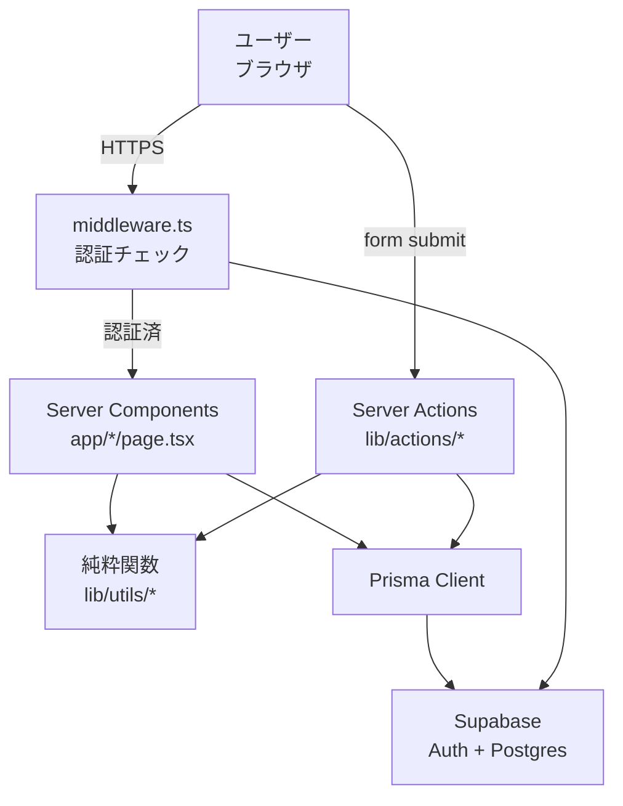
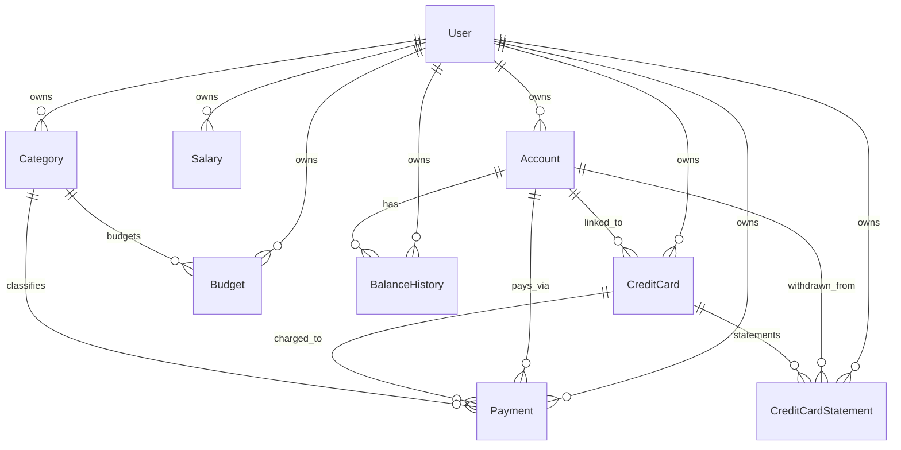
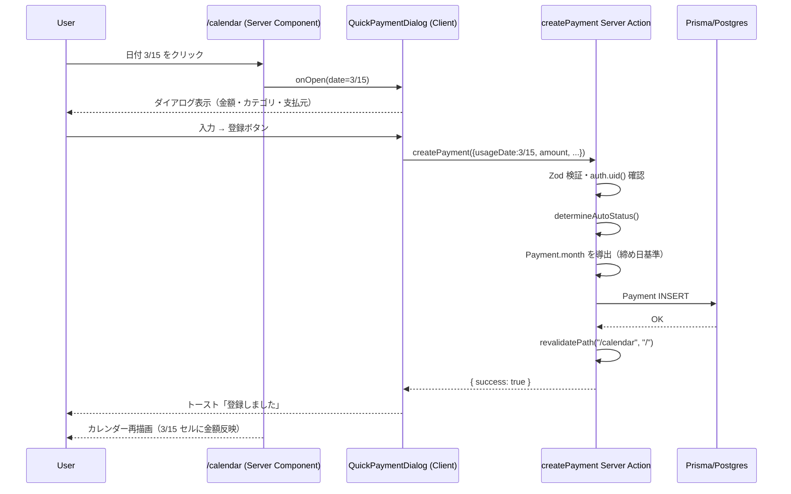
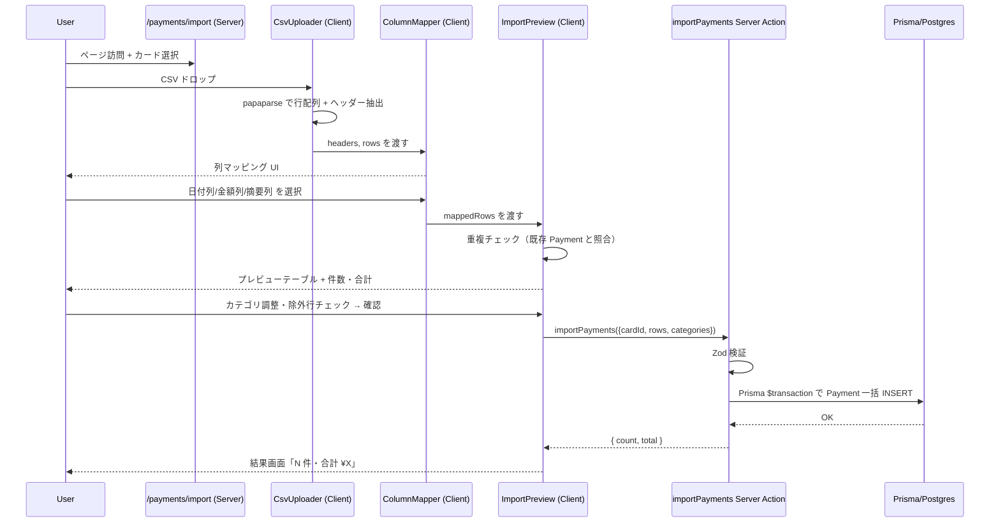
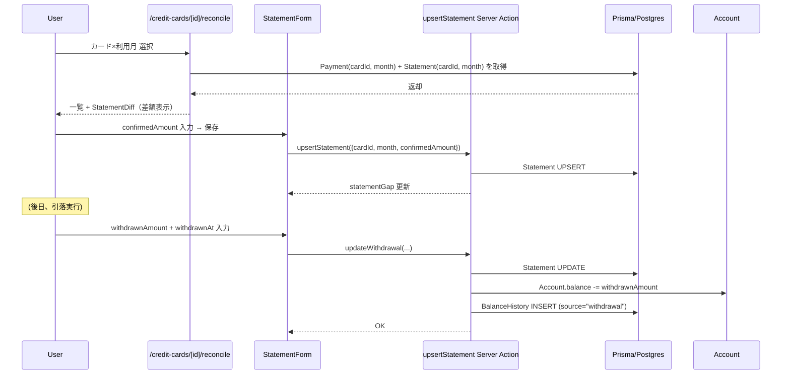
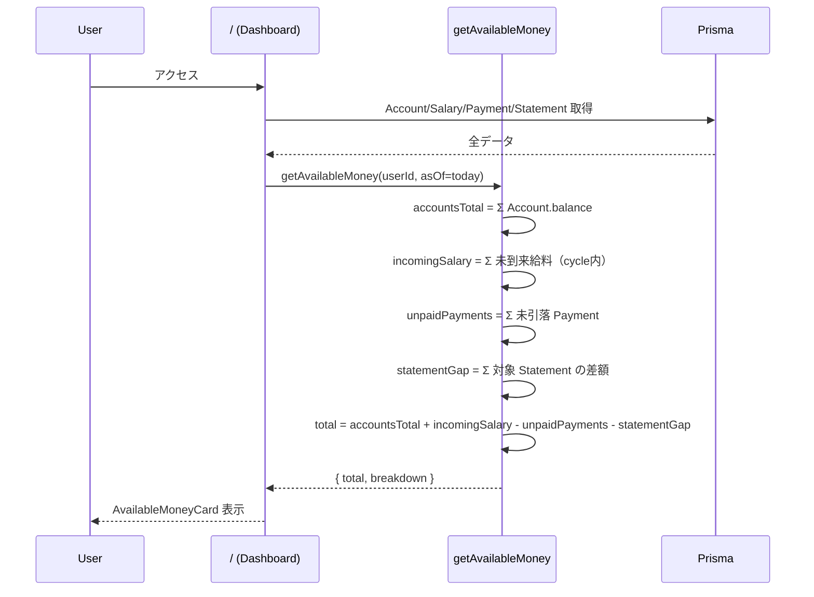
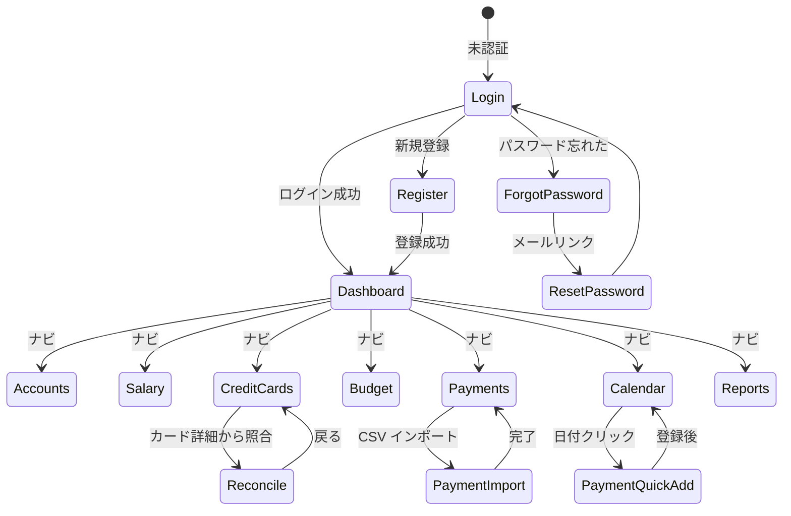

# 機能設計書 (Functional Design Document)

| 項目 | 内容 |
|------|------|
| プロダクト | kakeibo-app v3 |
| バージョン | v1.0 |
| 作成日 | 2026-04-17 |
| ステータス | ドラフト |

## システム構成図



## 技術スタック

詳細は `03_architecture.md` を参照。要約:

| 分類 | 技術 |
|------|------|
| フレームワーク | Next.js 16 App Router |
| 言語 | TypeScript 5 (strict) |
| UI | Tailwind CSS v4 + shadcn/ui |
| DB | Prisma 7 + Supabase Postgres |
| 認証 | Supabase Auth (@supabase/ssr) |
| チャート | Recharts |
| 日付 | date-fns |
| フォーム | React Hook Form + Zod |
| CSV | papaparse |
| テスト | Vitest + @testing-library/react + Playwright |

## データモデル定義

### ER 図



### エンティティ定義

#### Account（銀行口座・現金）

```prisma
model Account {
  id                String   @id @default(uuid())
  userId            String   @map("user_id")
  name              String
  type              String   // "bank" | "cash"
  balance           Int      // 円単位
  balanceUpdatedAt  DateTime @map("balance_updated_at")
  sortOrder         Int      @default(0) @map("sort_order")
  createdAt         DateTime @default(now()) @map("created_at")
  updatedAt         DateTime @updatedAt @map("updated_at")

  balanceHistories     BalanceHistory[]
  payments             Payment[]
  creditCards          CreditCard[]
  creditCardStatements CreditCardStatement[]

  @@index([userId, sortOrder])
  @@map("accounts")
}
```

**制約**:
- `type` は "bank" または "cash" のみ（DB check constraint）
- `balance` は負の値も許容（当座貸越口座想定）

#### Salary（手取り）

```prisma
model Salary {
  id        String   @id @default(uuid())
  userId    String   @map("user_id")
  month     String   // "YYYY-MM"
  amount    Int
  payDay    Int      @map("pay_day") // 1-31, 32=末日
  sortOrder Int      @default(0) @map("sort_order")
  createdAt DateTime @default(now())
  updatedAt DateTime @updatedAt

  @@index([userId, month])
  @@map("salaries")
}
```

#### CreditCard

```prisma
model CreditCard {
  id                       String   @id @default(uuid())
  userId                   String   @map("user_id")
  name                     String
  brand                    String?  // "visa" | "mastercard" | "jcb" | "amex" | null
  closingDay               Int      @map("closing_day")       // 1-31, 32=末日
  paymentDay               Int      @map("payment_day")        // 1-31, 32=末日
  paymentMonthOffset       Int      @map("payment_month_offset") @default(1)
  confirmationDay          Int?     @map("confirmation_day")
  confirmationMonthOffset  Int?     @map("confirmation_month_offset")
  accountId                String?  @map("account_id")         // 引落先口座
  sortOrder                Int      @default(0) @map("sort_order")
  createdAt                DateTime @default(now())
  updatedAt                DateTime @updatedAt

  account     Account?              @relation(fields: [accountId], references: [id])
  payments    Payment[]
  statements  CreditCardStatement[]

  @@index([userId, sortOrder])
  @@map("credit_cards")
}
```

**制約**:
- `confirmationDay` と `confirmationMonthOffset` はどちらかのみ設定不可（両方設定か両方 null）
- `paymentMonthOffset` は 0-2 の範囲

#### Category

```prisma
model Category {
  id        String   @id @default(uuid())
  userId    String   @map("user_id")
  name      String
  color     String   // "#RRGGBB"
  sortOrder Int      @default(0) @map("sort_order")
  isDefault Boolean  @default(false) @map("is_default")
  createdAt DateTime @default(now())
  updatedAt DateTime @updatedAt

  payments Payment[]
  budgets  Budget[]

  @@index([userId, sortOrder])
  @@map("categories")
}
```

#### Budget

```prisma
model Budget {
  id         String   @id @default(uuid())
  userId     String   @map("user_id")
  categoryId String   @map("category_id")
  month      String   // "YYYY-MM"
  amount     Int
  createdAt  DateTime @default(now())
  updatedAt  DateTime @updatedAt

  category Category @relation(fields: [categoryId], references: [id], onDelete: Cascade)

  @@unique([userId, categoryId, month])
  @@index([userId, month])
  @@map("budgets")
}
```

#### Payment

```prisma
model Payment {
  id               String   @id @default(uuid())
  userId           String   @map("user_id")
  usageDate        DateTime @map("usage_date") @db.Date
  month            String   // "YYYY-MM" 利用月
  amount           Int
  status           String   @default("unconfirmed") // "unconfirmed" | "confirmed" | "paid"
  categoryId       String   @map("category_id")
  creditCardId     String?  @map("credit_card_id")
  accountId        String?  @map("account_id")
  memo             String?
  isRecurring      Boolean  @default(false) @map("is_recurring")
  recurringGroupId String?  @map("recurring_group_id")
  createdAt        DateTime @default(now())
  updatedAt        DateTime @updatedAt

  category   Category    @relation(fields: [categoryId], references: [id])
  creditCard CreditCard? @relation(fields: [creditCardId], references: [id])
  account    Account?    @relation(fields: [accountId], references: [id])

  @@index([userId, month])
  @@index([userId, usageDate])
  @@index([userId, creditCardId, month])
  @@index([userId, recurringGroupId])
  @@map("payments")
}
```

**制約**:
- `creditCardId` と `accountId` はどちらか一方が必須（排他・アプリケーション層で検証）
- `amount > 0`（DB check constraint）

#### CreditCardStatement

```prisma
model CreditCardStatement {
  id                String    @id @default(uuid())
  userId            String    @map("user_id")
  creditCardId      String    @map("credit_card_id")
  month             String    // "YYYY-MM" 利用月単位
  confirmedAmount   Int       @map("confirmed_amount")
  withdrawnAmount   Int?      @map("withdrawn_amount")
  withdrawnAt       DateTime? @map("withdrawn_at")
  accountId         String?   @map("account_id") // 引落先口座
  memo              String?
  createdAt         DateTime  @default(now())
  updatedAt         DateTime  @updatedAt

  creditCard CreditCard @relation(fields: [creditCardId], references: [id], onDelete: Cascade)
  account    Account?   @relation(fields: [accountId], references: [id])

  @@unique([userId, creditCardId, month])
  @@map("credit_card_statements")
}
```

#### BalanceHistory

```prisma
model BalanceHistory {
  id         String   @id @default(uuid())
  userId     String   @map("user_id")
  accountId  String   @map("account_id")
  balance    Int
  recordedAt DateTime @default(now()) @map("recorded_at")
  source     String   // "manual" | "withdrawal" | "income"

  account Account @relation(fields: [accountId], references: [id], onDelete: Cascade)

  @@index([userId, accountId, recordedAt])
  @@map("balance_histories")
}
```

## コンポーネント設計

### UI コンポーネント主要構造

#### AvailableMoneyCard (dashboard)

**責務**:
- AvailableMoney の大きな表示
- マイナス時の赤色強調
- 内訳カードへの展開 UI

**Props**:
```typescript
interface AvailableMoneyCardProps {
  total: number;
  breakdown: {
    accountsTotal: number;
    incomingSalary: number;
    unpaidPayments: number;
    statementGap: number;
  };
}
```

#### PaymentForm (payments)

**責務**:
- Payment の新規登録・編集フォーム
- usageDate・amount・categoryId・支払元（card or account）・memo の入力
- Zod (`PaymentSchema`) 経由のバリデーション

**依存**: `createPayment`/`updatePayment` Server Actions、shadcn/ui の Input/Select/Button/Calendar

#### MonthCalendar (calendar)

**責務**:
- 月次カレンダーグリッドの表示
- 各日セルに Payment 合計額を表示
- 日付クリックで QuickPaymentDialog を開く

**Props**:
```typescript
interface MonthCalendarProps {
  year: number;
  month: number; // 1-12
  dailyTotals: Record<string, number>; // "YYYY-MM-DD" → amount
  onDayClick: (date: Date) => void;
}
```

#### CsvUploader (payments/import)

**責務**:
- CSV ファイルのドラッグ&ドロップ受け取り
- papaparse でヘッダー行と最初の 5 行をプレビュー
- 列マッピング UI（ColumnMapper）へ結果を渡す

#### StatementDiff (reconcile)

**責務**:
- `statementGap` の視覚的表示
- 0 円時は OK バッジ、正負時は絶対値と色分け
- Payment 一覧の合計と confirmedAmount の比較

**Props**:
```typescript
interface StatementDiffProps {
  paymentsTotal: number;
  confirmedAmount: number;
  withdrawnAmount: number | null;
}
```

## ユースケース図

### ユースケース 1: Payment の新規登録（カレンダー経由）



### ユースケース 2: CSV 明細インポート



### ユースケース 3: クレカ誤差ゼロ照合



### ユースケース 4: ダッシュボード表示



## 画面遷移図



## API 設計（Server Actions）

REST API は MVP では使用せず、Server Actions で完結する。主要 Action のシグネチャ:

### auth-actions.ts

```typescript
async function signIn(formData: FormData): Promise<{ error?: string }>
async function signUp(formData: FormData): Promise<{ error?: string }>
async function signOut(): Promise<void>
async function requestPasswordReset(formData: FormData): Promise<{ error?: string }>
async function resetPassword(formData: FormData): Promise<{ error?: string }>
```

### account-actions.ts

```typescript
async function createAccount(input: AccountInput): Promise<Account>
async function updateAccount(id: string, input: Partial<AccountInput>): Promise<Account>
async function updateAccountBalance(id: string, balance: number): Promise<Account>  // BalanceHistory 追加
async function deleteAccount(id: string): Promise<void>
async function reorderAccounts(orders: { id: string; sortOrder: number }[]): Promise<void>
```

### payment-actions.ts

```typescript
async function createPayment(input: PaymentInput): Promise<Payment>
async function updatePayment(id: string, input: Partial<PaymentInput>): Promise<Payment>
async function deletePayment(id: string): Promise<void>
async function bulkUpdateStatus(ids: string[], status: PaymentStatus): Promise<void>
async function bulkDelete(ids: string[]): Promise<void>
async function createRecurringPayment(input: PaymentInput): Promise<Payment[]>  // 4件作成
```

### statement-actions.ts

```typescript
async function upsertStatement(input: StatementInput): Promise<CreditCardStatement>
async function updateWithdrawal(id: string, withdrawnAmount: number, withdrawnAt: Date): Promise<CreditCardStatement>
async function deleteStatement(id: string): Promise<void>
```

### csv-import-actions.ts

```typescript
interface ImportRow {
  usageDate: string; // "YYYY-MM-DD"
  amount: number;
  memo: string;
  categoryId: string;
  isDuplicate: boolean;
  excluded: boolean;
}
async function importPayments(creditCardId: string, rows: ImportRow[]): Promise<{ count: number; total: number }>
```

### エラーレスポンス

Server Action は以下の形式で失敗を返す:

```typescript
type ActionResult<T> =
  | { success: true; data: T }
  | { success: false; error: string; fieldErrors?: Record<string, string> };
```

## アルゴリズム設計

### getAvailableMoney

**目的**: ユーザーが現在自由に使える金額を算出する。

**入力**: `userId: string`, `asOf: Date` (デフォルトは今日)

**出力**:
```typescript
interface AvailableMoneyResult {
  total: number;
  breakdown: {
    accountsTotal: number;
    incomingSalary: number;
    unpaidPayments: number;
    statementGap: number;
  };
}
```

**計算ロジック**:

#### ステップ 1: accountsTotal

- 全 Account の `balance` を合計

#### ステップ 2: incomingSalary

- 現在の給料サイクル（asOf を含む）を特定
- サイクル内の Salary のうち、`payDay` が asOf より未来のものの amount を合計

#### ステップ 3: unpaidPayments

- Payment のうち、以下を除いた合計:
  - `calculatePaymentDate()` で計算した引落日が asOf 以前のもの（= 既に引落済）
  - 後続ステップで statementGap に含めるもの（withdrawnAmount が入力された Statement 対応の Payment）

#### ステップ 4: statementGap

- Statement のうち、`confirmedAmount` があり `withdrawnAmount` が null のものを対象
- 対象ごとに `gap = ΣPayment(cardId, month) - confirmedAmount` を算出
- 全 gap を合計（符号そのまま）

#### ステップ 5: 総合計算

```
total = accountsTotal + incomingSalary − unpaidPayments − statementGap
```

**実装例**:

```typescript
export async function getAvailableMoney(
  userId: string,
  asOf: Date = new Date(),
): Promise<AvailableMoneyResult> {
  const [accounts, salaries, payments, statements] = await Promise.all([
    prisma.account.findMany({ where: { userId } }),
    prisma.salary.findMany({ where: { userId } }),
    prisma.payment.findMany({ where: { userId }, include: { creditCard: true } }),
    prisma.creditCardStatement.findMany({ where: { userId }, include: { creditCard: true } }),
  ]);

  const accountsTotal = accounts.reduce((sum, a) => sum + a.balance, 0);

  const cycle = calculateSalaryCycle(salaries, asOf);
  const incomingSalary = salaries
    .filter((s) => isInCycle(s, cycle) && isFutureDate(s.payDay, asOf))
    .reduce((sum, s) => sum + s.amount, 0);

  const withdrawnStatementKeys = new Set(
    statements.filter((s) => s.withdrawnAmount !== null).map((s) => `${s.creditCardId}:${s.month}`),
  );
  const unpaidPayments = payments
    .filter((p) => {
      const paymentDate = calculatePaymentDate(p, p.creditCard);
      if (paymentDate <= asOf) return false; // 引落済
      if (p.creditCardId) {
        const key = `${p.creditCardId}:${p.month}`;
        if (withdrawnStatementKeys.has(key)) return false; // Statement 側で処理済み
      }
      return true;
    })
    .reduce((sum, p) => sum + p.amount, 0);

  const statementGap = statements
    .filter((s) => s.withdrawnAmount === null)
    .reduce((gapSum, s) => {
      const cardPayments = payments.filter(
        (p) => p.creditCardId === s.creditCardId && p.month === s.month,
      );
      const paymentTotal = cardPayments.reduce((sum, p) => sum + p.amount, 0);
      return gapSum + (paymentTotal - s.confirmedAmount);
    }, 0);

  const total = accountsTotal + incomingSalary - unpaidPayments - statementGap;
  return { total, breakdown: { accountsTotal, incomingSalary, unpaidPayments, statementGap } };
}
```

### calculatePaymentDate

既存の v2 ロジックを踏襲。利用月の `paymentMonthOffset` ヶ月後の `paymentDay` を返す。

### determineAutoStatus

既存の v2 ロジックを踏襲。引落日・確定日の位置関係で 3 段階を決定。

### parseCsvImport

**目的**: CSV テキストを Payment 候補リストに変換する。

**入力**:
```typescript
interface ParseInput {
  csvText: string;
  columnMap: { date: number; amount: number; memo: number };
  cardId: string;
  existingPayments: { usageDate: Date; amount: number; creditCardId: string | null }[];
}
```

**処理**:
1. papaparse でヘッダー行 + 行配列にパース
2. 各行について columnMap に従いフィールド抽出
3. 日付文字列を Date に変換（複数フォーマット対応: YYYY/M/D, YYYY-MM-DD, M/D/YYYY）
4. 金額文字列を Int に変換（カンマ・通貨記号除去、マイナス許容）
5. 既存 Payment と `usageDate + amount + cardId` で重複判定 → `isDuplicate` 設定
6. 全行に `categoryId = その他` をデフォルト設定

**出力**: `{ rows: ImportRow[]; errors: { line: number; reason: string }[] }`

## UI 設計

### 全体レイアウト

**PC（lg 以上）**:
```
┌─────────────────────────────────────────────┐
│ Header (ロゴ / メール / ログアウト)            │
├──────────┬──────────────────────────────────┤
│ Sidebar  │ メインコンテンツ                   │
│ ・ダッシュ│                                  │
│ ・口座    │                                  │
│ ・手取り  │                                  │
│ ・カード  │                                  │
│ ・カテゴリ│                                  │
│ ・支払い  │                                  │
│ ・カレンダ│                                  │
│ ・レポート│                                  │
└──────────┴──────────────────────────────────┘
```

**モバイル（sm 以下）**:
```
┌─────────────────────────────────────────────┐
│ Header                                       │
├─────────────────────────────────────────────┤
│ メインコンテンツ                              │
│                                              │
├─────────────────────────────────────────────┤
│ ボトムナビ (ホーム/支払い/カレンダー/レポート)│
└─────────────────────────────────────────────┘
```

### ダッシュボード（/）

```
┌─ 空状態バナー（該当時のみ） ────────────┐
│  口座未登録 / 給料未登録 / カード未登録 / Payment未登録 │
└────────────────────────────────────────┘

┌─ AvailableMoneyCard ───────────────────┐
│  使えるお金                              │
│  ¥ 123,456                              │
│  （マイナスなら赤色）                     │
└────────────────────────────────────────┘

┌─ 内訳カード（2x2 グリッド） ─────────────┐
│ 銀行残高 ¥X │ 予定収入 ¥X              │
│ 未引落支払 ¥X │ 照合差額 ¥X            │
└────────────────────────────────────────┘

┌─ 給料サイクル ──────────────────────────┐
│ 2026-04-25 〜 2026-05-24 (あと N 日)    │
└────────────────────────────────────────┘

┌─ カード別支払い予定（引落日順） ─────────┐
│ 4/27 ○○カード ¥X                        │
│ 5/10 △△カード ¥X                        │
└────────────────────────────────────────┘

┌─ ステータス内訳 / 予算消化率 ────────────┐
└────────────────────────────────────────┘
```

### カレンダー（/calendar）

```
┌─ 月ナビ ────────────┐
│ ◀ 2026年 4月 ▶       │
└──────────────────────┘
┌───┬───┬───┬───┬───┬───┬───┐
│日 │月 │火 │水 │木 │金 │土 │
├───┼───┼───┼───┼───┼───┼───┤
│   │ 1 │ 2 │ 3 │ 4 │ 5 │ 6 │
│   │¥X │   │¥Y │   │¥Z │   │
├───┼───┼───┼───┼───┼───┼───┤
│ 7 │ 8 │ ...
...
└───┴───┴───┘

クリックで QuickPaymentDialog
```

### CSV インポート（/payments/import）

**ステップ 1: ファイル選択**
```
┌─ カード選択 ─────────────┐
│ [ ▼ 対象カード選択 ]      │
└──────────────────────────┘
┌─ CSV アップロード ────────┐
│  ドラッグ&ドロップ or      │
│  [ファイル選択]             │
└──────────────────────────┘
```

**ステップ 2: 列マッピング**
```
┌─ ヘッダープレビュー ──────┐
│ 元: 利用日,利用店名,金額    │
├─ 列マッピング ───────────┤
│ 日付列: [▼ 利用日]         │
│ 金額列: [▼ 金額]           │
│ 摘要列: [▼ 利用店名]        │
└──────────────────────────┘
```

**ステップ 3: プレビュー**
```
┌─ プレビュー（N 件、合計 ¥X） ──────────────┐
│ □ 2026-04-01 ¥500 スーパー  [▼ 食費]      │
│ □ 2026-04-02 ¥1,200 カフェ  [▼ 食費]      │
│ ⚠ 2026-04-03 ¥300 (重複)   [▼ 除外]      │
└────────────────────────────────────────────┘
[キャンセル] [登録]
```

### 誤差ゼロ照合（/credit-cards/[id]/reconcile）

```
カード: ○○カード
利用月: [▼ 2026-04]

┌─ Payment 一覧 ────────────────────────┐
│ 日付       摘要       金額            │
│ 2026-04-01 スーパー    ¥500           │
│ 2026-04-02 カフェ     ¥1,200          │
│ ...                                   │
│ 合計: ¥ 45,678                        │
└───────────────────────────────────────┘

┌─ 請求明細 ──────────────────────────┐
│ 確定額: [  45,678 ] 円               │
│ 引落額: [  45,678 ] 円 (4/27)        │
│ 引落先: [▼ 三井住友銀行]              │
└────────────────────────────────────┘

┌─ 差額 ──────────────────────────────┐
│ ✓ 差額 0 円 (誤差ゼロ達成！)          │
└────────────────────────────────────┘
```

## カラーコーディング

**ステータス色**:
- unconfirmed: グレー (`bg-gray-200 text-gray-700`)
- confirmed: 青 (`bg-blue-100 text-blue-700`)
- paid: 緑 (`bg-green-100 text-green-700`)

**AvailableMoney**:
- プラス: 緑 (`text-green-600`)
- マイナス: 赤 (`text-red-600`) + アラートアイコン

**差額 (StatementDiff)**:
- 0 円: 緑バッジ "OK"
- 正負あり: オレンジ (絶対値 < 100 円) / 赤 (絶対値 ≥ 100 円)

## パフォーマンス最適化

- **Server Components の並列フェッチ**: `Promise.all()` で複数テーブル同時取得
- **インデックス活用**: `(userId, month)`, `(userId, usageDate)` 等の複合インデックスで絞り込み
- **Recharts 再レンダリング抑制**: `useMemo` でデータを固定
- **CSV パース**: papaparse の `worker: true` を使いメインスレッドをブロックしない
- **画像最適化**: Next.js `<Image>` コンポーネントを使用
- **Tailwind**: Tailwind v4 JIT で不要クラスを排除

## セキュリティ考慮事項

- **認可**: 全 Server Action の冒頭で `supabase.auth.getUser()` を呼び、未認証なら throw
- **RLS**: Supabase Postgres 側で `auth.uid() = user_id` ポリシーを強制
- **SQL インジェクション**: Prisma のパラメータ化クエリで防止
- **XSS**: React の自動エスケープに依存、`dangerouslySetInnerHTML` 禁止
- **CSRF**: Server Actions の Next.js 組み込み保護
- **CSV アップロード**: ファイルサイズ上限 10MB、行数上限 10,000 行で DoS 防止
- **機密情報**: Supabase Service Role Key はサーバー側のみ使用

## エラーハンドリング

| エラー種別 | 処理 | ユーザーへの表示 |
|-----------|------|-----------------|
| 認証失敗 | 未ログインなら /login へリダイレクト | トースト「ログインしてください」 |
| 認可失敗 | 403 返却 | トースト「操作権限がありません」 |
| バリデーションエラー（Zod） | fieldErrors を返す | フィールド下に赤文字で表示 |
| DB UNIQUE 違反 | 「既に登録済み」メッセージ | トースト「この月の予算は既に登録されています」等 |
| DB 接続エラー | 500 返却、ログ出力 | トースト「接続できませんでした、時間を置いて再試行してください」 |
| CSV パースエラー | 行単位でスキップ、エラー理由を返却 | プレビュー画面にエラー行一覧 |

## テスト戦略（概要）

詳細は `06_test-plan.md` を参照。

### ユニットテスト
- `lib/utils/*` の全関数（純粋関数なのでテスト容易）
- 主要 Client Components（Form 系）の描画とバリデーション

### 統合テスト
- 各 Server Action の正常系と主要異常系（認可・バリデーション・UNIQUE 違反）

### E2E テスト
- Golden Path: ログイン → 口座作成 → 給料登録 → カード登録 → CSV インポート → Statement 入力 → 差額 0 確認 → ダッシュボード AvailableMoney 確認
