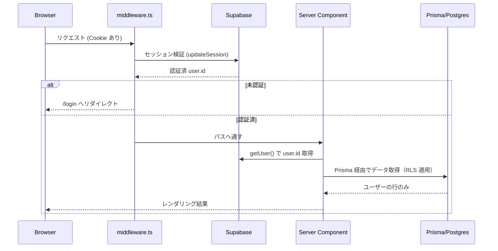
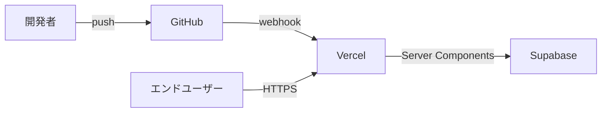

# アーキテクチャ設計書 (Architecture Design Document)

| 項目 | 内容 |
|------|------|
| プロダクト | kakeibo-app v3 |
| バージョン | v1.0 |
| 作成日 | 2026-04-17 |
| ステータス | ドラフト |

## テクノロジースタック

### 言語・ランタイム

| 技術 | バージョン |
|------|-----------|
| Node.js | 22 LTS |
| TypeScript | 5.x (strict mode) |
| npm | 10.x |

### フレームワーク・ライブラリ

| 技術 | バージョン | 用途 | 選定理由 |
|------|-----------|------|----------|
| Next.js | 16.x | フルスタック React フレームワーク（App Router） | Server Components + Server Actions により REST API を書かずに型安全なデータフローを構築できる |
| React | 19.x | UI ライブラリ | Next.js 16 との統合 |
| Tailwind CSS | 4.x | スタイリング | ユーティリティファースト、shadcn/ui と組み合わせる前提 |
| shadcn/ui | latest | UI コンポーネント集 | Radix UI ベースでアクセシビリティ担保、コピーして配置するためカスタマイズ容易 |
| Prisma | 7.x | ORM | 型安全なクエリ、マイグレーション管理、Next.js との親和性 |
| @supabase/ssr | latest | Supabase Auth 連携 | SSR 対応の Cookie-based 認証 |
| @supabase/supabase-js | latest | Supabase クライアント | 認証セッション管理 |
| React Hook Form | 7.x | フォーム状態管理 | 非制御コンポーネントで高パフォーマンス、Zod 統合 |
| Zod | 3.x | バリデーション | TypeScript-first、Server Action 側でも同一スキーマを使用可 |
| date-fns | 3.x | 日付処理 | 関数型でツリーシェイク可能、JST 固定運用に向く |
| Recharts | 2.x | チャート | React ベース、宣言的 API、円グラフ・棒グラフに十分 |
| papaparse | 5.x | CSV パース | ヘッダー自動検出、大容量ストリーム対応、ブラウザ/Node 両対応 |
| sonner | latest | トースト通知 | shadcn/ui 公式推奨 |
| lucide-react | latest | アイコン | shadcn/ui 標準 |

### 開発ツール

| 技術 | バージョン | 用途 | 選定理由 |
|------|-----------|------|----------|
| Vitest | 1.x | 単体テストランナー | Vite と同じ設定、高速 |
| @testing-library/react | 14.x | React コンポーネントテスト | ユーザー視点のアサーション |
| Playwright | 1.x | E2E テスト | chromium のみ、`--headed` で開発中に可視化 |
| ESLint | 9.x (flat config) | 静的解析 | Next.js 推奨設定 |
| Prettier | 3.x | コード整形 | ESLint と分離、保存時自動整形 |
| tsx | 4.x | TS スクリプト実行 | シード・マイグレーションスクリプト用 |
| Dev Container | - | 開発環境統一 | Node.js 22 固定、VS Code Remote |

## アーキテクチャパターン

### 全体構成（レイヤードアーキテクチャ）

```
┌──────────────────────────────────────────┐
│  UI レイヤー (app/ + components/)          │
│  Server Components + Client Components    │
│  Page・Layout・Form・Dialog 等             │
├──────────────────────────────────────────┤
│  アプリケーションレイヤー                    │
│  Server Actions (lib/actions/*)           │
│  Zod バリデーション (lib/validations/*)    │
├──────────────────────────────────────────┤
│  ドメインロジックレイヤー                    │
│  純粋関数ユーティリティ (lib/utils/*)        │
│  available-money, reconcile, csv-import   │
│  salary-cycle, payment-date, status       │
├──────────────────────────────────────────┤
│  データレイヤー                             │
│  Prisma Client (lib/prisma.ts)            │
│  Supabase Auth (lib/supabase/*)           │
├──────────────────────────────────────────┤
│  永続化レイヤー                             │
│  Supabase PostgreSQL (RLS + Prisma)       │
└──────────────────────────────────────────┘
```

### UI レイヤー
- **責務**: ユーザー入力の受付、表示、Server Actions への委譲
- **許可される操作**: Server Actions の呼び出し、`lib/utils/*` の呼び出し
- **禁止される操作**: Prisma への直接アクセス、`@supabase/supabase-js` の直接呼び出し（`lib/supabase/` 経由）

### アプリケーションレイヤー（Server Actions）
- **責務**: ユーザー要求の受付、認可チェック、バリデーション、ドメインロジック呼び出し、DB 更新、revalidatePath
- **許可される操作**: Prisma / Supabase / `lib/utils/*` / `lib/validations/*`
- **禁止される操作**: UI コンポーネントのインポート

### ドメインロジックレイヤー（Pure Utilities）
- **責務**: 副作用を持たない純粋な計算（給料サイクル、AvailableMoney、ステータス判定、CSV パース等）
- **許可される操作**: 引数のみに依存した計算
- **禁止される操作**: Prisma、Supabase、Date.now() の直接使用（`asOf` 引数で受け取る）

### データレイヤー
- **責務**: Prisma Client インスタンス（singleton）、Supabase Server/Browser Client 生成
- **実装箇所**: `lib/prisma.ts`, `lib/supabase/server.ts`, `lib/supabase/client.ts`

## データ永続化戦略

### ストレージ方式

| データ種別 | ストレージ | フォーマット | 理由 |
|-----------|----------|-------------|------|
| 業務データ | Supabase PostgreSQL | リレーショナル | RLS で行レベル分離、トランザクション必要 |
| 認証セッション | HTTP-only Cookie | encrypted | Supabase Auth 標準、CSRF 耐性 |
| CSV インポート時の一時データ | メモリ（Server Action 内） | papaparse 出力 | サーバーに保存しない（プライバシー） |
| ユーザー設定（表示テーマ等） | localStorage | JSON | 個人設定、サーバー保持不要 |

### マイグレーション戦略

- スキーマ変更は `npx prisma migrate dev --name [name]` でマイグレーションファイルを作成
- `prisma/migrations/` を Git 管理
- 本番反映は `npx prisma migrate deploy`
- ロールバックは新規マイグレーションで対応（down は使わない方針）

### バックアップ戦略

- Supabase の自動日次バックアップに依存（無料プランでも 7 日保持）
- 本 MVP では独自バックアップ実装なし

### Row Level Security (RLS)

- 全テーブルで RLS 有効化
- ポリシー: `auth.uid() = user_id`（SELECT/INSERT/UPDATE/DELETE 全てに適用）
- ポリシー定義は `prisma/rls_policies.sql` に記載、`prisma migrate deploy` 後に手動適用

## 認証フロー



## パフォーマンス要件

### レスポンスタイム

| 操作 | 目標時間 | 測定環境 |
|------|---------|---------|
| ダッシュボード初期表示 | 1 秒以内 | Payment 500 件、Account 5 件、Card 3 枚 |
| カレンダー画面表示 | 1 秒以内 | 1 ヶ月分の Payment |
| Payment 登録 (Server Action) | 500ms 以内 | 通常ネットワーク |
| CSV パース（100 行） | 3 秒以内 | ブラウザ側 papaparse |
| CSV 一括登録（100 件） | 2 秒以内 | Prisma transaction |
| レポート描画（Recharts） | 500ms 以内 | 12 ヶ月分のデータ |

### リソース使用量

| リソース | 上限 | 理由 |
|---------|------|------|
| Vercel Serverless メモリ | 1024 MB | デフォルト設定で十分 |
| Function 実行時間 | 10 秒 | Vercel 無料枠上限 |
| DB 接続プール | 10 接続 | Prisma pooler 経由で十分 |

## セキュリティアーキテクチャ

### データ保護

- **暗号化**:
  - 通信: HTTPS (Vercel 標準)
  - 保管: Supabase Postgres の at-rest encryption に依存
- **アクセス制御**: RLS ポリシー + Server Action 内で `auth.uid()` 検証
- **機密情報管理**: 環境変数（`.env.local`、Vercel 環境変数）
  - `DATABASE_URL`, `DIRECT_URL`, `NEXT_PUBLIC_SUPABASE_URL`, `NEXT_PUBLIC_SUPABASE_ANON_KEY`, `SUPABASE_SERVICE_ROLE_KEY`

### 入力検証

- **バリデーション**: 全 Server Action 入口で Zod スキーマ検証
- **サニタイゼーション**: React の自動エスケープに依存、`dangerouslySetInnerHTML` は使用禁止
- **エラーハンドリング**: スタックトレースをクライアントに返さず、ユーザー向けメッセージに変換

### CSRF 対策

- Supabase Auth の Cookie は `SameSite=Lax` + HTTP-only
- Server Actions は Next.js 組み込みで CSRF トークン検証

## スケーラビリティ設計

### データ増加への対応

- **想定データ量**:
  - Payment: 1 ユーザーあたり最大 5 万件
  - CreditCardStatement: 1 ユーザーあたり最大 500 件（12 ヶ月 × 40 カード相当）
  - BalanceHistory: 1 ユーザーあたり最大 1 万件
- **インデックス戦略**:
  - `Payment(userId, month)` 複合インデックス
  - `Payment(userId, usageDate)` 複合インデックス（カレンダー集計用）
  - `CreditCardStatement(userId, creditCardId, month)` UNIQUE
  - `BalanceHistory(userId, recordedAt)` 複合インデックス
- **ページング**: Payment 一覧は月フィルター前提で基本 100 件以下、500 件超時は仮想スクロール導入を検討（Post-MVP）

### 機能拡張性

- **プラグインシステム**: なし（MVP では不要）
- **設定のカスタマイズ**: デフォルトカテゴリ・カラーパレット等は `lib/constants.ts` に集約
- **API 拡張性**: MVP は Server Actions で完結。将来的に外部公開 API が必要な場合は `app/api/` に別途実装

## テスト戦略

### ユニットテスト

- **フレームワーク**: Vitest + @testing-library/react
- **対象**:
  - `lib/utils/*` の純粋関数全て（available-money, reconcile, csv-import, salary-cycle, payment-date, status, date, format）
  - 主要 React コンポーネント（Form 系の Client Components）
- **カバレッジ目標**: `lib/utils/` は 90% 以上、コンポーネントは主要シナリオのみ

### 統合テスト

- **方法**: Vitest + Prisma テスト DB（SQLite in-memory）
- **対象**: Server Actions の正常系・異常系（認可・バリデーション・DB 操作）

### E2E テスト

- **ツール**: Playwright (chromium のみ)
- **実行**: `npx playwright test --headed --reporter=list`
- **シナリオ**: `__tests__/e2e/golden-path.spec.ts` で登録〜照合〜ダッシュボード確認までを一気通貫

## 技術的制約

### 環境要件

- **OS**: Linux / macOS / Windows（WSL2 推奨）
- **Node.js**: 22 LTS 固定（Dev Container で強制）
- **Playwright システム依存**:
  - Linux/WSL では `sudo apt-get install` で以下を手動導入: libnspr4, libnss3, libatk1.0-0t64, libatk-bridge2.0-0t64, libcups2t64, libdrm2, libxkbcommon0, libatspi2.0-0t64, libxcomposite1, libxdamage1, libxfixes3, libxrandr2, libgbm1, libpango-1.0-0, libcairo2, libasound2t64
  - `npx playwright install --with-deps` は WSL では `sudo` が必要なため失敗する → `npx playwright install chromium` でブラウザのみ DL

### パフォーマンス制約

- Vercel 無料プランの Function 実行時間上限 10 秒（CSV バッチ処理に影響）
- Supabase 無料プランの DB 容量上限 500MB

### セキュリティ制約

- Supabase Service Role Key はサーバー側のみ使用（Client Components に渡さない）
- RLS は必須、Prisma で直接クエリする Server Components/Actions も RLS の影響を受けるため `user_id` 絞り込み必須

## 依存関係管理

| ライブラリ | 用途 | バージョン管理方針 |
|-----------|------|-------------------|
| next, react, react-dom | Next.js 本体 | 範囲指定（メジャー固定） |
| @prisma/client, prisma | ORM | 固定（マイグレーション整合性のため） |
| @supabase/ssr, @supabase/supabase-js | 認証 | 範囲指定 |
| tailwindcss, @tailwindcss/postcss | スタイル | 固定（設定差異を避ける） |
| shadcn/ui 系（Radix + class-variance-authority 等） | UI | 固定（コピー済み） |
| papaparse | CSV | 固定 |
| date-fns | 日付 | 固定 |
| zod, react-hook-form | フォーム | 範囲指定 |
| vitest, @playwright/test | テスト | 範囲指定 |

## デプロイアーキテクチャ



- **ホスティング**: Vercel（Next.js Preview/Production 自動デプロイ）
- **DB**: Supabase (Free tier → 必要なら Pro)
- **CI**: Vercel 標準（lint / build / type-check）
- **プレビュー URL**: PR ごとに自動生成
- **環境変数**: Vercel プロジェクト設定で環境別に管理（development / preview / production）

## 監視・ログ

MVP では最小限の構成とする:
- **アクセスログ**: Vercel 標準の Function ログ
- **エラー監視**: MVP では未導入（Post-MVP で Sentry 検討）
- **パフォーマンス計測**: Vercel Analytics（無料枠で有効化）
