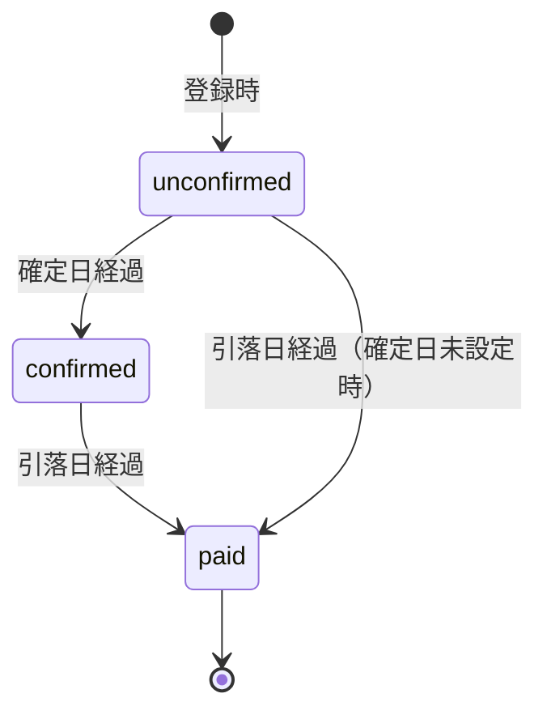

# プロジェクト用語集 (Glossary)

| 項目 | 内容 |
|------|------|
| プロダクト | kakeibo-app v3 |
| バージョン | v1.0 |
| 更新日 | 2026-04-17 |

## 概要

kakeibo-app v3 で使用されるドメイン・技術・アーキテクチャ用語の定義を集約する。他のドキュメントはこの用語定義を正とする。

## ドメイン用語

### 使えるお金 (AvailableMoney)

**定義**: 現時点でユーザーが自由に使える金額の総合指標。

**計算式**:
```
AvailableMoney = Σ Account.balance
               + 未入金 Salary（cycle 内で給料日未到来分）
               − 全 Payment（status 問わず未引落分）
               − Statement 登録済×withdrawnAmount 未入力 の statementGap（符号そのまま）
```

**関連用語**: Account, Salary, Payment, CreditCardStatement, statementGap

**実装箇所**: `lib/utils/available-money.ts`

**英語表記**: Available Money

### 銀行口座 (Account)

**定義**: ユーザーが手動で残高を管理する銀行口座または現金の保管場所。

**説明**: API 連携は MVP 対象外のため、ユーザーが都度残高を手動で更新する運用。1 人で複数登録可。

**関連用語**: BalanceHistory, AvailableMoney

**英語表記**: Account

### 手取り (Salary)

**定義**: 給料の税引後振込額。本アプリにおける「収入」。

**関連用語**: 給料サイクル, 給料日

**英語表記**: Net Income / Take-home Pay

### 利用日 (usageDate)

**定義**: 支払い（Payment）が実際に発生した日（買い物をした日）。

**説明**: カレンダー画面で Payment を並べる軸となる。クレカ利用の場合、この日付と締め日の関係から `month`（利用月）が自動導出される。

**関連用語**: 利用月, Payment

### 利用月 / 締め月 (month)

**定義**: クレジットカードの利用が計上される月。`YYYY-MM` 形式で Payment の `month` カラムに保存。

**導出ルール**:
- クレカ利用: `usageDate ≤ closingDay` なら当月、`usageDate > closingDay` なら翌月
- 現金・口座利用: `usageDate` のカレンダー月

**英語表記**: Billing Month

### 引き落とし月

**定義**: 実際にクレカ代金が銀行口座から引き落とされる月。

**計算**: `利用月 + paymentMonthOffset`

**関連用語**: paymentMonthOffset, paymentDay

### 給料サイクル (SalaryCycle)

**定義**: 給料日から次の給料日前日までの期間。

**例**: 25 日支給 → 2/25〜3/24 が「2 月の給料サイクル」

**説明**: カレンダー月ではなく給料サイクル単位で資金繰りを管理する。

**実装箇所**: `lib/utils/salary-cycle.ts`

**英語表記**: Salary Cycle

### 給料日 (payDay)

**定義**: 手取りが振り込まれる日（1-31, 32=末日）。

**説明**: UI では 31 日以降を選ぶと「末日」として扱う。

### 締め日 (closingDay)

**定義**: クレジットカードの利用金額が締められる日（1-31, 32=末日）。

### 支払い日 (paymentDay)

**定義**: クレジットカードの引き落とし日（1-31, 32=末日）。

### 確定日 (confirmationDay)

**定義**: クレジットカード会社が金額を確定する日（任意設定）。

**説明**: 設定済みの場合、この日を過ぎると Payment が自動的に `confirmed` ステータスに遷移する。未設定の場合は自動遷移しない。

### paymentMonthOffset

**定義**: 利用月から引き落とし月までの月数差（0=当月, 1=翌月, 2=翌々月）。

**説明**: カード会社によって異なるため、カード単位で設定。

### confirmationMonthOffset

**定義**: 利用月から確定日の属する月までの月数差（任意設定）。

### 請求明細 (CreditCardStatement)

**定義**: カード会社が月次で発行する請求確定額を記録するエンティティ。

**主要フィールド**: `creditCardId`, `month`, `confirmedAmount`, `withdrawnAmount`, `withdrawnAt`, `accountId`

**制約**: `@@unique([userId, creditCardId, month])` により同一カード×同一月は 1 件のみ。

**関連用語**: statementGap, 誤差ゼロ管理

**英語表記**: Credit Card Statement

### statementGap

**定義**: `ΣPayment(該当カード×該当月) − confirmedAmount` で算出される差額。

**表示ルール**: 0 円で OK バッジ表示、正負どちらの場合も絶対値で強調表示。

**AvailableMoney 算入ルール**:
- Statement 登録済 かつ `withdrawnAmount` 未入力 の組のみ算入
- 符号そのまま AvailableMoney から減算
- Statement 未登録カード×月は算入せず、ΣPayment をそのまま減算
- `withdrawnAmount` 入力済みの組は Account.balance 側に反映済みのため AvailableMoney から除外

### 誤差ゼロ管理

**定義**: Payment 登録合計と CreditCardStatement の `confirmedAmount` を突き合わせ、`statementGap` が 0 円の状態を目指す運用。

**関連用語**: statementGap, CSV インポート

**英語表記**: Zero-Gap Reconciliation

### CSV 明細インポート

**定義**: カード会社からダウンロードした CSV 明細をアップロードして Payment を一括登録する機能。

**対象ファイル**: クレジットカード利用明細 CSV（MVP では 1 カード 1 ファイル）

**関連用語**: Payment, 重複検出

**実装箇所**: `lib/utils/csv-import.ts`, `app/(main)/payments/import/page.tsx`

### カテゴリ (Category)

**定義**: 支出を分類するためのラベル。色・並び順を持ち、予算と紐付けできる。

**デフォルトカテゴリ**: 食費・日用品・交通・娯楽・その他

**説明**: 「その他」は削除不可、末尾固定。

### 予算 (Budget)

**定義**: カテゴリ × 月の組み合わせで設定する支出上限額。

**制約**: `@@unique([userId, categoryId, month])`

### 残高履歴 (BalanceHistory)

**定義**: Account の残高変更を記録する履歴エンティティ。

**source**: `"manual"` (手動更新), `"withdrawal"` (クレカ引落反映), `"income"` (給料入金反映)

### 繰り返し支払い

**定義**: 家賃やサブスクなど、定期的に発生する Payment を一括登録する機能。

**仕様**: `isRecurring=true` で登録すると、本体 + 追加 3 件の計 4 件が `recurringGroupId` で紐付けられて登録される。

## 技術用語

### Next.js App Router

**定義**: Next.js の推奨ルーティングシステム。`app/` ディレクトリを使い、Server Components をデフォルトとする。

**公式サイト**: https://nextjs.org/docs/app

**本プロジェクトでの用途**: 全画面のルーティング、Server Components によるデータ取得、Server Actions による更新処理。

**バージョン**: Next.js 16.x（Node.js 22 LTS）

### Server Components / Client Components

**定義**: Next.js App Router における 2 種類のコンポーネント。

**使い分け**:
- **Server Components（デフォルト）**: データ取得、初期レンダリング。Prisma を直接呼ぶ
- **Client Components（`"use client"`）**: useState / useEffect / onClick / ブラウザ API を使う場合のみ

**本プロジェクトでの方針**: Client Components は最小単位に分離し、Server Components の子として配置する。

### Server Actions

**定義**: `"use server"` ディレクティブを付与したサーバー側関数。フォーム送信や Client Components から直接呼び出せる。

**本プロジェクトでの用途**: 全データ更新処理（`lib/actions/*.ts`）。REST API は原則不要。

### Prisma

**定義**: TypeScript 用の ORM。スキーマファイルから型安全なクライアントを自動生成する。

**公式サイト**: https://www.prisma.io/

**バージョン**: Prisma 7.x（`@prisma/adapter-better-sqlite3` または `@prisma/adapter-pg` 必須）

**本プロジェクトでの用途**: DB スキーマ定義、マイグレーション、型安全なクエリ。

### Supabase

**定義**: PostgreSQL ベースの BaaS。認証・DB・ストレージを提供。

**公式サイト**: https://supabase.com/

**本プロジェクトでの用途**: PostgreSQL (データ永続化)、Supabase Auth (認証)、RLS (行レベルアクセス制御)。

### Row Level Security (RLS)

**定義**: PostgreSQL の行単位アクセス制御機能。

**本プロジェクトでの用途**: 全テーブルで `auth.uid() = user_id` ポリシーを適用し、ユーザーが自分のデータ以外にアクセスできないようにする。

### shadcn/ui

**定義**: Radix UI + Tailwind CSS ベースのコピー型 UI コンポーネントライブラリ。

**公式サイト**: https://ui.shadcn.com/

**本プロジェクトでの用途**: Button, Dialog, Select, Table 等の UI 基礎部品。`components/ui/` に配置。

### Recharts

**定義**: React 用のチャートライブラリ。

**公式サイト**: https://recharts.org/

**本プロジェクトでの用途**: `/reports` ページの円グラフ・棒グラフ。

### React Hook Form + Zod

**定義**: フォーム状態管理ライブラリ + TypeScript-first のバリデーションライブラリ。

**本プロジェクトでの用途**: 全フォーム入力のバリデーション。`lib/validations/*.ts` に Zod スキーマを配置。

### Vitest

**定義**: Vite ベースのユニットテストランナー。

**本プロジェクトでの用途**: ロジック関数・React コンポーネントの単体テスト。

### Playwright

**定義**: Microsoft 製の E2E テストフレームワーク。

**本プロジェクトでの用途**: ブラウザ操作シナリオの自動テスト（chromium のみ）。実行は `npx playwright test --headed --reporter=list`。

## 略語・頭字語

### RLS

**正式名称**: Row Level Security

**意味**: 行レベルアクセス制御

**本プロジェクトでの使用**: Supabase Postgres のポリシー記述（`prisma/rls_policies.sql`）

### PRD

**正式名称**: Product Requirements Document

**意味**: プロダクト要求定義書

**本プロジェクトでの使用**: `docs/01_product-requirements.md`

### MVP

**正式名称**: Minimum Viable Product

**意味**: 実用最小限のプロダクト

**本プロジェクトでの使用**: 優先度 P0 の機能群

### SSR / CSR

**正式名称**: Server-Side Rendering / Client-Side Rendering

**本プロジェクトでの使用**: Next.js App Router の Server / Client Components 区分

## アーキテクチャ用語

### App Router レイヤー分離

**定義**: Next.js App Router における責務分離モデル。

**本プロジェクトでの適用**:
```
app/         → ルーティング・Page・Layout（Server Components 中心）
components/  → UI 部品（Server / Client 混在、責務単位で分離）
lib/actions/ → Server Actions（"use server"）
lib/utils/   → 純粋関数ユーティリティ（date, salary-cycle, 等）
lib/validations/ → Zod スキーマ
prisma/      → DB スキーマ・RLS ポリシー
```

### Route Group

**定義**: Next.js App Router の括弧付きディレクトリ `(name)/`。ルーティングパスに影響しないグループ化。

**本プロジェクトでの適用**: `app/(auth)/` で認証画面群、`app/(main)/` で認証後画面群を分離。

## ステータス・状態

### Payment ステータス

| ステータス | 意味 | 遷移条件 |
|----------|------|---------|
| unconfirmed | 未確定（カード会社の金額確定前） | 初期状態 |
| confirmed | 確定（カード会社が金額確定済み、未引落） | 確定日 ≤ 今日 |
| paid | 支払済（引落日を過ぎた） | 引落日 ≤ 今日 |

**状態遷移図**:


**実装箇所**: `lib/utils/status.ts` の `determineAutoStatus()`

### CreditCardStatement ステータス（暗黙）

| 状態 | 条件 | 用途 |
|------|------|------|
| 未登録 | レコードなし | AvailableMoney は ΣPayment をそのまま減算 |
| 確定のみ | confirmedAmount あり、withdrawnAmount なし | statementGap を AvailableMoney 計算に算入 |
| 引落済 | withdrawnAmount あり | Account.balance に反映済み、AvailableMoney 計算から除外 |

## データモデル用語

### User

**定義**: Supabase Auth が管理する認証ユーザー。

**主要フィールド**: `id` (UUID), `email`

**関連エンティティ**: すべての業務エンティティの所有者（`user_id` 外部キー）

### Account

**主要フィールド**: `id`, `userId`, `name`, `type`, `balance`, `balanceUpdatedAt`, `sortOrder`, `createdAt`, `updatedAt`

**関連エンティティ**: BalanceHistory, CreditCardStatement（引落先）

### CreditCard

**主要フィールド**: `id`, `userId`, `name`, `brand`, `closingDay`, `paymentDay`, `paymentMonthOffset`, `confirmationDay`, `confirmationMonthOffset`, `accountId` (引落先), `sortOrder`

**関連エンティティ**: Payment, CreditCardStatement, Account

### Payment

**主要フィールド**: `id`, `userId`, `usageDate`, `month`, `amount`, `status`, `categoryId`, `creditCardId?`, `accountId?`, `memo`, `isRecurring`, `recurringGroupId?`

**制約**: `creditCardId` と `accountId` はどちらか一方が必須（排他）

**関連エンティティ**: Category, CreditCard, Account

### Category

**主要フィールド**: `id`, `userId`, `name`, `color`, `sortOrder`, `isDefault`

### Budget

**主要フィールド**: `id`, `userId`, `categoryId`, `month`, `amount`

**制約**: `@@unique([userId, categoryId, month])`

### Salary

**主要フィールド**: `id`, `userId`, `month`, `amount`, `payDay`, `sortOrder`

### BalanceHistory

**主要フィールド**: `id`, `userId`, `accountId`, `balance`, `recordedAt`, `source`

## エラー・例外

### ValidationError

**発生条件**: Zod スキーマ検証失敗、ビジネスルール違反（例: Payment で creditCardId と accountId 両方未設定）

**対処方法**: ユーザーにフィールド別エラーメッセージを日本語で表示

### AuthError

**発生条件**: Supabase Auth の認証失敗

**対処方法**: 日本語メッセージに変換してトースト表示

### DuplicateError

**発生条件**: UNIQUE 制約違反（Budget の同一 userId×categoryId×month 等）

**対処方法**: 「既に登録済みです」とユーザーに通知

## 計算・アルゴリズム

### calculatePaymentDate

**定義**: クレカ Payment の実際の引き落とし日を算出する。

**計算式**:
```
引落日 = 基準日(利用月1日) + paymentMonthOffset ヶ月 の月の paymentDay
```

**実装箇所**: `lib/utils/payment-date.ts`

### calculateSalaryCycle

**定義**: 指定日が属する給料サイクル（開始日〜終了日）を算出。

**実装箇所**: `lib/utils/salary-cycle.ts`

### determineAutoStatus

**定義**: Payment のステータスを引落日・確定日・現在日から決定論的に算出。

**ルール**:
1. 引落日 ≤ 今日 → `paid`
2. 確定日が設定済み かつ 確定日 ≤ 今日 → `confirmed`
3. それ以外 → `unconfirmed`

**実装箇所**: `lib/utils/status.ts`

### getAvailableMoney

**定義**: AvailableMoney を集計する。

**シグネチャ**: `getAvailableMoney(userId, asOf = today): { total, breakdown }`

**実装箇所**: `lib/utils/available-money.ts`

### parseCsvImport

**定義**: CSV ファイルを解析して列マッピングを適用、Payment 候補リストを生成する。

**シグネチャ**: `parseCsvImport(csvText, columnMap, cardId): { rows, errors }`

**実装箇所**: `lib/utils/csv-import.ts`
